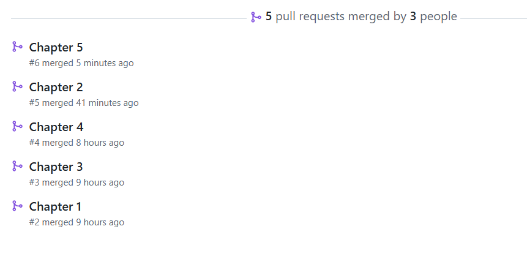
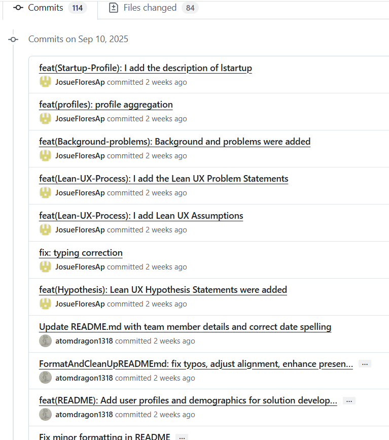
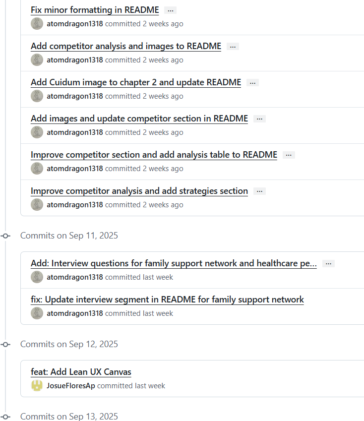

# Universidad Peruana de Ciencias Aplicadas

### **CURSO:** Desarrollo de Aplicaciones Open Source

### **NRC**: 4334

### **Profesor:** Hugo Allan Mori Paiva

### **Ingeniería de software**

## Informe de Trabajo Final

### **Nombre del startup:* EternaCare* 

### **Nombre del producto:* Carlink* 

## **Integrantes**

| **Nombre**                             | **Código**   |
| -------------------------------------- | ------------ |
| **Fiorella Angela Vilca Valverde**     | U20211E417   |
| **Italo Sebastian Verona Flores**      | U20221E617   |
| **Josue Antonio Flores Apaico**        | U20201F773   |
| **Mauricio Rigoberto Muñoz Vilcapoma** | U202217212   |

Agost 2025

## Registro de Versiones del Informe

<table>
  <thead>
    <tr>
      <th>Versión</th>
      <th>Fecha</th>
      <th>Autor</th>
      <th>Descripción de modificación</th>
    </tr>
  </thead>
  <tbody>
<tr>
      <td>0.1</td>
      <td>2025-09-08</td>
      <td>Josue Antonio Flores Apaico	</td>
      <td>Desarrollo de los ítems: 1.1. Startup Profile 
1.1.1. Descripción de la Startup ,1.1.2. Perfiles de integrantes del equipo ,1.2. Solution Profile ,1.2.1  Antecedentes y problemática ,1.2.2 Lean UX Process. ,1.2.2.1.Lean UX Problem Statements 1.2.2.2. Lean UX Assumptions. 1.2.2.3.Lean UX Hypothesis Statements 1.2.2.4.Lean UX Canvas 1.3.Segmentos objetivo 
 </td>
    </tr>
     <tr>
      <td>0.2</td>
      <td>2025-09-12</td>
      <td>Italo Sebastian Verona Flores, Josue Antonio Flores Apaico, Fiorella Angela Vilca Valverde y Mauricio Rigoberto Muñoz Vilcapoma</td>
      <td>Desarrollo de los ítems: 2.1. Competidores, 2.1.1. Análisis competitivo, 2.1.2. Estrategias y tácticas frente a competidores, 2.2. Entrevistas, 2.2.1. Diseño de entrevistas, 2.2.2. Registro de entrevistas, 2.2.3. Análisis de entrevistas, 2.3. Needfinding, 2.3.1. User Personas, 2.3.2. User Task Matrix, 2.3.3. User Journey Mapping, 2.3.4. Empathy Mapping, 2.3.5. As-is Scenario Mapping, 2.4. Ubiquitous Language. </td>
    </tr>
    <tr>
      <td>0.3</td>
      <td>2025-09-14</td>
      <td>Italo Sebastian Verona Flores y Fiorella Angela Vilca Valverde </td>
      <td>Desarrollo de los ítems: 3.1.To-Be Scenario Mapping, 3.2.Avance de User Stories (12 user stories), 3.3. Impact Mapping y 3.4. Product Backlog. </td>
    </tr>
    <tr>
      <td>0.4</td>
      <td>2025-09-18</td>
      <td>Italo Sebastian Verona Flores, Josue Antonio Flores Apaico, Fiorella Angela Vilca Valverde y Mauricio Rigoberto Muñoz Vilcapoma</td>
      <td>Desarrollo de los ítems: 3.2.User Stories 4.1. Style Guidelines, 4.1.1. General Style Guidelines, 4.1.2. Web Style Guidelines, 4.2. Information Architecture, 4.2.1. Organization Systems, 4.2.2. Labeling Systems, 4.2.3. SEO Tags and Meta Tags, 4.2.4. Searching Systems, 4.2.5. Navigation Systems, 4.3. Landing Page UI Design, 4.3.1. Landing Page Wireframe, 4.3.2. Landing Page Mock-up, 4.4. Web Applications UX/UI Design, 4.4.1. Web Applications Wireframes, 4.4.2. Web Applications Wireflow Diagrams, 4.4.3. Web Applications Mock-ups, 4.4.4. Web Applications User Flow Diagrams, 4.5. Web Applications Prototyping, 4.6. Domain-Driven Software Architecture, 4.6.1. Software Architecture Context Diagram, 4.6.2. Software Architecture Container Diagrams, 4.6.3. Software Architecture Components Diagrams, 4.7. Software Object-Oriented Design, 4.7.1. Class Diagrams, 4.7.2. Class Dictionary, 4.8. Database Design, 4.8.1. Database Diagram.  </td>
    </tr>
    <tr>
      <td>0.5</td>
      <td>2025-09-20</td>
      <td>Italo Sebastian Verona Flores, Josue Antonio Flores Apaico, Fiorella Angela Vilca Valverde y Mauricio Rigoberto Muñoz Vilcapoma</td>
      <td>Desarrollo de los ítems:  5.1. Software Configuration Management, 5.1.1. Software Development Environment Configuration, 5.1.2. Source Code Management, 5.1.3. Source Code Style Guide & Conventions, 5.1.4. Software Deployment Configuration, 5.2. Landing Page, Services & Applications Implementation, 5.2.1. Sprint 1, 5.2.1.1. Sprint Planning 1, 5.2.1.2. Aspect Leaders and Collaborators, 5.2.1.3. Sprint Backlog 1, 5.2.1.4. Development Evidence for Sprint Review, 5.2.1.5. Execution Evidence for Sprint Review, 5.2.1.6. Services Documentation Evidence for Sprint Review, 5.2.1.7. Software Deployment Evidence for Sprint Review, 5.2.1.8. Team Collaboration Insights during Sprint.  </td>
    </tr>
    <tr>
      <td>1.0</td>
      <td>2025-09-21</td>
      <td>Josue Antonio Flores Apaico y Fiorella Angela Vilca Valverde</td>
      <td>Revisión completa hasta el capitulo 5, corrección ortográfica y coherencia global del reporte.</td>
    </tr>
  </tbody>
</table>

## Project Report Collaboration Insights

| Tipo de Enlace                      | URL                                                                                   |
|------------------------------------|----------------------------------------------------------------------------------------|
| **Landing Page**                   | ``     |
| **Repositorio de la organización** | `https://github.com/EternaCare-OpenSource`                                |
| **Repositorio del reporte**        | `https://github.com/EternaCare-OpenSource/report.git`         |

Entrega TB1 (27/04/2025):

Para esta primera entrega se desarollaron los capítulos del 1 al 5 y el sprint 1, en imagenes adjuntadas se evidencia del trabajo colaborativo de github. Todos los integrantes del grupo trabajaron en el proyecto.

Distribución de commits:

* Fiorella Angela Vilca Valverde: N commits
* Italo Sebastian Verona Flores: N commits
* Flores Apaico Josue Antonio: N commits
* Mauricio Rigoberto Muñoz Vilcapoma: N commits

## Contenido

- [Universidad Peruana de Ciencias Aplicadas](#universidad-peruana-de-ciencias-aplicadas)
    - [**CURSO:** Desarrollo de Aplicaciones Open Source](#curso-desarrollo-de-aplicaciones-open-source)
    - [**NRC**: 4334](#nrc-4334)
    - [**Profesor:** Hugo Allan Mori Paiva](#profesor-hugo-allan-mori-paiva)
    - [**Ingeniería de software**](#ingeniería-de-software)
  - [Informe de Trabajo Final](#informe-de-trabajo-final)
    - [**Nombre del startup:** EternaCare](#nombre-del-startup-apx-01)
    - [**Nombre del producto:** Carlink](#nombre-del-producto-eduhive)
  - [**Integrantes**](#integrantes)
  - [Registro de Versiones del Informe](#registro-de-versiones-del-informe)
  - [Project Report Collaboration Insights](#project-report-collaboration-insights)
  - [Contenido](#contenido)
  - [Student Outcome](#student-outcome)
  - [Capitulo I](#capitulo-i)
    - [1.1. Startup Profile](#11-startup-profile)
      - [1.1.1. Descripción de la Startup](#111-descripción-de-la-startup)
      - [1.1.2. Perfiles de integrantes del equipo](#112-perfiles-de-integrantes-del-equipo)
    - [1.2. Solution Profile](#12-solution-profile)
      - [1.2.1. Antecedentes y problemática](#121-antecedentes-y-problemática)
      - [1.2.2. Lean UX Process](#122-lean-ux-process)
        - [1.2.2.1. Lean UX Problem Statements](#1221-lean-ux-problem-statements)
        - [1.2.2.2. Lean UX Assumptions](#1222-lean-ux-assumptions)
        - [1.2.2.3. Lean UX Hypothesis Statements](#1223-lean-ux-hypothesis-statements)
        - [1.2.2.4. Lean UX Canvas](#1224-lean-ux-canvas)
    - [1.3. Segmentos Objetivo](#13-segmentos-objetivo)
    - [**Segmento Objetivo 1: Estudiantes Universitarios**](#segmento-objetivo-1-estudiantes-universitarios)
    - [**Segmento Objetivo 2: Profesores Universitarios**](#segmento-objetivo-2-profesores-universitarios)
  - [Capítulo II: Requirements Elicitation \& Analysis](#capítulo-ii-requirements-elicitation--analysis)
    - [2.1. Competidores](#21-competidores)
      - [2.1.1. Análisis competitivo](#211-análisis-competitivo)
      - [2.1.2. Estrategias y tácticas frente a competidores](#212-estrategias-y-tácticas-frente-a-competidores)
    - [2.2. Entrevistas](#22-entrevistas)
      - [2.2.1. Diseño de entrevistas](#221-diseño-de-entrevistas)
      - [2.2.2. Registro de entrevistas](#222-registro-de-entrevistas)
      - [2.2.3. Análisis de entrevistas](#223-análisis-de-entrevistas)
    - [2.3. Needfinding](#23-needfinding)
      - [2.3.1. User Personas](#231-user-personas)
      - [2.3.2. User Task Matrix](#232-user-task-matrix)
      - [2.3.3. User Journey Mapping](#233-user-journey-mapping)
      - [2.3.4. Empathy Mapping](#234-empathy-mapping)
      - [2.3.5. As-is Scenario Mapping](#235-as-is-scenario-mapping)
    - [2.4. Ubiquitous Language](#24-ubiquitous-language)
  - [Capítulo III: Requirements specification](#capítulo-iii-requirements-specification)
    - [3.1. To-Be Scenario Mapping](#31-to-be-scenario-mapping)
    - [3.2. User Stories](#32-user-stories)
    - [3.3. Impact Mapping](#33-impact-mapping)
    - [3.4. Product Backlog](#34-product-backlog)
  - [Capítulo IV: Product Design](#capítulo-iv-product-design)
    - [4.1. Style Guidelines](#41-style-guidelines)
      - [4.1.1. General Style Guidelines](#411-general-style-guidelines)
      - [4.1.2. Web Style Guidelines](#412-web-style-guidelines)
    - [4.2. Information Architecture](#42-information-architecture)
      - [4.2.1. Organization Systems](#421-organization-systems)
      - [4.2.2. Labeling Systems](#422-labeling-systems)
      - [4.2.3. SEO Tags and Meta Tags](#423-seo-tags-and-meta-tags)
      - [4.2.4. Searching Systems](#424-searching-systems)
      - [4.2.5. Navigation Systems](#425-navigation-systems)
    - [4.3. Landing Page UI Design](#43-landing-page-ui-design)
      - [4.3.1. Landing Page Wireframe](#431-landing-page-wireframe)
      - [4.3.2. Landing Page Mock-up](#432-landing-page-mock-up)
    - [4.4. Web Applications UX/UI Design](#44-web-applications-uxui-design)
      - [4.4.1. Web Applications Wireframes](#441-web-applications-wireframes)
      - [4.4.2. Web Applications Wireflow Diagrams](#442-web-applications-wireflow-diagrams)
      - [4.4.2. Web Applications Mock-ups](#442-web-applications-mock-ups)
      - [4.4.3. Web Applications User Flow Diagrams](#443-web-applications-user-flow-diagrams)
    - [4.5. Web Applications Prototyping](#45-web-applications-prototyping)
    - [4.6. Domain-Driven Software Architecture](#46-domain-driven-software-architecture)
      - [4.6.1. Software Architecture Context Diagram](#461-software-architecture-context-diagram)
      - [4.6.2. Software Architecture Container Diagrams](#462-software-architecture-container-diagrams)
      - [4.6.3. Software Architecture Components Diagrams](#463-software-architecture-components-diagrams)
    - [4.7. Software Object-Oriented Design](#47-software-object-oriented-design)
      - [4.7.1. Class Diagrams](#471-class-diagrams)
      - [4.7.2. Class Dictionary](#472-class-dictionary)
    - [4.8. Database Design](#48-database-design)
      - [4.8.1. Database Diagram](#481-database-diagram)
  - [Capítulo V: Product Implementation, Validation \& Deployment](#capítulo-v-product-implementation-validation--deployment)
    - [5.1. Software Configuration Management](#51-software-configuration-management)
      - [5.1.1. Software Development Environment Configuration](#511-software-development-environment-configuration)
      - [5.1.2. Source Code Management](#512-source-code-management)
      - [5.1.3. Source Code Style Guide \& Conventions](#513-source-code-style-guide--conventions)
      - [5.1.4. Software Deployment Configuration](#514-software-deployment-configuration)
    - [5.2. Landing Page, Services \& Applications Implementation.](#52-landing-page-services--applications-implementation)
      - [5.2.1. Sprint 1](#521-sprint-1)
        - [5.2.1.1. Sprint Planning 1](#5211-sprint-planning-1)
        - [5.2.1.2. Aspect Leaders and Collaborators](#5212-aspect-leaders-and-collaborators)
        - [5.2.1.3. Sprint Backlog 1](#5213-sprint-backlog-1)
        - [5.2.1.4. Development Evidence for Sprint Review](#5214-development-evidence-for-sprint-review)
        - [5.2.1.5. Execution Evidence for Sprint Review](#5215-execution-evidence-for-sprint-review)
        - [5.2.1.6. Services Documentation Evidence for Sprint Review](#5216-services-documentation-evidence-for-sprint-review)
        - [5.2.1.7. Software Deployment Evidence for Sprint Review](#5217-software-deployment-evidence-for-sprint-review)
        - [5.2.1.8. Team Collaboration Insights during Sprint](#5218-team-collaboration-insights-during-sprint)
  - [Conclusiones](#conclusiones)
  - [Bibliografía](#bibliografía)
  - [Anexos](#anexos)

## Student Outcome

El curso contribuye al cumplimiento del Student Outcome ABET:
ABET – EAC - Student Outcome 3
Criterio: Capacidad de comunicarse efectivamente con un rango de audiencias.
En el siguiente cuadro se describe las acciones realizadas y enunciados de
conclusiones por parte del grupo, que permiten sustentar el haber alcanzado el logro
del ABET – EAC - Student Outcome 3.

| Criterio específico | Acciones realizadas | Conclusiones |
|---------------------|---------------------|--------------|
| **Comunica oralmente con efectividad a diferentes rangos de audiencia.** | **Fiorella Angela Vilca Valverde (TB1):** Yo presenté de manera clara los objetivos de la investigación, expliqué en detalle la metodología aplicada durante el desarrollo del trabajo y participé en la introducción oral del informe, procurando transmitir las ideas con orden y precisión.  **Italo Sebastian Verona Flores (TB1):** Yo expuse los objetivos de la investigación con un enfoque estructurado, desarrollé la explicación de la metodología frente a la clase y reforcé la presentación de la introducción, contribuyendo a la coherencia general de la exposición oral.  **Josue Antonio Flores Apaico (TB1):** Yo comuniqué los objetivos principales del proyecto, expliqué la metodología ante la audiencia y participé en la exposición de la introducción del informe, asegurando que el mensaje se transmitiera de forma clara y entendible.  **Mauricio Rigoberto Muñoz Vilcapoma (TB1):** Yo me encargué de exponer los objetivos de la investigación, brindar una explicación detallada de la metodología utilizada y presentar parte de la introducción del informe, demostrando seguridad y dominio del tema. | En conjunto, nuestras presentaciones orales permitieron transmitir los resultados con claridad tanto a un público técnico como no técnico. Supimos adaptar el discurso según la audiencia, lo que facilitó la comprensión del tema y generó confianza en la exposición. La comunicación oral fortaleció el impacto del proyecto y consolidó nuestro trabajo en equipo. |
| **Comunica por escrito con efectividad a diferentes rangos de audiencia.** | **Fiorella Angela Vilca Valverde (TB1):** Yo elaboré la introducción del informe con un estilo claro y organizado, participé en la redacción de la metodología y estructuré los objetivos de manera comprensible para distintos lectores.  **Italo Sebastian Verona Flores (TB1):** Yo redacté apartados del informe vinculados a la metodología, colaboré en la presentación escrita de los objetivos y revisé la introducción para asegurar la coherencia del documento.  **Josue Antonio Flores Apaico (TB1):** Yo trabajé en la redacción de la introducción, formulé los objetivos por escrito con precisión y colaboré en la explicación de la metodología dentro del informe, cuidando la claridad de la redacción.  **Mauricio Rigoberto Muñoz Vilcapoma (TB1):** Yo me encargué de la redacción de la metodología, participé en la presentación escrita de los objetivos y ayudé en la organización de la introducción, procurando la cohesión y el estilo del informe. | El trabajo escrito reflejó la participación activa de todos los integrantes y dio como resultado un documento bien estructurado y coherente. Logramos transmitir nuestras ideas de forma clara y adaptarlas a distintos públicos, desde lectores especializados hasta no técnicos. El informe final consolidó nuestras conclusiones y mostró la efectividad de nuestra comunicación escrita. |

## Capitulo I

### 1.1. Startup Profile

#### 1.1.1. Descripción de la Startup

Somos **EternaCare**, una startup fundada por estudiantes comprometidos con el bienestar social, con la visión de transformar la experiencia de vida de los adultos mayores mediante soluciones tecnológicas innovadoras que eleven la calidad del cuidado, tanto en centros geriátricos como en el hogar.

Hemos desarrollado **CareLink**, una plataforma digital que permite monitorear en tiempo real el estado físico, emocional y mental de las personas mayores. La solución ofrece reportes detallados, alertas personalizadas y herramientas de comunicación que facilitan la coordinación entre cuidadores, familiares y personal de salud, sin importar si el cuidado se brinda en un centro especializado o en casa.

De esta forma, no solo fortalecemos la atención y el acompañamiento, sino que también brindamos tranquilidad y confianza a las familias, asegurando que sus seres queridos estén bien atendidos y conectados.

Con miras al futuro, proyectamos la integración de tecnología IoT para conectar dispositivos inteligentes como wearables de salud, sensores de movimiento y sistemas de monitoreo ambiental. Esto permitirá un seguimiento más preciso, preventivo y personalizado, anticipando necesidades y mejorando la seguridad y bienestar de los adultos mayores.

**Misión**: Empoderar a los adultos mayores y a sus familias a través de herramientas digitales que mejoren la comunicación, el monitoreo de la salud y la calidad de vida, en el hogar y en centros de cuidado.

**Visión**: En EternaCare, aspiramos a ser la plataforma líder en el cuidado integral de adultos mayores, impulsando conexiones más significativas y apoyándonos en tecnologías emergentes como el IoT para ofrecer soluciones innovadoras de bienestar.

#### 1.1.2. Perfiles de integrantes del equipo

<table>
  <tr>
    <th colspan="2">Verona Flores Italo Sebastian</th>
  </tr>
  <tr>
    <td>  </td>
    <td>Estudiante de Ingeniería de Software en la Universidad Peruana de Ciencias Aplicadas (UPC). Apasionado por la tecnología y el desarrollo de software, con habilidades en programación web, bases de datos y diseño de interfaces. Experiencia en proyectos académicos y personales que demuestran su capacidad para trabajar en equipo y resolver problemas técnicos. </td>
  </tr>
  <tr>
    <th colspan="2"> Fiorella Vilca Valverde</th>
  </tr>
  <tr>
    <td>  </td>
    <td> Soy Fiorella Angela Vilca Valverde, tengo 23 años y actualmente estoy cursando 7mo ciclo de la carrera Ingeniería de Software en la Universidad Peruana de Ciencias Aplicadas (U.P.C). Elegí esta carrera porque siempre quería saber de las funcionalidades de la computadora y aprender cada día más sobre los lenguajes de programación. Me considero una persona muy sociable, perseverante, responsable, trabajar en equipo y sobre todo leal. Tengo conocimientos en lenguaje de programación C++, Python y Matlab Básico. </td>
  </tr>
  <tr>
    <th colspan="2">Mauricio Muñoz</th>
  </tr>
  <tr>
    <td>  </td>
    <td> Soy Muñoz Vilcapoma Mauricio, estudiante de Ingeniería de Software, con el objetivo de aportar de manera significativa al mundo tecnológico a través del desarrollo de soluciones innovadoras y de alto impacto. Estoy comprometido con mi crecimiento profesional y con generar un aporte real en el campo de la ingeniería de software.
    
 </td>
  </tr>
  <tr>
    <th colspan="2">Josue Flores Apaico</th>
  </tr>
  <tr>
    <td>  </td>
    <td> Soy Josue Flores es una persona creativa, perseverante y empática, con interés en áreas como la Inteligencia Artificial, ciberseguridad y ciencia de datos. Busca aplicar sus conocimientos en C++, Python, C# y Java dentro de una startup tecnológica, impulsando la innovación y la mejora continua. Cuenta con experiencia práctica en proyectos y participación en conferencias de ciberseguridad. </td>
  </tr>
</table>

### 1.2. Solution Profile

#### 1.2.1. Antecedentes y problemática

**1. What / ¿QUÉ?**
- ¿Cuál es el problema que se está presentando?

El problema es la falta de transparencia y comunicación efectiva entre los asilos y los familiares sobre el estado de salud y bienestar de los adultos mayores.

**2. When / ¿CUÁNDO?**
- ¿Cuándo estamos viendo el problema?

El problema se presenta de manera continua y cotidiana, en distintos momentos del cuidado

- ¿En qué momento del día o del proceso en cuestión?

Ocurre principalmente durante visitas esporádicas, llamadas ocasionales o en situaciones críticas de salud cuando la información no llega a tiempo.

**3. Where / ¿DÓNDE?**

- ¿Dónde estamos viendo los problemas?

Estamos observando los problemas tanto en centros geriátricos como en los hogares donde adultos mayores reciben cuidado por parte de familiares o cuidadores informales.

- ¿En qué parte del proceso estamos viendo el problema?

El problema aparece en la etapa de organización y seguimiento del trabajo colaborativo, ya que las herramientas actuales no facilitan una coordinación efectiva entre los estudiantes.

**4. Who / ¿QUIÉN?**

- ¿A quién le sucede?

El problema afecta principalmente a los adultos mayores, a sus familiares que necesitan información clara y oportuna, y a los cuidadores (formales e informales) que enfrentan dificultades para dar un seguimiento continuo y de calidad.

- ¿El problema está relacionado con las habilidades de las personas?

No, está relacionado con la falta de herramientas tecnológicas, no con las capacidades de los cuidadores o familiares.

**5. Why / ¿POR QUÉ?**

- ¿Por qué sucede el problema?

Porque no existen herramientas tecnológicas accesibles que permitan un monitoreo constante y una comunicación efectiva entre adultos mayores, cuidadores, personal médico y familiares.

**6. How / ¿CÓMO?**

- ¿Cómo se diferencia el problema del estado normal (óptimo)?

En el problema actual, el cuidado se da con información limitada, comunicación tardía y sin monitoreo continuo.

Y en el estado óptimo, el adulto mayor recibe un seguimiento constante y personalizado, los cuidadores cuentan con apoyo tecnológico y las familias tienen información clara y en tiempo real.

- ¿La tendencia en la que aparece el problema es aleatoria o sigue un patrón?

Sigue un patrón, ya que ocurre de forma recurrente en el cuidado diario de los adultos mayores: falta de monitoreo continuo, comunicación limitada y ausencia de alertas oportunas.

**7. How Much / ¿CUÁNTO?**

- ¿Cuántos problemas se dan en un día, una semana o un mes?

Cada grupo puede enfrentar dificultades de coordinación varias veces por semana, especialmente en etapas críticas del curso.

- ¿Cuánto dinero están implicando?

Aunque no hay un gasto directo, las instituciones podrían ahorrar hasta un 30% del tiempo de gestión docente si existiera una solución automatizada que facilite el seguimiento y organización de los grupos de estudio.

#### 1.2.2. Lean UX Process

El Lean UX process es una metodología de diseño iterativa que coloca al usuario como eje central, fomentando la colaboración constante del equipo y el trabajo en ciclos cortos. Su enfoque se basa en la investigación, las pruebas rápidas y la validación continua de las ideas para confirmar su efectividad. A diferencia de los enfoques tradicionales, minimiza la documentación extensa y prioriza la retroalimentación temprana, lo que permite validar o descartar hipótesis de forma ágil y asegurar que las soluciones respondan a las necesidades reales de los usuarios.

##### 1.2.2.1. Lean UX Problem Statements

**Problem Statment 1:**
* **Usuarios**: Familiares de adultos mayores que viven en asilos o reciben cuidado en casa.
* **Necesidad**: Requieren mantenerse informados sobre la salud y el bienestar de sus seres queridos, pero actualmente no cuentan con acceso a información en tiempo real ni con canales de comunicación confiables y efectivos.

**Problem Statment 2:**
* **Usuarios**: Cuidadores formales en asilos y cuidadores informales en el hogar.
* **Necesidad**: Necesitan una manera práctica y eficiente de registrar, organizar y compartir información sobre el estado físico y emocional de los adultos mayores, sin que esto interfiera con sus tareas de cuidado diarias.

**Problem Statment 3:**
* **Usuarios**: Directores y administradores de centros geriátricos, así como familiares responsables de la gestión del cuidado en casa.
* **Necesidad**: Buscan garantizar una atención de calidad y mantener la confianza de las familias, pero carecen de herramientas basadas en datos que respalden decisiones informadas y permitan un seguimiento integral del cuidado.

##### 1.2.2.2. Lean UX Assumptions

### User Assumptions (Suposiciones de Usuario)

**¿Quiénes son nuestros usuarios?** 
Nuestros usuarios son los familiares de adultos mayores, el personal de cuidado (enfermeros, cuidadores formales e informales) y los administradores de centros geriátricos. También consideramos a los profesionales de la salud que buscan mejorar la atención a través de la tecnología. La solución está pensada tanto para el cuidado institucional como para el cuidado en el hogar.

**¿Dónde encaja muestro producto en su trabajo o vida?** 
CareLink se integra de manera natural en las rutinas de cuidado. Para los familiares, representa una fuente confiable de información y tranquilidad sobre sus seres queridos, ya sea que estén en un asilo o en casa. Para el personal de cuidado, facilita el registro y análisis de datos de salud. Y para los administradores o familiares responsables en el hogar, permite supervisar mejor la calidad de la atención y mantener una comunicación más clara con quienes participan en el cuidado.

**¿Qué problema podría afrontar nuestro producto y cómo podemos resolverlo?** 
* **Problema:** Actualmente, los familiares suelen sentirse desconectados o preocupados por la falta de información sobre la salud y el bienestar de los adultos mayores. A la par, el personal enfrenta sobrecarga administrativa debido a registros manuales y comunicación dispersa. 
* **Solución:** CareLink soluciona esto al centralizar la información clínica y emocional, brindar actualizaciones en tiempo real a las familias y optimizar el trabajo de cuidadores y responsables mediante registros intuitivos, alertas inteligentes y canales de comunicación directos.

**¿Cuándo y cómo se utiliza?**  
CareLink puede usarse en cualquier momento desde un dispositivo móvil o computadora. El personal lo emplea en su rutina de cuidado para registrar observaciones, los familiares acceden para consultar información y comunicarse con los cuidadores, y los administradores o responsables del hogar lo utilizan para generar reportes, evaluar la calidad del cuidado y dar seguimiento preventivo.

**¿Qué características son importantes?**  

* Registro ágil y sencillo del estado físico y emocional de los adultos mayores.

* Actualizaciones en tiempo real accesibles para familiares.

* Alertas automáticas ante riesgos o cambios significativos.

* Panel de control con reportes visuales para administradores o familiares responsables.

* Canal de comunicación directo entre familias y cuidadores.

**¿Cómo debe verse nuestro producto y cómo comportarse?**  
La plataforma debe tener un diseño cálido, humano y profesional, con una interfaz clara y accesible tanto para cuidadores en asilos como para familiares en el hogar. Debe transmitir confianza, mostrar la información de manera visual y fácil de entender, y funcionar de forma fluida, segura y confiable, siempre centrada en el bienestar del adulto mayor y en fortalecer la conexión emocional con sus familias.

### Business Assumptions (Suposiciones de Negocio)

**Necesidades y problemas**
- **Familiares:** falta de información clara y en tiempo real sobre el estado de sus seres queridos.
- **Cuidadores:** carga administrativa elevada por registros manuales y comunicación dispersa.
- **Administradores/responsables en hogar:** ausencia de datos confiables para la toma de decisiones.

**Plataforma**
- Aplicación web y móvil que centraliza información clínica y emocional.
- Actualizaciones en tiempo real, paneles visuales y canales de comunicación seguros.
- Diseñada tanto para centros geriátricos como para el cuidado en el hogar.

**Segmentación**
- Familiares de adultos mayores (visitantes remotos y responsables en hogar).
- Cuidadores formales: enfermeros, asistentes en centros geriátricos.
- Cuidadores informales: familiares que cuidan en casa.
- Administradores y profesionales de la salud interesados en datos.

**Comportamientos**
- Consultas frecuentes por tranquilidad y seguimiento.
- Registros rutinarios durante las actividades de cuidado.
- Administradores revisando reportes y tendencias para tomar decisiones.

**Beneficios:**
- **Familiares:** mayor confianza, conexión y reducción de ansiedad.
- **Cuidadores:** menos carga administrativa y más tiempo para atención directa.
- **Administradores:** decisiones basadas en datos y supervisión clara del servicio.

**Captación de clientes:**
- Marketing digital y redes sociales orientado a familiares y cuidadores.
- Alianzas con centros geriátricos, aseguradoras y asociaciones de adultos mayores.
- Programas piloto y recomendaciones por boca a boca.

**Modelo de ingresos:**
- Suscripciones mensuales para familias y centros.
- Licencias institucionales y planes empresariales para asilos.
- Servicios premium: integración IoT, reportes avanzados y soporte priorizado.

**Competencia:**
- Apps de gestión de salud y comunicación similares.
- Diferenciador: enfoque integral para centros y hogares, información en tiempo real y conexión emocional.

### Technical Assumptions (Suposiciones Técnicas)

**Tecnología utilizada:**
- **Frontend:** React/Angular/Vue o frameworks multiplataforma (Flutter) para web y móvil.
- **Backend:** API REST/GraphQL en la nube, base de datos con cifrado.
- **Notificaciones en tiempo real:** WebSockets o servicios push.

**Integraciones:**  
Dispositivos IoT (wearables, sensores ambientales), pasarelas de pago y sistemas de mensajería.

**Escalabilidad:** 
Arquitectura de microservicios o servidores escalables, colas para eventos y particionado de datos.

### Market Assumptions (Suposiciones de Mercado)

**Tamaño del mercado:** 
Mercado en expansión por el envejecimiento poblacional y demanda de soluciones remotas.

**Competencia:** 
Presencia de apps de salud y plataformas locales; oportunidad en la integración hogar-centro.

**Tendencias:** 
Telemedicina, monitoreo remoto y adopción de IoT en salud.

### Design Assumptions (Suposiciones de Diseño)

**Interacción del usuario:** 
Filtros por residente, tipo de alerta y rol de usuario (familiar, cuidador, admin).

**Experiencia del usuario:** 
Flujos simples, accesibilidad y accesos diferenciados según perfil.

**Colores y tipografía:** 
Paleta cálida y profesional; tipografías legibles y tamaños adecuados para lectura rápida.

**Preferencias visuales:** 
Diseño minimalista, enfoque en visualizaciones (gráficos, timelines) y mensajes claros.

**Prototipos y pruebas:** 
Pruebas de usabilidad con familiares, cuidadores y administradores; iteración rápida según feedback.

##### 1.2.2.3. Lean UX Hypothesis Statements

### Hypothesis Statement 01:

- **Creemos que** al optimizar el registro y la organización de datos por parte del personal de cuidado, se reducirá la carga administrativa y podrán dedicar más tiempo a la atención directa. 
- **Sabremos que** hemos tenido éxito cuando los cuidadores reporten un ahorro considerable en tareas administrativas y mayor satisfacción laboral. 
- **Sabremos que** esto es verdad porque se evidenciará un incremento en la cantidad de observaciones clínicas completas y registradas oportunamente.

### Hypothesis Statement 02:

- **Creemos que** al proporcionar a los administradores información clara y confiable sobre el estado de los residentes, se reforzará la capacidad de tomar decisiones orientadas a mejorar la calidad del servicio. 
- **Sabremos que** tenido éxito cuando los directivos utilicen estos datos para implementar mejoras y expresen mayor confianza en sus decisiones. 
- **Sabremos que** esto es verdad porque se verá un incremento en la aplicación de políticas basadas en evidencia y mayor satisfacción en las familias.

### Hypothesis Statement 03:

- **Creemos que** al ofrecer un acceso ágil y confiable a la información sobre la salud de los residentes, los familiares disminuirán su nivel de ansiedad y tendrán una percepción más positiva del cuidado recibido. 
- **Sabremos que** hemos tenido éxito cuando más del 70% de ellos manifiesten sentirse mejor informados y tranquilos en las encuestas periódicas. 
- **Sabremos que** esto es verdad porque aumentará la frecuencia y duración de las consultas realizadas por los familiares en la plataforma.

### Hypothesis Statement 04:

- **Creemos que** al ofrecer a los familiares acceso remoto y disponible en todo momento, aumentará su percepción de acompañamiento y participación en el cuidado de sus seres queridos. 
- **Sabremos que** hemos tenido éxito cuando crezca la frecuencia de accesos y consultas fuera del horario de visitas. 
- **Sabremos que** esto es verdad porque los familiares expresarán una mayor conexión emocional y compromiso con el proceso de cuidado.

### Hypothesis Statement 05:

- **Creemos que** al reducir la dependencia de canales de comunicación informales y dispersos, se minimizarán los errores y malentendidos en la atención a los residentes. 
- **Sabremos que** hemos tenido éxito cuando disminuya el número de incidentes relacionados con falta de información o errores comunicativos. 
- **Sabremos que** esto es verdad porque se presentarán menos quejas formales y reclamaciones tanto de familiares como del personal.

### Hypothesis Statement 06:

- **Creemos que** al facilitar la interpretación de tendencias y variaciones en el bienestar físico y emocional de los residentes, el personal podrá anticipar complicaciones y mejorar el seguimiento individualizado. 
- **Sabremos que** hemos tenido éxito cuando los cuidadores reporten un uso constante de estas herramientas y mayor efectividad en intervenciones preventivas. 
- **Sabremos que** esto es verdad porque se reducirá la aparición de complicaciones derivadas de deterioros no detectados a tiempo.

### Hypothesis Statement 07:

- **Creemos que** al integrar recordatorios automáticos de medicamentos y citas médicas, los familiares tendrán mayor tranquilidad al saber que no se olvidan tareas críticas.
- **Sabremos que** hemos tenido éxito cuando se reduzcan los reportes de dosis omitidas. 
- **Sabremos que** esto es verdad porque aumentará la puntualidad en la administración de tratamientos.

### Hypothesis Statement 08:

- **Creemos que** al ofrecer un historial clínico digital centralizado, se facilitará la continuidad de atención entre distintos médicos y cuidadores. 
- **Sabremos que** hemos tenido éxito cuando los profesionales reporten menos pérdida de información. 
- **Sabremos que** esto es verdad porque los historiales estarán completos y actualizados en todo momento.

### Hypothesis Statement 09:

- **Creemos que** al permitir el seguimiento de la actividad física y movilidad, se promoverá un estilo de vida más activo en los adultos mayores. 
- **Sabremos que** hemos tenido éxito cuando aumente la cantidad de registros de actividad en la plataforma. 
- **Sabremos que** esto es verdad porque mejorarán indicadores de movilidad y bienestar físico.

### Hypothesis Statement 10:

- **Creemos que** al incluir herramientas para monitorear el estado emocional (ánimo, interacciones sociales), se logrará detectar aislamiento o depresión de manera temprana. S
- **Sabremos que** hemos tenido éxito cuando los cuidadores reporten intervenciones oportunas. 
- **Sabremos que** esto es verdad porque se reducirán los casos de deterioro emocional no atendidos.

### Hypothesis Statement 11:

- **Creemos que** al permitir que los familiares dejen mensajes de apoyo o notas motivacionales, se reforzará la conexión emocional con los residentes. 
- **Sabremos que** hemos tenido éxito cuando aumente la interacción dentro de la plataforma. 
- **Sabremos que** esto es verdad porque los residentes se sentirán más acompañados y valorados.

### Hypothesis Statement 12:

- **Creemos que** al ofrecer un módulo de seguimiento nutricional, se podrá identificar deficiencias alimenticias y prevenir complicaciones de salud.
- **Sabremos que** hemos tenido éxito cuando aumente el control y registro de dietas personalizadas para los residentes.
- **Sabremos que** esto es verdad porque se reducirá la incidencia de problemas relacionados con la nutrición y se observarán mejoras en los indicadores de salud alimentaria.

### Hypothesis Statement 13:

- **Creemos que** al automatizar la generación de reportes semanales para los familiares, se incrementará la transparencia y la confianza en el cuidado de los adultos mayores.
- **Sabremos que** hemos tenido éxito cuando los familiares expresen mayor satisfacción en las encuestas de seguimiento.
- **Sabremos que** esto es verdad porque disminuirá la frecuencia de reclamos relacionados con la falta de información sobre el estado de los residentes.

### Hypothesis Statement 14:

- **Creemos que** al integrar videollamadas dentro de la plataforma, se facilitará el contacto directo sin depender de herramientas externas.
- **Sabremos que** hemos tenido éxito cuando aumente la frecuencia de interacciones virtuales.
- **Sabremos que** esto es verdad porque los familiares manifestarán sentirse más presentes en la vida del residente.

### Hypothesis Statement 15:

- **Creemos que** al incluir un sistema de calificación y retroalimentación del servicio, se incentivará la mejora continua en el cuidado.
- **Sabremos que** hemos tenido éxito cuando los administradores utilicen los resultados para implementar cambios en los procesos y servicios.
- **Sabremos que** esto es verdad porque se observará un aumento en la satisfacción general de las familias y una mejora en los indicadores de calidad del cuidado.

### Hypothesis Statement 16:

- **Creemos que** al permitir la exportación de datos clínicos y emocionales en formatos estándar, se facilitará el acceso para médicos externos o nuevas instituciones.
- **Sabremos que** hemos tenido éxito cuando los profesionales externos reporten menos barreras para acceder a la información.
- **Sabremos que** esto es verdad porque disminuirá la duplicidad de exámenes y diagnósticos.

### Hypothesis Statement 17:
- **Creemos que** al integrar sensores o dispositivos wearables, se obtendrá información más precisa y continua sobre la salud de los residentes.
- **Sabremos que** hemos tenido éxito cuando aumente la cantidad de datos capturados automáticamente.
- **Sabremos que** esto es verdad porque se reducirá la dependencia del registro manual.

### Hypothesis Statement 18:

- **Creemos que** al habilitar un sistema de permisos personalizados, se garantizará la seguridad y privacidad de la información sensible.
- **Sabremos que** hemos tenido éxito cuando no se registren incidentes de accesos indebidos.
- **Sabremos que** esto es verdad porque los usuarios confiarán más en la plataforma.

### Hypothesis Statement 19:

- **Creemos que** al contar con un módulo de alertas ante caídas o emergencias, se podrá actuar con mayor rapidez en situaciones críticas.
- **Sabremos que** hemos tenido éxito cuando el tiempo de respuesta ante emergencias se reduzca significativamente.
- **Sabremos que** esto es verdad porque habrá menos consecuencias graves por falta de atención inmediata.

### Hypothesis Statement 20:

- **Creemos que** al ofrecer un sistema de agenda compartida para actividades y visitas, se coordinará mejor la participación de familiares y cuidadores.  
- **Sabremos que** hemos tenido éxito cuando aumente la asistencia a actividades programadas.  
- **Sabremos que** esto es verdad porque los residentes tendrán mayor interacción social y emocional.

##### 1.2.2.4. Lean UX Canvas

### 1.3. Segmentos Objetivo

Para el desarrollo de la solución, se han identificado dos grupos de usuarios principales cuyo perfil y necesidades son fundamentales para el dominio del problema. A continuación, se detalla cada uno, incluyendo sus características demográficas y datos estadísticos que validan su relevancia.

#### a) Red de Apoyo Familiar

* **Descripción del Perfil:**
  Este grupo está compuesto por los parientes adultos (hijos, nietos, etc.) de las personas de la tercera edad que residen en centros geriátricos. Su principal motivación es la tranquilidad y la certeza de que sus seres queridos reciben una atención de calidad, especialmente cuando la distancia o las ocupaciones les impiden realizar visitas frecuentes. Buscan un canal de comunicación y seguimiento fiable sobre el estado de salud y bienestar de sus familiares.

* **Características Demográficas:**
    * **Rango de Edad:** A partir de los 18 años.
    * **Procedencia Geográfica:** Concentrados mayormente en Lima Metropolitana, aunque también se incluyen residentes de otras regiones del Perú e incluso del extranjero que necesitan monitorear a sus familiares a distancia.
    * **Nivel Académico:** Predomina la educación secundaria completa, técnica o superior.
    * **Competencia Digital:** Son usuarios habituales de dispositivos móviles inteligentes y plataformas sociales, lo que indica una alta familiaridad con la tecnología digital.

* **Sustento Estadístico:**
    * La viabilidad de una solución digital se ve respaldada por datos del **INEI (2022)**, que indican que casi 7 de cada 10 hogares en Lima Metropolitana (69.7%) cuentan con conexión a Internet, facilitando el acceso a plataformas de seguimiento remoto.
    * Adicionalmente, información del **MIMP** sugiere que existe una considerable red de apoyo, estimando que cada adulto mayor cuenta con un promedio de al menos dos familiares directamente implicados o interesados en su supervisión y cuidado.

#### b) Personal Sanitario y de Cuidado

* **Descripción del Perfil:**
  Este segmento engloba a los profesionales que interactúan directamente con los residentes en los asilos, como personal de enfermería, médicos geriatras y cuidadores calificados. Dentro del sistema, ellos son los usuarios primarios encargados de la alimentación y actualización de los datos, registrando la información vital del día a día de los adultos mayores.

* **Características Demográficas:**
    * **Rango de Edad:** Generalmente entre 25 y 60 años.
    * **Formación Profesional:** Cuentan con estudios técnicos o universitarios en áreas de la salud.
    * **Entorno Laboral:** Desempeñan sus funciones en residencias para adultos mayores, tanto del sector público como privado, ubicadas en Lima.
    * **Competencia Digital:** Poseen experiencia en el manejo de registros electrónicos o el uso de dispositivos móviles como parte de sus herramientas de trabajo.

* **Sustento Estadístico:**
    * El mercado potencial es significativo; según cifras del **Minsa**, en Lima operan más de 1,300 instituciones dedicadas al cuidado de personas de la tercera edad.
    * La pertinencia de la herramienta es confirmada por el **Observatorio de Salud Pública del Perú**, que reporta que un 81% del personal que trabaja en estos centros considera necesaria la implementación de herramientas digitales para optimizar la calidad de la atención ofrecida. 

## Capítulo II: Requirements Elicitation & Analysis

### 2.1. Competidores

#### 2.1.1. Análisis competitivo

#### 2.1.2. Estrategias y tácticas frente a competidores

### 2.2. Entrevistas

#### 2.2.1. Diseño de entrevistas

#### 2.2.2. Registro de entrevistas

#### 2.2.3. Análisis de entrevistas

### 2.3. Needfinding

#### 2.3.1. User Personas

#### 2.3.2. User Task Matrix

#### 2.3.3. User Journey Mapping

#### 2.3.4. Empathy Mapping

#### 2.3.5. As-is Scenario Mapping

### 2.4. Ubiquitous Language

## Capítulo III: Requirements specification

### 3.1. User Stories

**Epics:**

| Epic ID | Descripción | Total User Stories |
|---------|-------------|-------------------|
| **EP-001** | Gestión del Bienestar del Residente | 8 User Stories |
| **EP-002** | Interacción Familiar | 7 User Stories |
| **EP-003** | Cuidado en el Hogar | 5 User Stories |
| **EP-004** | Reportes y Analítica | 6 User Stories |
| **EP-005** | Gestión de Medicamentos | 5 User Stories |
| **EP-006** | Gestión de Personal Médico | 5 User Stories |
| **EP-007** | RESTful API | 6 User Stories |
| **EP-008** | Landing Page / Sitio Informativo | 8 User Stories |

**User Stories:**

| Epic/Story ID | Título | Descripción | Criterios de Aceptación | Relacionado con (Epic ID) |
|---------------|--------|-------------|------------------------|---------------------------|
| **US-01** | Ver estado de salud del residente | Como familiar, quiero ver el estado de salud actualizado del residente para estar informado sobre su condición actual. | "Given el familiar ha iniciado sesión. When accede al perfil del residente. Then puede ver sus signos vitales y registros recientes." | **EP-001** |
| **US-02** | Registrar signos vitales | Como cuidador, quiero registrar los signos vitales del residente para llevar un control de su salud. | "Given el cuidador está autenticado. When ingresa los datos del residente. Then el sistema guarda los signos vitales correctamente." | **EP-001** |
| **US-03** | Recibir alertas críticas | Como familiar, quiero recibir una alerta cuando la salud del residente esté en riesgo para tomar acciones inmediatas. | "Given el sistema detecta un valor crítico. When el familiar tiene las notificaciones activadas. Then se envía una alerta inmediata." | **EP-001** |
| **US-04** | Ver actividades diarias | Como familiar, quiero ver las actividades realizadas por mi ser querido para saber si participa y está activo. | "Given el familiar accede al perfil del residente. Then visualiza un resumen de las actividades registradas por el personal." | **EP-001** |
| **US-05** | Registrar actividad del residente | Como cuidador, quiero registrar las actividades del residente para tener un seguimiento de su rutina diaria. | "Given el cuidador está autenticado. When completa el formulario de actividad. Then se guarda la información y se vincula al residente correspondiente." | **EP-001** |
| **US-06** | Evaluar estado emocional del residente | Como cuidador, quiero registrar una evaluación emocional diaria para dar seguimiento a su bienestar psicológico. | "Given el cuidador está autenticado. When ingresa a la sección emocional del residente. Then puede registrar el estado anímico observado y comentarios." | **EP-001** |
| **US-07** | Monitoreo con dispositivos IoT | Como cuidador, quiero que los dispositivos wearables registren automáticamente los datos vitales para reducir el trabajo manual y tener información continua. | "Given el residente tiene dispositivos IoT configurados. When los sensores detectan cambios. Then se actualizan automáticamente los registros en la plataforma." | **EP-001** |
| **US-08** | Alertas de emergencia por sensores | Como personal sanitario, quiero recibir alertas automáticas cuando los sensores detecten caídas o emergencias para responder rápidamente a situaciones críticas. | "Given los sensores IoT están activos. When detectan una caída o patrón anómalo. Then se envía alerta inmediata al personal de turno." | **EP-001** |
| **US-09** | Enviar mensajes al personal | Como familiar, quiero enviar mensajes al personal para consultar sobre el residente para obtener información específica cuando la necesite. | "Given el familiar ha iniciado sesión. When redacta y envía un mensaje. Then el mensaje se entrega al personal correspondiente." | **EP-002** |
| **US-10** | Ver respuestas del personal | Como familiar, quiero leer las respuestas a mis consultas para mantenerme informado. | "Given el personal responde un mensaje. When el familiar accede a su bandeja. Then puede leer las respuestas asociadas." | **EP-002** |
| **US-11** | Programar visitas | Como familiar, quiero programar visitas a través de la plataforma para coordinar horarios con el centro o cuidadores en casa. | "Given el familiar accede al calendario. When selecciona fecha y hora disponible. Then se programa la visita y se notifica al centro." | **EP-002** |
| **US-12** | Videollamadas integradas | Como familiar, quiero realizar videollamadas con mi ser querido desde la plataforma para mantener contacto visual regular. | "Given ambos usuarios tienen la función habilitada. When se inicia la videollamada. Then se establece la conexión audiovisual." | **EP-002** |
| **US-13** | Evaluar la calidad del servicio | Como familiar, quiero dejar una evaluación de la atención brindada para contribuir con la mejora del servicio. | "Given el familiar accede a la sección de feedback. When responde la encuesta. Then el sistema registra sus respuestas de forma anónima y confidencial." | **EP-002** |
| **US-14** | Recibir notificaciones de cambios | Como familiar, quiero recibir notificaciones cuando hay cambios importantes en el estado de mi familiar para estar siempre informado. | "Given hay un cambio relevante (crítico o anormal). When se registra el evento. Then el sistema genera una alerta que llega al familiar por el canal configurado." | **EP-002** |
| **US-15** | Compartir fotos y mensajes motivacionales | Como familiar, quiero enviar fotos y mensajes de apoyo a mi ser querido para mantener la conexión emocional. | "Given el familiar accede a la función de mensajes. When sube una foto o escribe un mensaje. Then se almacena y se muestra al residente en su perfil." | **EP-002** |
| **US-16** | Coordinar cuidadores informales | Como familiar responsable, quiero coordinar las tareas entre diferentes cuidadores familiares para asegurar continuidad en la atención domiciliaria. | "Given hay múltiples cuidadores asignados. When se programa una tarea. Then todos los involucrados reciben la notificación y pueden confirmar." | **EP-003** |
| **US-17** | Registro de cuidado domiciliario | Como cuidador familiar, quiero registrar las actividades de cuidado realizadas en casa para mantener un historial completo del cuidado. | "Given el cuidador familiar está autenticado. When completa el registro de actividades diarias. Then se guarda en el historial del adulto mayor." | **EP-003** |
| **US-18** | Monitoreo ambiental del hogar | Como familiar responsable, quiero monitorear las condiciones ambientales del hogar (temperatura, humedad, calidad del aire) para asegurar un entorno saludable. | "Given hay sensores IoT instalados en el hogar. When detectan condiciones fuera del rango óptimo. Then se envía alerta al familiar responsable." | **EP-003** |
| **US-19** | Coordinar con servicios médicos externos | Como familiar responsable, quiero coordinar citas médicas y compartir el historial con profesionales externos para mantener continuidad en la atención médica. | "Given se programa una cita médica. When el profesional necesita el historial. Then puede acceder a los datos autorizados desde la plataforma." | **EP-003** |
| **US-20** | Gestión de emergencias domiciliarias | Como cuidador familiar, quiero activar protocolos de emergencia desde la aplicación para recibir asistencia rápida en situaciones críticas. | "Given ocurre una emergencia en el hogar. When se activa el botón de emergencia. Then se notifica a contactos de emergencia y servicios médicos." | **EP-003** |
| **US-21** | Ver reporte semanal de estado del residente | Como familiar, quiero ver un reporte semanal de salud para entender la evolución general. | "Given el familiar está autenticado. When accede a 'Reportes'. Then visualiza gráficos y resúmenes del estado físico y emocional en la semana." | **EP-004** |
| **US-22** | Descargar reporte en PDF | Como familiar, quiero descargar el reporte semanal en formato PDF para archivarlo o compartirlo. | "Given hay un reporte disponible. When hace clic en 'Descargar PDF'. Then el sistema genera el archivo y permite su descarga inmediata." | **EP-004** |
| **US-23** | Ver tendencias de salud por categoría | Como cuidador, quiero ver tendencias por categorías (nutrición, movilidad, ánimo) para ajustar planes de cuidado. | "Given el cuidador accede a la vista de métricas. When selecciona una categoría. Then el sistema muestra la evolución gráfica correspondiente." | **EP-004** |
| **US-24** | Recibir recordatorios para revisar informes | Como familiar, quiero recibir recordatorios semanales para revisar los reportes para estar al tanto del estado del residente. | "Given es fin de semana. When el sistema detecta que hay un nuevo reporte. Then se envía un recordatorio vía correo o notificación push configurada." | **EP-004** |
| **US-25** | Generar reportes personalizados | Como médico, quiero generar reportes personalizados con métricas específicas para análisis clínicos detallados. | "Given el médico accede al sistema. When selecciona parámetros específicos y rango de fechas. Then se genera un reporte personalizado con los datos solicitados." | **EP-004** |
| **US-26** | Comparar períodos de tiempo | Como familiar, quiero comparar el estado actual con períodos anteriores para evaluar el progreso o deterioro. | "Given hay datos históricos disponibles. When selecciona dos períodos para comparar. Then se muestra una comparación visual de los indicadores clave." | **EP-004** |
| **US-27** | Registrar medicamento | Como cuidador, quiero registrar una nueva medicina para llevar control del tratamiento de los residentes. | "Given el cuidador está autenticado. When llena el formulario de medicina. Then el sistema guarda el nombre, dosis, fecha de vencimiento y observaciones." | **EP-005** |
| **US-28** | Eliminar medicina caducada | Como cuidador, quiero eliminar medicinas vencidas del sistema para mantener el stock actualizado y evitar errores de medicación. | "Given hay medicinas caducadas. When el cuidador selecciona una y hace clic en eliminar. Then el sistema la retira del listado y muestra confirmación." | **EP-005** |
| **US-29** | Recordatorios de medicación | Como cuidador, quiero recibir recordatorios automáticos de medicamentos para evitar olvidos en la administración. | "Given hay medicamentos programados. When llega la hora de administración. Then se envía notificación al cuidador responsable." | **EP-005** |
| **US-30** | Registro de administración | Como cuidador, quiero registrar cuando administro un medicamento para mantener un historial preciso de tratamientos. | "Given se administra un medicamento. When el cuidador marca como administrado. Then se registra fecha, hora y cuidador responsable." | **EP-005** |
| **US-31** | Alertas de medicamentos faltantes | Como administrador, quiero recibir alertas cuando se agoten medicamentos críticos para asegurar continuidad del tratamiento. | "Given el stock de un medicamento es bajo. When alcanza el nivel mínimo configurado. Then se envía alerta al administrador." | **EP-005** |
| **US-32** | Registrar doctor | Como administrador, quiero registrar un nuevo doctor para asignarlo a los residentes y que pueda hacer seguimiento médico. | "Given el administrador accede al sistema. When completa el formulario de registro del doctor. Then el sistema guarda sus datos y lo asocia al equipo médico." | **EP-006** |
| **US-33** | Editar doctor existente | Como administrador, quiero editar la información de un doctor ya registrado para mantener sus datos actualizados. | "Given el administrador está autenticado. When accede al perfil del doctor. Then puede modificar campos como especialidad, correo o teléfono y guardar los cambios." | **EP-006** |
| **US-34** | Registrar enfermero | Como administrador, quiero registrar un nuevo enfermero para gestionar sus funciones dentro del sistema. | "Given el administrador accede al sistema. When completa los datos del enfermero. Then el sistema guarda la información y lo agrega al personal activo." | **EP-006** |
| **US-35** | Asignar personal a turnos | Como administrador, quiero asignar personal médico a turnos específicos para asegurar cobertura médica 24/7. | "Given hay personal disponible. When se asigna a un turno. Then se actualiza el calendario y se notifica al personal asignado." | **EP-006** |
| **US-36** | Ver disponibilidad del personal | Como administrador, quiero ver la disponibilidad del personal médico para optimizar la planificación de turnos. | "Given se accede al módulo de personal. When se consulta disponibilidad. Then se muestra un calendario con turnos ocupados y libres." | **EP-006** |
| **US-37** | Consultar API de residentes (GET) | Como developer, quiero consultar el listado de residentes mediante la API para integrarlo al frontend. | "Given se realiza un GET a /api/residentes. When la autenticación es válida. Then se devuelve un JSON con los residentes registrados." | **EP-007** |
| **US-38** | Validar credenciales del API | Como developer, quiero autenticarme con token para acceder a los servicios protegidos del API para asegurar la seguridad de los datos. | "Given se envía un token válido en la cabecera. When accede a una ruta protegida. Then el sistema verifica la autenticación y autoriza o deniega el acceso." | **EP-007** |
| **US-39** | Registrar nuevo residente (API) | Como developer, quiero registrar un nuevo residente en la base de datos a través del API para crear nuevos perfiles desde la aplicación. | "Given se realiza un POST a /api/residentes con información válida. When la petición es aceptada. Then se guarda el nuevo residente y se devuelve su ID con código 201." | **EP-007** |
| **US-40** | Actualizar datos del residente (API) | Como developer, quiero actualizar los datos personales o médicos de un residente vía API para mantener la información actualizada. | "Given se realiza un PUT a /api/residentes/{id} con información válida. When se valida la existencia del residente. Then se actualizan los datos y retorna un código 200." | **EP-007** |
| **US-41** | Obtener historial de actividades (API) | Como developer, quiero obtener el historial de actividades de un residente para mostrarlo en su perfil. | "Given se realiza un GET a /api/actividades/{residenteId}. When el residente tiene registros. Then se devuelve un array con las actividades en formato JSON." | **EP-007** |
| **US-42** | Integración con dispositivos IoT | Como developer, quiero recibir datos de dispositivos IoT a través de endpoints específicos para procesar información de sensores automáticamente. | "Given un dispositivo IoT envía datos. When llega al endpoint /api/iot/data. Then se valida el dispositivo y se almacenan los datos con timestamp." | **EP-007** |
| **US-43** | Conocer los servicios | Como visitante, quiero conocer los servicios que ofrece EternaCare para evaluar si es adecuado para mis necesidades. | "Given el visitante accede a la landing. When navega por la sección de servicios. Then visualiza una descripción detallada de cada servicio." | **EP-008** |
| **US-44** | Leer la misión y visión del proyecto | Como visitante, quiero saber la misión y visión del proyecto para entender su propósito. | "Given el visitante accede a la sección institucional. When explora la página. Then ve la misión, visión y objetivos claros del servicio." | **EP-008** |
| **US-45** | Ver testimonios y casos de éxito | Como visitante, quiero leer experiencias reales para sentir confianza en el servicio. | "Given el visitante está en la sección de testimonios. When explora las historias. Then puede ver comentarios y casos de familias satisfechas." | **EP-008** |
| **US-46** | Solicitar información personalizada | Como visitante, quiero llenar un formulario de contacto para recibir más información personalizada sobre los servicios. | "Given el visitante completa el formulario. When envía los datos. Then el sistema envía un correo al área correspondiente y muestra confirmación." | **EP-008** |
| **US-47** | Ver precios y planes | Como visitante, quiero conocer los precios de los diferentes planes para evaluar la inversión requerida. | "Given el visitante accede a la sección de precios. When navega por los planes. Then ve información clara de costos y funcionalidades incluidas." | **EP-008** |
| **US-48** | Registrarse para demo gratuita | Como visitante interesado, quiero solicitar una demostración gratuita del servicio para probar la plataforma antes de contratarla. | "Given el visitante solicita demo. When completa el formulario. Then se programa una sesión y recibe confirmación por email." | **EP-008** |
| **US-49** | Acceder a recursos educativos | Como visitante, quiero acceder a guías y recursos sobre cuidado de adultos mayores para obtener información valiosa independientemente del servicio. | "Given hay recursos disponibles. When el visitante accede a la sección educativa. Then puede descargar guías, ver videos o leer artículos relevantes." | **EP-008** |
| **US-50** | Comparar con competidores | Como visitante, quiero ver una comparación con otras soluciones del mercado para tomar una decisión informada. | "Given el visitante busca comparaciones. When accede a la tabla comparativa. Then ve las ventajas diferenciales de EternaCare frente a otras opciones." | **EP-008** |

### 3.2. Impact Mapping

### 3.3. Product Backlog

El Product Backlog representa la lista priorizada de funcionalidades, mejoras y requerimientos técnicos que forman parte del alcance del sistema EternaCare/CareLink. Cada ítem del backlog responde a una necesidad identificada en los dos segmentos de usuarios principales (Red de Apoyo Familiar y Personal Sanitario y de Cuidado), así como en actores secundarios relevantes (desarrolladores, personal médico, administradores y visitantes).

Este backlog ha sido construido a partir de las 50 historias de usuario previamente definidas, organizadas en 8 épicas funcionales, y está estructurado de forma que permita una gestión iterativa e incremental del desarrollo del sistema, conforme a los principios de metodologías ágiles. La priorización considera tanto el valor de negocio como la complejidad técnica, priorizando especialmente las funcionalidades críticas de seguridad del adulto mayor, las capacidades core de monitoreo y cuidado, y el diferenciador clave del sistema: la coordinación integral del cuidado domiciliario.

## Product Backlog - 50 User Stories

| # Orden | User Story Id | Título | Descripción | Story Points (1/2/3/5/8) |
|---------|---------------|--------|-------------|---------------------------|
| 1 | US003 | Recibir alertas críticas | Como familiar quiero recibir una alerta cuando la salud del residente esté en riesgo para tomar acciones inmediatas | 8 |
| 2 | US008 | Alertas de emergencia por sensores | Como personal sanitario quiero recibir alertas automáticas cuando los sensores detecten caídas o emergencias para responder rápidamente a situaciones críticas | 8 |
| 3 | US020 | Gestión de emergencias domiciliarias | Como cuidador familiar quiero activar protocolos de emergencia desde la aplicación para recibir asistencia rápida en situaciones críticas | 5 |
| 4 | US001 | Ver estado de salud del residente | Como familiar quiero ver el estado de salud actualizado del residente para estar informado sobre su condición actual | 5 |
| 5 | US002 | Registrar signos vitales | Como cuidador quiero registrar los signos vitales del residente para llevar un control de su salud | 3 |
| 6 | US037 | Consultar API de residentes (GET) | Como developer quiero consultar el listado de residentes mediante la API para integrarlo al frontend | 3 |
| 7 | US038 | Validar credenciales del API | Como developer quiero autenticarme con token para acceder a los servicios protegidos del API para asegurar la seguridad de los datos | 5 |
| 8 | US039 | Registrar nuevo residente (API) | Como developer quiero registrar un nuevo residente en la base de datos a través del API para crear nuevos perfiles desde la aplicación | 3 |
| 9 | US043 | Conocer los servicios | Como visitante quiero conocer los servicios que ofrece EternaCare para evaluar si es adecuado para mis necesidades | 2 |
| 10 | US044 | Leer la misión y visión del proyecto | Como visitante quiero saber la misión y visión del proyecto para entender su propósito | 1 |
| 11 | US046 | Solicitar información personalizada | Como visitante quiero llenar un formulario de contacto para recibir más información personalizada sobre los servicios | 2 |
| 12 | US007 | Monitoreo con dispositivos IoT | Como cuidador quiero que los dispositivos wearables registren automáticamente los datos vitales para reducir el trabajo manual y tener información continua | 8 |
| 13 | US042 | Integración con dispositivos IoT | Como developer quiero recibir datos de dispositivos IoT a través de endpoints específicos para procesar información de sensores automáticamente | 8 |
| 14 | US018 | Monitoreo ambiental del hogar | Como familiar responsable quiero monitorear las condiciones ambientales del hogar para asegurar un entorno saludable | 5 |
| 15 | US009 | Enviar mensajes al personal | Como familiar quiero enviar mensajes al personal para consultar sobre el residente para obtener información específica cuando la necesite | 3 |
| 16 | US010 | Ver respuestas del personal | Como familiar quiero leer las respuestas a mis consultas para mantenerme informado | 2 |
| 17 | US029 | Recordatorios de medicación | Como cuidador quiero recibir recordatorios automáticos de medicamentos para evitar olvidos en la administración | 5 |
| 18 | US031 | Alertas de medicamentos faltantes | Como administrador quiero recibir alertas cuando se agoten medicamentos críticos para asegurar continuidad del tratamiento | 3 |
| 19 | US027 | Registrar medicamento | Como cuidador quiero registrar una nueva medicina para llevar control del tratamiento de los residentes | 3 |
| 20 | US030 | Registro de administración | Como cuidador quiero registrar cuando administro un medicamento para mantener un historial preciso de tratamientos | 2 |
| 21 | US004 | Ver actividades diarias | Como familiar quiero ver las actividades realizadas por mi ser querido para saber si participa y está activo | 3 |
| 22 | US005 | Registrar actividad del residente | Como cuidador quiero registrar las actividades del residente para tener un seguimiento de su rutina diaria | 2 |
| 23 | US006 | Evaluar estado emocional del residente | Como cuidador quiero registrar una evaluación emocional diaria para dar seguimiento a su bienestar psicológico | 3 |
| 24 | US021 | Ver reporte semanal de estado del residente | Como familiar quiero ver un reporte semanal de salud para entender la evolución general | 5 |
| 25 | US023 | Ver tendencias de salud por categoría | Como cuidador quiero ver tendencias por categorías para ajustar planes de cuidado | 5 |
| 26 | US040 | Actualizar datos del residente (API) | Como developer quiero actualizar los datos personales o médicos de un residente vía API para mantener la información actualizada | 3 |
| 27 | US041 | Obtener historial de actividades (API) | Como developer quiero obtener el historial de actividades de un residente para mostrarlo en su perfil | 3 |
| 28 | US032 | Registrar doctor | Como administrador quiero registrar un nuevo doctor para asignarlo a los residentes y que pueda hacer seguimiento médico | 3 |
| 29 | US034 | Registrar enfermero | Como administrador quiero registrar un nuevo enfermero para gestionar sus funciones dentro del sistema | 3 |
| 30 | US035 | Asignar personal a turnos | Como administrador quiero asignar personal médico a turnos específicos para asegurar cobertura médica 24/7 | 5 |
| 31 | US016 | Coordinar cuidadores informales | Como familiar responsable quiero coordinar las tareas entre diferentes cuidadores familiares para asegurar continuidad en la atención domiciliaria | 5 |
| 32 | US017 | Registro de cuidado domiciliario | Como cuidador familiar quiero registrar las actividades de cuidado realizadas en casa para mantener un historial completo del cuidado | 3 |
| 33 | US019 | Coordinar con servicios médicos externos | Como familiar responsable quiero coordinar citas médicas y compartir el historial con profesionales externos para mantener continuidad en la atención médica | 8 |
| 34 | US011 | Programar visitas | Como familiar quiero programar visitas a través de la plataforma para coordinar horarios con el centro o cuidadores en casa | 3 |
| 35 | US012 | Videollamadas integradas | Como familiar quiero realizar videollamadas con mi ser querido desde la plataforma para mantener contacto visual regular | 8 |
| 36 | US014 | Recibir notificaciones de cambios | Como familiar quiero recibir notificaciones cuando hay cambios importantes en el estado de mi familiar para estar siempre informado | 5 |
| 37 | US015 | Compartir fotos y mensajes motivacionales | Como familiar quiero enviar fotos y mensajes de apoyo a mi ser querido para mantener la conexión emocional | 3 |
| 38 | US022 | Descargar reporte en PDF | Como familiar quiero descargar el reporte semanal en formato PDF para archivarlo o compartirlo | 3 |
| 39 | US024 | Recibir recordatorios para revisar informes | Como familiar quiero recibir recordatorios semanales para revisar los reportes para estar al tanto del estado del residente | 2 |
| 40 | US025 | Generar reportes personalizados | Como médico quiero generar reportes personalizados con métricas específicas para análisis clínicos detallados | 5 |
| 41 | US026 | Comparar períodos de tiempo | Como familiar quiero comparar el estado actual con períodos anteriores para evaluar el progreso o deterioro | 5 |
| 42 | US028 | Eliminar medicina caducada | Como cuidador quiero eliminar medicinas vencidas del sistema para mantener el stock actualizado y evitar errores de medicación | 2 |
| 43 | US033 | Editar doctor existente | Como administrador quiero editar la información de un doctor ya registrado para mantener sus datos actualizados | 2 |
| 44 | US036 | Ver disponibilidad del personal | Como administrador quiero ver la disponibilidad del personal médico para optimizar la planificación de turnos | 3 |
| 45 | US013 | Evaluar la calidad del servicio | Como familiar quiero dejar una evaluación de la atención brindada para contribuir con la mejora del servicio | 3 |
| 46 | US045 | Ver testimonios y casos de éxito | Como visitante quiero leer experiencias reales para sentir confianza en el servicio | 2 |
| 47 | US047 | Ver precios y planes | Como visitante quiero conocer los precios de los diferentes planes para evaluar la inversión requerida | 2 |
| 48 | US048 | Registrarse para demo gratuita | Como visitante interesado quiero solicitar una demostración gratuita del servicio para probar la plataforma antes de contratarla | 3 |
| 49 | US049 | Acceder a recursos educativos | Como visitante quiero acceder a guías y recursos sobre cuidado de adultos mayores para obtener información valiosa independientemente del servicio | 3 |
| 50 | US050 | Comparar con competidores | Como visitante quiero ver una comparación con otras soluciones del mercado para tomar una decisión informada | 2 |

## Capítulo IV: Product Design

### 4.1. Style Guidelines

#### 4.1.1. General Style Guidelines

#### 4.1.2. Web Style Guidelines

### 4.2. Information Architecture

#### 4.2.1. Organization Systems

#### 4.2.2. Labeling Systems

#### 4.2.3. SEO Tags and Meta Tags

#### 4.2.4. Searching Systems

#### 4.2.5. Navigation Systems

### 4.3. Landing Page UI Design

#### 4.3.1. Landing Page Wireframe

#### 4.3.2. Landing Page Mock-up

### 4.4. Web Applications UX/UI Design

#### 4.4.1. Web Applications Wireframes

#### 4.4.2. Web Applications Wireflow Diagrams

#### 4.4.2. Web Applications Mock-ups

#### 4.4.3. Web Applications User Flow Diagrams

### 4.5. Web Applications Prototyping

### 4.6. Domain-Driven Software Architecture

#### 4.6.1. Software Architecture Context Diagram

#### 4.6.2. Software Architecture Container Diagrams

#### 4.6.3. Software Architecture Components Diagrams

### 4.7. Software Object-Oriented Design

#### 4.7.1. Class Diagrams

#### 4.7.2. Class Dictionary

### 4.8. Database Design

#### 4.8.1. Database Diagram

## Capítulo V: Product Implementation, Validation & Deployment

### 5.1. Software Configuration Management

#### 5.1.1. Software Development Environment Configuration

#### 5.1.2. Source Code Management

#### 5.1.3. Source Code Style Guide & Conventions

#### 5.1.4. Software Deployment Configuration

### 5.2. Landing Page, Services & Applications Implementation.

#### 5.2.1. Sprint 1

##### 5.2.1.1. Sprint Planning 1

##### 5.2.1.2. Aspect Leaders and Collaborators

##### 5.2.1.3. Sprint Backlog 1

##### 5.2.1.4. Development Evidence for Sprint Review

##### 5.2.1.5. Execution Evidence for Sprint Review

##### 5.2.1.6. Services Documentation Evidence for Sprint Review

##### 5.2.1.7. Software Deployment Evidence for Sprint Review

##### 5.2.1.8. Team Collaboration Insights during Sprint

## Conclusiones

## Bibliografía

## Anexos

