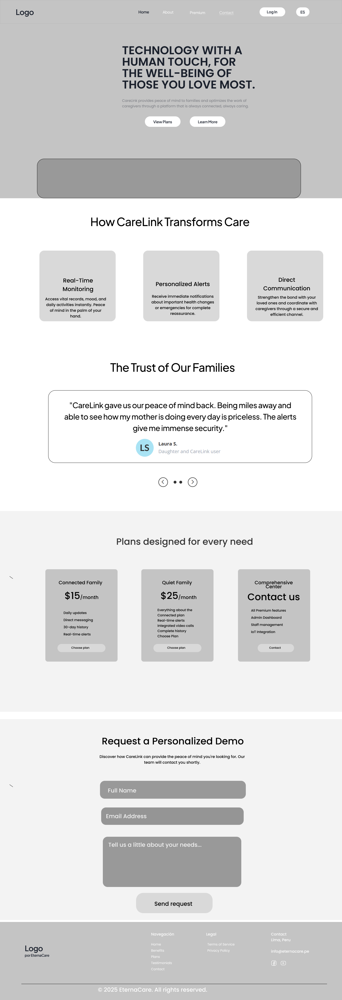

<div align="center">


# Universidad Peruana de Ciencias Aplicadas

### **CURSO:** Desarrollo de Aplicaciones Open Source


### **NRC**: 4334

### **Profesor:** Hugo Allan Mori Paiva


### **Ingeniería de software**

## Informe de Trabajo Final


### **Nombre del startup:* EternaCare*

### **Nombre del producto:* Carlink*


## **Integrantes**


| **Nombre**                             | **Código**   |
| -------------------------------------- | ------------ |
| **Fiorella Angela Vilca Valverde**     | U20211E417   |
| **Italo Sebastian Verona Flores**      | U20221E617   |
| **Josue Antonio Flores Apaico**        | U20201F773   |
| **Mauricio Rigoberto Muñoz Vilcapoma** | U202217212   |


Agosto 2025

## Registro de Versiones del Informe

<table>
  <thead>
    <tr>
      <th>Versión</th>
      <th>Fecha</th>
      <th>Autor</th>
      <th>Descripción de modificación</th>
    </tr>
  </thead>
  <tbody>
<tr>
      <td>0.1</td>
      <td>2025-09-08</td>
      <td>Josue Antonio Flores Apaico	</td>
      <td>Desarrollo de los ítems: 1.1. Startup Profile 
1.1.1. Descripción de la Startup ,1.1.2. Perfiles de integrantes del equipo ,1.2. Solution Profile ,1.2.1  Antecedentes y problemática ,1.2.2 Lean UX Process. ,1.2.2.1.Lean UX Problem Statements 1.2.2.2. Lean UX Assumptions. 1.2.2.3.Lean UX Hypothesis Statements 1.2.2.4.Lean UX Canvas 1.3.Segmentos objetivo 
 </td>
    </tr>
     <tr>
      <td>0.2</td>
      <td>2025-09-12</td>
      <td>Italo Sebastian Verona Flores, Josue Antonio Flores Apaico, Fiorella Angela Vilca Valverde y Mauricio Rigoberto Muñoz Vilcapoma</td>
      <td>Desarrollo de los ítems: 2.1. Competidores, 2.1.1. Análisis competitivo, 2.1.2. Estrategias y tácticas frente a competidores, 2.2. Entrevistas, 2.2.1. Diseño de entrevistas, 2.2.2. Registro de entrevistas, 2.2.3. Análisis de entrevistas, 2.3. Needfinding, 2.3.1. User Personas, 2.3.2. User Task Matrix, 2.3.3. User Journey Mapping, 2.3.4. Empathy Mapping, 2.3.5. As-is Scenario Mapping, 2.4. Ubiquitous Language. </td>
    </tr>
    <tr>
      <td>0.3</td>
      <td>2025-09-14</td>
      <td>Italo Sebastian Verona Flores y Fiorella Angela Vilca Valverde </td>
      <td>Desarrollo de los ítems: 3.1.To-Be Scenario Mapping, 3.2.Avance de User Stories (12 user stories), 3.3. Impact Mapping y 3.4. Product Backlog. </td>
    </tr>
    <tr>
      <td>0.4</td>
      <td>2025-09-18</td>
      <td>Italo Sebastian Verona Flores, Josue Antonio Flores Apaico, Fiorella Angela Vilca Valverde y Mauricio Rigoberto Muñoz Vilcapoma</td>
      <td>Desarrollo de los ítems: 3.2.User Stories 4.1. Style Guidelines, 4.1.1. General Style Guidelines, 4.1.2. Web Style Guidelines, 4.2. Information Architecture, 4.2.1. Organization Systems, 4.2.2. Labeling Systems, 4.2.3. SEO Tags and Meta Tags, 4.2.4. Searching Systems, 4.2.5. Navigation Systems, 4.3. Landing Page UI Design, 4.3.1. Landing Page Wireframe, 4.3.2. Landing Page Mock-up, 4.4. Web Applications UX/UI Design, 4.4.1. Web Applications Wireframes, 4.4.2. Web Applications Wireflow Diagrams, 4.4.3. Web Applications Mock-ups, 4.4.4. Web Applications User Flow Diagrams, 4.5. Web Applications Prototyping, 4.6. Domain-Driven Software Architecture, 4.6.1. Software Architecture Context Diagram, 4.6.2. Software Architecture Container Diagrams, 4.6.3. Software Architecture Components Diagrams, 4.7. Software Object-Oriented Design, 4.7.1. Class Diagrams, 4.7.2. Class Dictionary, 4.8. Database Design, 4.8.1. Database Diagram.  </td>
    </tr>
    <tr>
      <td>0.5</td>
      <td>2025-09-20</td>
      <td>Italo Sebastian Verona Flores, Josue Antonio Flores Apaico, Fiorella Angela Vilca Valverde y Mauricio Rigoberto Muñoz Vilcapoma</td>
      <td>Desarrollo de los ítems:  5.1. Software Configuration Management, 5.1.1. Software Development Environment Configuration, 5.1.2. Source Code Management, 5.1.3. Source Code Style Guide & Conventions, 5.1.4. Software Deployment Configuration, 5.2. Landing Page, Services & Applications Implementation, 5.2.1. Sprint 1, 5.2.1.1. Sprint Planning 1, 5.2.1.2. Aspect Leaders and Collaborators, 5.2.1.3. Sprint Backlog 1, 5.2.1.4. Development Evidence for Sprint Review, 5.2.1.5. Execution Evidence for Sprint Review, 5.2.1.6. Services Documentation Evidence for Sprint Review, 5.2.1.7. Software Deployment Evidence for Sprint Review, 5.2.1.8. Team Collaboration Insights during Sprint.  </td>
    </tr>
    <tr>
      <td>1.0</td>
      <td>2025-09-21</td>
      <td>Josue Antonio Flores Apaico y Fiorella Angela Vilca Valverde</td>
      <td>Revisión completa hasta el capitulo 5, corrección ortográfica y coherencia global del reporte.</td>
    </tr>
  </tbody>
</table>

</div>

## Project Report Collaboration Insights

| Tipo de Enlace                      | URL                                                                                   |
|------------------------------------|----------------------------------------------------------------------------------------|
| **Landing Page**                   | `https://eternacare-opensource.github.io/landing-page/`     |
| **Repositorio de la organización** | `https://github.com/EternaCare-OpenSource`                                |
| **Repositorio del reporte**        | `https://github.com/EternaCare-OpenSource/report.git`         |


Entrega TB1 (27/04/2025):


Para esta primera entrega se desarollaron los capítulos del 1 al 5 y el sprint 1, en imagenes adjuntadas se evidencia del trabajo colaborativo de github. Todos los integrantes del grupo trabajaron en el proyecto.

Distribución de commits:

* Fiorella Angela Vilca Valverde: 21 commits
* Italo Sebastian Verona Flores: 52 commits
* Flores Apaico Josue Antonio: 46 commits
* Mauricio Rigoberto Muñoz Vilcapoma: 11 commits

## Contenido

- [Universidad Peruana de Ciencias Aplicadas](#universidad-peruana-de-ciencias-aplicadas)
    - [**CURSO:** Desarrollo de Aplicaciones Open Source](#curso-desarrollo-de-aplicaciones-open-source)
    - [**NRC**: 4334](#nrc-4334)
    - [**Profesor:** Hugo Allan Mori Paiva](#profesor-hugo-allan-mori-paiva)
    - [**Ingeniería de software**](#ingeniería-de-software)
  - [Informe de Trabajo Final](#informe-de-trabajo-final)
    - [**Nombre de la startup:** EternaCare](#nombre-del-startup-apx-01)
    - [**Nombre del producto:** Carlink](#nombre-del-producto-eduhive)
  - [**Integrantes**](#integrantes)
  - [Registro de Versiones del Informe](#registro-de-versiones-del-informe)
  - [Project Report Collaboration Insights](#project-report-collaboration-insights)
  - [Contenido](#contenido)
  - [Student Outcome](#student-outcome)
  - [Capitulo I](#capitulo-i)
    - [1.1. Startup Profile](#11-startup-profile)
      - [1.1.1. Descripción de la Startup](#111-descripción-de-la-startup)
      - [1.1.2. Perfiles de integrantes del equipo](#112-perfiles-de-integrantes-del-equipo)
    - [1.2. Solution Profile](#12-solution-profile)
      - [1.2.1. Antecedentes y problemática](#121-antecedentes-y-problemática)
      - [1.2.2. Lean UX Process](#122-lean-ux-process)
        - [1.2.2.1. Lean UX Problem Statements](#1221-lean-ux-problem-statements)
        - [1.2.2.2. Lean UX Assumptions](#1222-lean-ux-assumptions)
        - [1.2.2.3. Lean UX Hypothesis Statements](#1223-lean-ux-hypothesis-statements)
        - [1.2.2.4. Lean UX Canvas](#1224-lean-ux-canvas)
    - [1.3. Segmentos Objetivo](#13-segmentos-objetivo)
    - [**Segmento Objetivo 1: Estudiantes Universitarios**](#segmento-objetivo-1-estudiantes-universitarios)
    - [**Segmento Objetivo 2: Profesores Universitarios**](#segmento-objetivo-2-profesores-universitarios)
  - [Capítulo II: Requirements Elicitation \& Analysis](#capítulo-ii-requirements-elicitation--analysis)
    - [2.1. Competidores](#21-competidores)
      - [2.1.1. Análisis competitivo](#211-análisis-competitivo)
      - [2.1.2. Estrategias y tácticas frente a competidores](#212-estrategias-y-tácticas-frente-a-competidores)
    - [2.2. Entrevistas](#22-entrevistas)
      - [2.2.1. Diseño de entrevistas](#221-diseño-de-entrevistas)
      - [2.2.2. Registro de entrevistas](#222-registro-de-entrevistas)
      - [2.2.3. Análisis de entrevistas](#223-análisis-de-entrevistas)
    - [2.3. Needfinding](#23-needfinding)
      - [2.3.1. User Personas](#231-user-personas)
      - [2.3.2. User Task Matrix](#232-user-task-matrix)
      - [2.3.3. User Journey Mapping](#233-user-journey-mapping)
      - [2.3.4. Empathy Mapping](#234-empathy-mapping)
      - [2.3.5. As-is Scenario Mapping](#235-as-is-scenario-mapping)
    - [2.4. Ubiquitous Language](#24-ubiquitous-language)
  - [Capítulo III: Requirements specification](#capítulo-iii-requirements-specification)
    - [3.1. To-Be Scenario Mapping](#31-to-be-scenario-mapping)
    - [3.2. User Stories](#32-user-stories)
    - [3.3. Impact Mapping](#33-impact-mapping)
    - [3.4. Product Backlog](#34-product-backlog)
  - [Capítulo IV: Product Design](#capítulo-iv-product-design)
    - [4.1. Style Guidelines](#41-style-guidelines)
      - [4.1.1. General Style Guidelines](#411-general-style-guidelines)
      - [4.1.2. Web Style Guidelines](#412-web-style-guidelines)
    - [4.2. Information Architecture](#42-information-architecture)
      - [4.2.1. Organization Systems](#421-organization-systems)
      - [4.2.2. Labeling Systems](#422-labeling-systems)
      - [4.2.3. SEO Tags and Meta Tags](#423-seo-tags-and-meta-tags)
      - [4.2.4. Searching Systems](#424-searching-systems)
      - [4.2.5. Navigation Systems](#425-navigation-systems)
    - [4.3. Landing Page UI Design](#43-landing-page-ui-design)
      - [4.3.1. Landing Page Wireframe](#431-landing-page-wireframe)
      - [4.3.2. Landing Page Mock-up](#432-landing-page-mock-up)
    - [4.4. Web Applications UX/UI Design](#44-web-applications-uxui-design)
      - [4.4.1. Web Applications Wireframes](#441-web-applications-wireframes)
      - [4.4.2. Web Applications Wireflow Diagrams](#442-web-applications-wireflow-diagrams)
      - [4.4.2. Web Applications Mock-ups](#442-web-applications-mock-ups)
      - [4.4.3. Web Applications User Flow Diagrams](#443-web-applications-user-flow-diagrams)
    - [4.5. Web Applications Prototyping](#45-web-applications-prototyping)
    - [4.6. Domain-Driven Software Architecture](#46-domain-driven-software-architecture)
      - [4.6.1. Software Architecture Context Diagram](#461-software-architecture-context-diagram)
      - [4.6.2. Software Architecture Container Diagrams](#462-software-architecture-container-diagrams)
      - [4.6.3. Software Architecture Components Diagrams](#463-software-architecture-components-diagrams)
    - [4.7. Software Object-Oriented Design](#47-software-object-oriented-design)
      - [4.7.1. Class Diagrams](#471-class-diagrams)
      - [4.7.2. Class Dictionary](#472-class-dictionary)
    - [4.8. Database Design](#48-database-design)
      - [4.8.1. Database Diagram](#481-database-diagram)
  - [Capítulo V: Product Implementation, Validation \& Deployment](#capítulo-v-product-implementation-validation--deployment)
    - [5.1. Software Configuration Management](#51-software-configuration-management)
      - [5.1.1. Software Development Environment Configuration](#511-software-development-environment-configuration)
      - [5.1.2. Source Code Management](#512-source-code-management)
      - [5.1.3. Source Code Style Guide \& Conventions](#513-source-code-style-guide--conventions)
      - [5.1.4. Software Deployment Configuration](#514-software-deployment-configuration)
    - [5.2. Landing Page, Services \& Applications Implementation.](#52-landing-page-services--applications-implementation)
      - [5.2.1. Sprint 1](#521-sprint-1)
        - [5.2.1.1. Sprint Planning 1](#5211-sprint-planning-1)
        - [5.2.1.2. Aspect Leaders and Collaborators](#5212-aspect-leaders-and-collaborators)
        - [5.2.1.3. Sprint Backlog 1](#5213-sprint-backlog-1)
        - [5.2.1.4. Development Evidence for Sprint Review](#5214-development-evidence-for-sprint-review)
        - [5.2.1.5. Execution Evidence for Sprint Review](#5215-execution-evidence-for-sprint-review)
        - [5.2.1.6. Services Documentation Evidence for Sprint Review](#5216-services-documentation-evidence-for-sprint-review)
        - [5.2.1.7. Software Deployment Evidence for Sprint Review](#5217-software-deployment-evidence-for-sprint-review)
        - [5.2.1.8. Team Collaboration Insights during Sprint](#5218-team-collaboration-insights-during-sprint)
      - [5.2.2. Sprint 2](#522-sprint-2)
        - [5.2.2.1. Sprint Planning 2](#5221-sprint-planning-2)
        - [5.2.2.2. Aspect Leaders and Collaborators](#5222-aspect-leaders-and-collaborators)
        - [5.2.2.3. Sprint Backlog 2](#5223-sprint-backlog-2)
        - [5.2.2.4. Development Evidence for Sprint Review](#5224-development-evidence-for-sprint-review)
        - [5.2.2.5. Execution Evidence for Sprint Review](#5225-execution-evidence-for-sprint-review)
        - [5.2.2.6. Services Documentation Evidence for Sprint Review](#5226-services-documentation-evidence-for-sprint-review)
        - [5.2.2.7. Software Deployment Evidence for Sprint Review](#5227-software-deployment-evidence-for-sprint-review)
        - [5.2.2.8. Team Collaboration Insights during Sprint](#5228-team-collaboration-insights-during-sprint)
  - [Conclusiones](#conclusiones)
  - [Bibliografía](#bibliografía)
  - [Anexos](#anexos)


## Student Outcome

El curso contribuye al cumplimiento del Student Outcome ABET:
ABET – EAC - Student Outcome 3
Criterio: Capacidad de comunicarse efectivamente con un rango de audiencias.
En el siguiente cuadro se describe las acciones realizadas y enunciados de
conclusiones por parte del grupo, que permiten sustentar el haber alcanzado el logro
del ABET – EAC - Student Outcome 3.

| Criterio específico | Acciones realizadas | Conclusiones |
|---------------------|---------------------|--------------|
| **Comunica oralmente con efectividad a diferentes rangos de audiencia.** | **Fiorella Angela Vilca Valverde (TB1):** Yo presenté de manera clara los objetivos de la investigación, expliqué en detalle la metodología aplicada durante el desarrollo del trabajo y participé en la introducción oral del informe, procurando transmitir las ideas con orden y precisión.<br><br>**Italo Sebastian Verona Flores (TB1):** Yo expuse los objetivos de la investigación con un enfoque estructurado, desarrollé la explicación de la metodología frente a la clase y reforcé la presentación de la introducción, contribuyendo a la coherencia general de la exposición oral.<br><br>**Josue Antonio Flores Apaico (TB1):** Yo comuniqué los objetivos principales del proyecto, expliqué la metodología ante la audiencia y participé en la exposición de la introducción del informe, asegurando que el mensaje se transmitiera de forma clara y entendible.<br><br>**Mauricio Rigoberto Muñoz Vilcapoma (TB1):** Yo me encargué de exponer los objetivos de la investigación, brindar una explicación detallada de la metodología utilizada y presentar parte de la introducción del informe, demostrando seguridad y dominio del tema. | En conjunto, nuestras presentaciones orales permitieron transmitir los resultados con claridad tanto a un público técnico como no técnico. Supimos adaptar el discurso según la audiencia, lo que facilitó la comprensión del tema y generó confianza en la exposición. La comunicación oral fortaleció el impacto del proyecto y consolidó nuestro trabajo en equipo. |
| **Comunica por escrito con efectividad a diferentes rangos de audiencia.** | **Fiorella Angela Vilca Valverde (TB1):** Yo elaboré la introducción del informe con un estilo claro y organizado, participé en la redacción de la metodología y estructuré los objetivos de manera comprensible para distintos lectores.<br><br>**Italo Sebastian Verona Flores (TB1):** Yo redacté apartados del informe vinculados a la metodología, colaboré en la presentación escrita de los objetivos y revisé la introducción para asegurar la coherencia del documento.<br><br>**Josue Antonio Flores Apaico (TB1):** Yo trabajé en la redacción de la introducción, formulé los objetivos por escrito con precisión y colaboré en la explicación de la metodología dentro del informe, cuidando la claridad de la redacción.<br><br>**Mauricio Rigoberto Muñoz Vilcapoma (TB1):** Yo me encargué de la redacción de la metodología, participé en la presentación escrita de los objetivos y ayudé en la organización de la introducción, procurando la cohesión y el estilo del informe. | El trabajo escrito reflejó la participación activa de todos los integrantes y dio como resultado un documento bien estructurado y coherente. Logramos transmitir nuestras ideas de forma clara y adaptarlas a distintos públicos, desde lectores especializados hasta no técnicos. El informe final consolidó nuestras conclusiones y mostró la efectividad de nuestra comunicación escrita. |


## Capitulo I

### 1.1. Startup Profile

#### 1.1.1. Descripción de la Startup

Somos **EternaCare**, una startup fundada por estudiantes comprometidos con el bienestar social, con la visión de transformar la experiencia de vida de los adultos mayores mediante soluciones tecnológicas innovadoras que eleven la calidad del cuidado, tanto en centros geriátricos como en el hogar.

Hemos desarrollado **CareLink**, una plataforma digital que permite monitorear en tiempo real el estado físico, emocional y mental de las personas mayores. La solución ofrece reportes detallados, alertas personalizadas y herramientas de comunicación que facilitan la coordinación entre cuidadores, familiares y personal de salud, sin importar si el cuidado se brinda en un centro especializado o en casa.

De esta forma, no solo fortalecemos la atención y el acompañamiento, sino que también brindamos tranquilidad y confianza a las familias, asegurando que sus seres queridos estén bien atendidos y conectados.

Con miras al futuro, proyectamos la integración de tecnología IoT para conectar dispositivos inteligentes como wearables de salud, sensores de movimiento y sistemas de monitoreo ambiental. Esto permitirá un seguimiento más preciso, preventivo y personalizado, anticipando necesidades y mejorando la seguridad y bienestar de los adultos mayores.

**Misión**: Empoderar a los adultos mayores y a sus familias a través de herramientas digitales que mejoren la comunicación, el monitoreo de la salud y la calidad de vida, en el hogar y en centros de cuidado.

**Visión**: En EternaCare, aspiramos a ser la plataforma líder en el cuidado integral de adultos mayores, impulsando conexiones más significativas y apoyándonos en tecnologías emergentes como el IoT para ofrecer soluciones innovadoras de bienestar.

#### 1.1.2. Perfiles de integrantes del equipo

<table>
  <tr>
    <th colspan="2">Verona Flores Italo Sebastian</th>
  </tr>
  <tr>
    <td>  </td>
    <td>Estudiante de Ingeniería de Software en la Universidad Peruana de Ciencias Aplicadas (UPC). Apasionado por la tecnología y el desarrollo de software, con habilidades en programación web, bases de datos y diseño de interfaces. Experiencia en proyectos académicos y personales que demuestran su capacidad para trabajar en equipo y resolver problemas técnicos. </td>
  </tr>
  <tr>
    <th colspan="2"> Fiorella Vilca Valverde</th>
  </tr>
  <tr>
    <td>  </td>
    <td> Soy Fiorella Angela Vilca Valverde, tengo 23 años y actualmente estoy cursando 7mo ciclo de la carrera Ingeniería de Software en la Universidad Peruana de Ciencias Aplicadas (U.P.C). Elegí esta carrera porque siempre quería saber de las funcionalidades de la computadora y aprender cada día más sobre los lenguajes de programación. Me considero una persona muy sociable, perseverante, responsable, trabajar en equipo y sobre todo leal. Tengo conocimientos en lenguaje de programación C++, Python y Matlab Básico. </td>
  </tr>
  <tr>
    <th colspan="2">Mauricio Muñoz</th>
  </tr>
  <tr>
    <td>  </td>
    <td> Soy Muñoz Vilcapoma Mauricio, estudiante de Ingeniería de Software, con el objetivo de aportar de manera significativa al mundo tecnológico a través del desarrollo de soluciones innovadoras y de alto impacto. Estoy comprometido con mi crecimiento profesional y con generar un aporte real en el campo de la ingeniería de software.
    
 </td>
  </tr>
  <tr>
    <th colspan="2">Josue Flores Apaico</th>
  </tr>
  <tr>
    <td>  </td>
    <td> Soy Josue Flores es una persona creativa, perseverante y empática, con interés en áreas como la Inteligencia Artificial, ciberseguridad y ciencia de datos. Busca aplicar sus conocimientos en C++, Python, C# y Java dentro de una startup tecnológica, impulsando la innovación y la mejora continua. Cuenta con experiencia práctica en proyectos y participación en conferencias de ciberseguridad. </td>
  </tr>
</table>

### 1.2. Solution Profile

#### 1.2.1. Antecedentes y problemática

**1. What / ¿QUÉ?**
- ¿Cuál es el problema que se está presentando?

El problema es la falta de transparencia y comunicación efectiva entre los asilos y los familiares sobre el estado de salud y bienestar de los adultos mayores.

**2. When / ¿CUÁNDO?**
- ¿Cuándo estamos viendo el problema?

El problema se presenta de manera continua y cotidiana, en distintos momentos del cuidado

- ¿En qué momento del día o del proceso en cuestión?

Ocurre principalmente durante visitas esporádicas, llamadas ocasionales o en situaciones críticas de salud cuando la información no llega a tiempo.

**3. Where / ¿DÓNDE?**

- ¿Dónde estamos viendo los problemas?

Estamos observando los problemas tanto en centros geriátricos como en los hogares donde adultos mayores reciben cuidado por parte de familiares o cuidadores informales.

- ¿En qué parte del proceso estamos viendo el problema?

El problema aparece en la etapa de organización y seguimiento del trabajo colaborativo, ya que las herramientas actuales no facilitan una coordinación efectiva entre los estudiantes.

**4. Who / ¿QUIÉN?**

- ¿A quién le sucede?

El problema afecta principalmente a los adultos mayores, a sus familiares que necesitan información clara y oportuna, y a los cuidadores (formales e informales) que enfrentan dificultades para dar un seguimiento continuo y de calidad.

- ¿El problema está relacionado con las habilidades de las personas?

No, está relacionado con la falta de herramientas tecnológicas, no con las capacidades de los cuidadores o familiares.

**5. Why / ¿POR QUÉ?**

- ¿Por qué sucede el problema?

Porque no existen herramientas tecnológicas accesibles que permitan un monitoreo constante y una comunicación efectiva entre adultos mayores, cuidadores, personal médico y familiares.

**6. How / ¿CÓMO?**

- ¿Cómo se diferencia el problema del estado normal (óptimo)?

En el problema actual, el cuidado se da con información limitada, comunicación tardía y sin monitoreo continuo.

Y en el estado óptimo, el adulto mayor recibe un seguimiento constante y personalizado, los cuidadores cuentan con apoyo tecnológico y las familias tienen información clara y en tiempo real.

- ¿La tendencia en la que aparece el problema es aleatoria o sigue un patrón?

Sigue un patrón, ya que ocurre de forma recurrente en el cuidado diario de los adultos mayores: falta de monitoreo continuo, comunicación limitada y ausencia de alertas oportunas.

**7. How Much / ¿CUÁNTO?**

- ¿Cuántos problemas se dan en un día, una semana o un mes?

Cada grupo puede enfrentar dificultades de coordinación varias veces por semana, especialmente en etapas críticas del curso.

- ¿Cuánto dinero están implicando?

Aunque no hay un gasto directo, las instituciones podrían ahorrar hasta un 30% del tiempo de gestión docente si existiera una solución automatizada que facilite el seguimiento y organización de los grupos de estudio.

#### 1.2.2. Lean UX Process

El Lean UX process es una metodología de diseño iterativa que coloca al usuario como eje central, fomentando la colaboración constante del equipo y el trabajo en ciclos cortos. Su enfoque se basa en la investigación, las pruebas rápidas y la validación continua de las ideas para confirmar su efectividad. A diferencia de los enfoques tradicionales, minimiza la documentación extensa y prioriza la retroalimentación temprana, lo que permite validar o descartar hipótesis de forma ágil y asegurar que las soluciones respondan a las necesidades reales de los usuarios.

##### 1.2.2.1. Lean UX Problem Statements

**Problem Statment 1:**
* **Usuarios**: Familiares de adultos mayores que viven en asilos o reciben cuidado en casa.
* **Necesidad**: Requieren mantenerse informados sobre la salud y el bienestar de sus seres queridos, pero actualmente no cuentan con acceso a información en tiempo real ni con canales de comunicación confiables y efectivos.

**Problem Statment 2:**
* **Usuarios**: Cuidadores formales en asilos y cuidadores informales en el hogar.
* **Necesidad**: Necesitan una manera práctica y eficiente de registrar, organizar y compartir información sobre el estado físico y emocional de los adultos mayores, sin que esto interfiera con sus tareas de cuidado diarias.

**Problem Statment 3:**
* **Usuarios**: Directores y administradores de centros geriátricos, así como familiares responsables de la gestión del cuidado en casa.
* **Necesidad**: Buscan garantizar una atención de calidad y mantener la confianza de las familias, pero carecen de herramientas basadas en datos que respalden decisiones informadas y permitan un seguimiento integral del cuidado.

##### 1.2.2.2. Lean UX Assumptions

### User Assumptions (Suposiciones de Usuario)

**¿Quiénes son nuestros usuarios?**<br>
Nuestros usuarios son los familiares de adultos mayores, el personal de cuidado (enfermeros, cuidadores formales e informales) y los administradores de centros geriátricos. También consideramos a los profesionales de la salud que buscan mejorar la atención a través de la tecnología. La solución está pensada tanto para el cuidado institucional como para el cuidado en el hogar.

**¿Dónde encaja muestro producto en su trabajo o vida?**<br>
CareLink se integra de manera natural en las rutinas de cuidado. Para los familiares, representa una fuente confiable de información y tranquilidad sobre sus seres queridos, ya sea que estén en un asilo o en casa. Para el personal de cuidado, facilita el registro y análisis de datos de salud. Y para los administradores o familiares responsables en el hogar, permite supervisar mejor la calidad de la atención y mantener una comunicación más clara con quienes participan en el cuidado.

**¿Qué problema podría afrontar nuestro producto y cómo podemos resolverlo?**<br>
* **Problema:** Actualmente, los familiares suelen sentirse desconectados o preocupados por la falta de información sobre la salud y el bienestar de los adultos mayores. A la par, el personal enfrenta sobrecarga administrativa debido a registros manuales y comunicación dispersa. 
* **Solución:** CareLink soluciona esto al centralizar la información clínica y emocional, brindar actualizaciones en tiempo real a las familias y optimizar el trabajo de cuidadores y responsables mediante registros intuitivos, alertas inteligentes y canales de comunicación directos.

**¿Cuándo y cómo se utiliza?** <br>
CareLink puede usarse en cualquier momento desde un dispositivo móvil o computadora. El personal lo emplea en su rutina de cuidado para registrar observaciones, los familiares acceden para consultar información y comunicarse con los cuidadores, y los administradores o responsables del hogar lo utilizan para generar reportes, evaluar la calidad del cuidado y dar seguimiento preventivo.

**¿Qué características son importantes?** <br>

* Registro ágil y sencillo del estado físico y emocional de los adultos mayores.

* Actualizaciones en tiempo real accesibles para familiares.

* Alertas automáticas ante riesgos o cambios significativos.

* Panel de control con reportes visuales para administradores o familiares responsables.

* Canal de comunicación directo entre familias y cuidadores.

**¿Cómo debe verse nuestro producto y cómo comportarse?** <br>
La plataforma debe tener un diseño cálido, humano y profesional, con una interfaz clara y accesible tanto para cuidadores en asilos como para familiares en el hogar. Debe transmitir confianza, mostrar la información de manera visual y fácil de entender, y funcionar de forma fluida, segura y confiable, siempre centrada en el bienestar del adulto mayor y en fortalecer la conexión emocional con sus familias.

### Business Assumptions (Suposiciones de Negocio)

**Necesidades y problemas**
- **Familiares:** falta de información clara y en tiempo real sobre el estado de sus seres queridos.
- **Cuidadores:** carga administrativa elevada por registros manuales y comunicación dispersa.
- **Administradores/responsables en hogar:** ausencia de datos confiables para la toma de decisiones.


**Plataforma**
- Aplicación web y móvil que centraliza información clínica y emocional.
- Actualizaciones en tiempo real, paneles visuales y canales de comunicación seguros.
- Diseñada tanto para centros geriátricos como para el cuidado en el hogar.


**Segmentación**
- Familiares de adultos mayores (visitantes remotos y responsables en hogar).
- Cuidadores formales: enfermeros, asistentes en centros geriátricos.
- Cuidadores informales: familiares que cuidan en casa.
- Administradores y profesionales de la salud interesados en datos.


**Comportamientos**
- Consultas frecuentes por tranquilidad y seguimiento.
- Registros rutinarios durante las actividades de cuidado.
- Administradores revisando reportes y tendencias para tomar decisiones.

**Beneficios:**
- **Familiares:** mayor confianza, conexión y reducción de ansiedad.
- **Cuidadores:** menos carga administrativa y más tiempo para atención directa.
- **Administradores:** decisiones basadas en datos y supervisión clara del servicio.


**Captación de clientes:**
- Marketing digital y redes sociales orientado a familiares y cuidadores.
- Alianzas con centros geriátricos, aseguradoras y asociaciones de adultos mayores.
- Programas piloto y recomendaciones por boca a boca.


**Modelo de ingresos:**
- Suscripciones mensuales para familias y centros.
- Licencias institucionales y planes empresariales para asilos.
- Servicios premium: integración IoT, reportes avanzados y soporte priorizado.


**Competencia:**
- Apps de gestión de salud y comunicación similares.
- Diferenciador: enfoque integral para centros y hogares, información en tiempo real y conexión emocional.


### Technical Assumptions (Suposiciones Técnicas)

**Tecnología utilizada:**
- **Frontend:** React/Angular/Vue o frameworks multiplataforma (Flutter) para web y móvil.
- **Backend:** API REST/GraphQL en la nube, base de datos con cifrado.
- **Notificaciones en tiempo real:** WebSockets o servicios push.

**Integraciones:** <br>
Dispositivos IoT (wearables, sensores ambientales), pasarelas de pago y sistemas de mensajería.

**Escalabilidad:**<br>
Arquitectura de microservicios o servidores escalables, colas para eventos y particionado de datos.

### Market Assumptions (Suposiciones de Mercado)

**Tamaño del mercado:**<br>
Mercado en expansión por el envejecimiento poblacional y demanda de soluciones remotas.

**Competencia:**<br>
Presencia de apps de salud y plataformas locales; oportunidad en la integración hogar-centro.

**Tendencias:**<br>
Telemedicina, monitoreo remoto y adopción de IoT en salud.

### Design Assumptions (Suposiciones de Diseño)

**Interacción del usuario:**<br>
Filtros por residente, tipo de alerta y rol de usuario (familiar, cuidador, admin).


**Experiencia del usuario:**<br>
Flujos simples, accesibilidad y accesos diferenciados según perfil.


**Colores y tipografía:**<br>
Paleta cálida y profesional; tipografías legibles y tamaños adecuados para lectura rápida.


**Preferencias visuales:**<br>
Diseño minimalista, enfoque en visualizaciones (gráficos, timelines) y mensajes claros.


**Prototipos y pruebas:**<br>
Pruebas de usabilidad con familiares, cuidadores y administradores; iteración rápida según feedback.

##### 1.2.2.3. Lean UX Hypothesis Statements

### Hypothesis Statement 01:

- **Creemos que** al optimizar el registro y la organización de datos por parte del personal de cuidado, se reducirá la carga administrativa y podrán dedicar más tiempo a la atención directa. 
- **Sabremos que** hemos tenido éxito cuando los cuidadores reporten un ahorro considerable en tareas administrativas y mayor satisfacción laboral. 
- **Sabremos que** esto es verdad porque se evidenciará un incremento en la cantidad de observaciones clínicas completas y registradas oportunamente.

### Hypothesis Statement 02:

- **Creemos que** al proporcionar a los administradores información clara y confiable sobre el estado de los residentes, se reforzará la capacidad de tomar decisiones orientadas a mejorar la calidad del servicio. 
- **Sabremos que** tenido éxito cuando los directivos utilicen estos datos para implementar mejoras y expresen mayor confianza en sus decisiones. 
- **Sabremos que** esto es verdad porque se verá un incremento en la aplicación de políticas basadas en evidencia y mayor satisfacción en las familias.

### Hypothesis Statement 03:

- **Creemos que** al ofrecer un acceso ágil y confiable a la información sobre la salud de los residentes, los familiares disminuirán su nivel de ansiedad y tendrán una percepción más positiva del cuidado recibido. 
- **Sabremos que** hemos tenido éxito cuando más del 70% de ellos manifiesten sentirse mejor informados y tranquilos en las encuestas periódicas. 
- **Sabremos que** esto es verdad porque aumentará la frecuencia y duración de las consultas realizadas por los familiares en la plataforma.

### Hypothesis Statement 04:

- **Creemos que** al ofrecer a los familiares acceso remoto y disponible en todo momento, aumentará su percepción de acompañamiento y participación en el cuidado de sus seres queridos. 
- **Sabremos que** hemos tenido éxito cuando crezca la frecuencia de accesos y consultas fuera del horario de visitas. 
- **Sabremos que** esto es verdad porque los familiares expresarán una mayor conexión emocional y compromiso con el proceso de cuidado.

### Hypothesis Statement 05:

- **Creemos que** al reducir la dependencia de canales de comunicación informales y dispersos, se minimizarán los errores y malentendidos en la atención a los residentes. 
- **Sabremos que** hemos tenido éxito cuando disminuya el número de incidentes relacionados con falta de información o errores comunicativos. 
- **Sabremos que** esto es verdad porque se presentarán menos quejas formales y reclamaciones tanto de familiares como del personal.

### Hypothesis Statement 06:

- **Creemos que** al facilitar la interpretación de tendencias y variaciones en el bienestar físico y emocional de los residentes, el personal podrá anticipar complicaciones y mejorar el seguimiento individualizado. 
- **Sabremos que** hemos tenido éxito cuando los cuidadores reporten un uso constante de estas herramientas y mayor efectividad en intervenciones preventivas. 
- **Sabremos que** esto es verdad porque se reducirá la aparición de complicaciones derivadas de deterioros no detectados a tiempo.

### Hypothesis Statement 07:

- **Creemos que** al integrar recordatorios automáticos de medicamentos y citas médicas, los familiares tendrán mayor tranquilidad al saber que no se olvidan tareas críticas.
- **Sabremos que** hemos tenido éxito cuando se reduzcan los reportes de dosis omitidas. 
- **Sabremos que** esto es verdad porque aumentará la puntualidad en la administración de tratamientos.

### Hypothesis Statement 08:

- **Creemos que** al ofrecer un historial clínico digital centralizado, se facilitará la continuidad de atención entre distintos médicos y cuidadores. 
- **Sabremos que** hemos tenido éxito cuando los profesionales reporten menos pérdida de información. 
- **Sabremos que** esto es verdad porque los historiales estarán completos y actualizados en todo momento.

### Hypothesis Statement 09:

- **Creemos que** al permitir el seguimiento de la actividad física y movilidad, se promoverá un estilo de vida más activo en los adultos mayores. 
- **Sabremos que** hemos tenido éxito cuando aumente la cantidad de registros de actividad en la plataforma. 
- **Sabremos que** esto es verdad porque mejorarán indicadores de movilidad y bienestar físico.

### Hypothesis Statement 10:

- **Creemos que** al incluir herramientas para monitorear el estado emocional (ánimo, interacciones sociales), se logrará detectar aislamiento o depresión de manera temprana. S
- **Sabremos que** hemos tenido éxito cuando los cuidadores reporten intervenciones oportunas. 
- **Sabremos que** esto es verdad porque se reducirán los casos de deterioro emocional no atendidos.

### Hypothesis Statement 11:

- **Creemos que** al permitir que los familiares dejen mensajes de apoyo o notas motivacionales, se reforzará la conexión emocional con los residentes. 
- **Sabremos que** hemos tenido éxito cuando aumente la interacción dentro de la plataforma. 
- **Sabremos que** esto es verdad porque los residentes se sentirán más acompañados y valorados.

### Hypothesis Statement 12:

- **Creemos que** al ofrecer un módulo de seguimiento nutricional, se podrá identificar deficiencias alimenticias y prevenir complicaciones de salud.
- **Sabremos que** hemos tenido éxito cuando aumente el control y registro de dietas personalizadas para los residentes.
- **Sabremos que** esto es verdad porque se reducirá la incidencia de problemas relacionados con la nutrición y se observarán mejoras en los indicadores de salud alimentaria.

### Hypothesis Statement 13:

- **Creemos que** al automatizar la generación de reportes semanales para los familiares, se incrementará la transparencia y la confianza en el cuidado de los adultos mayores.
- **Sabremos que** hemos tenido éxito cuando los familiares expresen mayor satisfacción en las encuestas de seguimiento.
- **Sabremos que** esto es verdad porque disminuirá la frecuencia de reclamos relacionados con la falta de información sobre el estado de los residentes.

### Hypothesis Statement 14:

- **Creemos que** al integrar videollamadas dentro de la plataforma, se facilitará el contacto directo sin depender de herramientas externas.
- **Sabremos que** hemos tenido éxito cuando aumente la frecuencia de interacciones virtuales.
- **Sabremos que** esto es verdad porque los familiares manifestarán sentirse más presentes en la vida del residente.

### Hypothesis Statement 15:

- **Creemos que** al incluir un sistema de calificación y retroalimentación del servicio, se incentivará la mejora continua en el cuidado.
- **Sabremos que** hemos tenido éxito cuando los administradores utilicen los resultados para implementar cambios en los procesos y servicios.
- **Sabremos que** esto es verdad porque se observará un aumento en la satisfacción general de las familias y una mejora en los indicadores de calidad del cuidado.

### Hypothesis Statement 16:

- **Creemos que** al permitir la exportación de datos clínicos y emocionales en formatos estándar, se facilitará el acceso para médicos externos o nuevas instituciones.
- **Sabremos que** hemos tenido éxito cuando los profesionales externos reporten menos barreras para acceder a la información.
- **Sabremos que** esto es verdad porque disminuirá la duplicidad de exámenes y diagnósticos.

### Hypothesis Statement 17:
- **Creemos que** al integrar sensores o dispositivos wearables, se obtendrá información más precisa y continua sobre la salud de los residentes.
- **Sabremos que** hemos tenido éxito cuando aumente la cantidad de datos capturados automáticamente.
- **Sabremos que** esto es verdad porque se reducirá la dependencia del registro manual.

### Hypothesis Statement 18:

- **Creemos que** al habilitar un sistema de permisos personalizados, se garantizará la seguridad y privacidad de la información sensible.
- **Sabremos que** hemos tenido éxito cuando no se registren incidentes de accesos indebidos.
- **Sabremos que** esto es verdad porque los usuarios confiarán más en la plataforma.

### Hypothesis Statement 19:

- **Creemos que** al contar con un módulo de alertas ante caídas o emergencias, se podrá actuar con mayor rapidez en situaciones críticas.
- **Sabremos que** hemos tenido éxito cuando el tiempo de respuesta ante emergencias se reduzca significativamente.
- **Sabremos que** esto es verdad porque habrá menos consecuencias graves por falta de atención inmediata.

### Hypothesis Statement 20:

- **Creemos que** al ofrecer un sistema de agenda compartida para actividades y visitas, se coordinará mejor la participación de familiares y cuidadores.  
- **Sabremos que** hemos tenido éxito cuando aumente la asistencia a actividades programadas.  
- **Sabremos que** esto es verdad porque los residentes tendrán mayor interacción social y emocional.


##### 1.2.2.4. Lean UX Canvas


### 1.3. Segmentos Objetivo

Para el desarrollo de la solución, se han identificado dos grupos de usuarios principales cuyo perfil y necesidades son fundamentales para el dominio del problema. A continuación, se detalla cada uno, incluyendo sus características demográficas y datos estadísticos que validan su relevancia.

#### a) Red de Apoyo Familiar

* **Descripción del Perfil:**
  Este grupo está compuesto por los parientes adultos (hijos, nietos, etc.) de las personas de la tercera edad que residen en centros geriátricos. Su principal motivación es la tranquilidad y la certeza de que sus seres queridos reciben una atención de calidad, especialmente cuando la distancia o las ocupaciones les impiden realizar visitas frecuentes. Buscan un canal de comunicación y seguimiento fiable sobre el estado de salud y bienestar de sus familiares.

* **Características Demográficas:**
    * **Rango de Edad:** A partir de los 18 años.
    * **Procedencia Geográfica:** Concentrados mayormente en Lima Metropolitana, aunque también se incluyen residentes de otras regiones del Perú e incluso del extranjero que necesitan monitorear a sus familiares a distancia.
    * **Nivel Académico:** Predomina la educación secundaria completa, técnica o superior.
    * **Competencia Digital:** Son usuarios habituales de dispositivos móviles inteligentes y plataformas sociales, lo que indica una alta familiaridad con la tecnología digital.

* **Sustento Estadístico:**
    * La viabilidad de una solución digital se ve respaldada por datos del **INEI (2022)**, que indican que casi 7 de cada 10 hogares en Lima Metropolitana (69.7%) cuentan con conexión a Internet, facilitando el acceso a plataformas de seguimiento remoto.
    * Adicionalmente, información del **MIMP** sugiere que existe una considerable red de apoyo, estimando que cada adulto mayor cuenta con un promedio de al menos dos familiares directamente implicados o interesados en su supervisión y cuidado.

#### b) Personal Sanitario y de Cuidado

* **Descripción del Perfil:**
  Este segmento engloba a los profesionales que interactúan directamente con los residentes en los asilos, como personal de enfermería, médicos geriatras y cuidadores calificados. Dentro del sistema, ellos son los usuarios primarios encargados de la alimentación y actualización de los datos, registrando la información vital del día a día de los adultos mayores.

* **Características Demográficas:**
    * **Rango de Edad:** Generalmente entre 25 y 60 años.
    * **Formación Profesional:** Cuentan con estudios técnicos o universitarios en áreas de la salud.
    * **Entorno Laboral:** Desempeñan sus funciones en residencias para adultos mayores, tanto del sector público como privado, ubicadas en Lima.
    * **Competencia Digital:** Poseen experiencia en el manejo de registros electrónicos o el uso de dispositivos móviles como parte de sus herramientas de trabajo.

* **Sustento Estadístico:**
    * El mercado potencial es significativo; según cifras del **Minsa**, en Lima operan más de 1,300 instituciones dedicadas al cuidado de personas de la tercera edad.
    * La pertinencia de la herramienta es confirmada por el **Observatorio de Salud Pública del Perú**, que reporta que un 81% del personal que trabaja en estos centros considera necesaria la implementación de herramientas digitales para optimizar la calidad de la atención ofrecida. 

## Capítulo II: Requirements Elicitation & Analysis

### 2.1. Competidores

- **Competidores Directos**

Los competidores directos de EternaCare son plataformas con modelos de negocio similares, enfocadas en el cuidado y monitoreo de adultos mayores a través de soluciones digitales.

* **Quimun:** Startup chilena que se especializa en la gestión integral de residencias de adultos mayores. Su plataforma digitaliza procesos administrativos y médicos, y facilita la comunicación entre familiares y el personal de cuidado. Compite directamente en la región (Chile, Ecuador y con planes de expansión en Perú y Colombia) y ofrece funcionalidades muy parecidas a las de EternaCare, lo que la convierte en una rival clave.

  <div align="center">
    
  </div>

* **Safe365:** Esta aplicación española se centra en el **monitoreo y localización** de personas mayores. Si bien su principal función es la seguridad y la asistencia en emergencias (botón de pánico, localización en tiempo real), también incorpora comunicación familiar. Su enfoque en la seguridad se alinea con una parte importante de la propuesta de valor de CareLink.

  <div align="center">
    
* </div>

* **MiCuidum (Cuidum):** Una plataforma que se enfoca en la **gestión del cuidado a domicilio**. Permite a las familias monitorear y coordinar la atención del adulto mayor, facilitando la comunicación entre familiares, cuidadores y profesionales de la salud. Su modelo de asistencia domiciliaria la posiciona como una competidora directa, aunque con un enfoque específico en el hogar.

  <div align="center">
    
  </div>

- **Competidores Indirectos**

Los competidores indirectos de EternaCare ofrecen soluciones que satisfacen algunas de las necesidades de su público objetivo, pero con un modelo de negocio o un enfoque diferente, lo que las hace menos una amenaza directa.

* **Mon Ami:** Esta plataforma se orienta al **bienestar social y emocional**, conectando a adultos mayores con estudiantes universitarios para compañía y asistencia en actividades diarias. A diferencia de EternaCare, su enfoque no es clínico ni de monitoreo de salud, sino de acompañamiento, cubriendo una necesidad que CareLink podría considerar secundaria pero importante.
  <div align="center">
  
  </div>
* **Dispositivos Inteligentes y Asistentes de Voz:** Soluciones de IoT como **Blipcare** (monitores de salud) o asistentes como **Amazon Echo Show** compiten en el espacio de la gestión de salud desde el hogar. Ofrecen recordatorios de medicación y facilitan el día a día, pero carecen de la profundidad en el monitoreo integral y las funciones de comunicación familiar que son el núcleo de la plataforma CareLink.

  <div align="center">
  
  </div>

#### 2.1.1. Análisis competitivo

<table border="1" cellspacing="0" cellpadding="6">
  <tr>
    <th colspan="2" style="font-size: 20px; text-align:left;">Competitive Analysis Landscape</th>
    <th colspan="4"></th>
  </tr>
  <tr>
    <td><b>¿Por qué llevar a cabo este análisis?</b></td>
    <td colspan="5">Este análisis permite identificar fortalezas y debilidades de la startup frente a los principales competidores, así como oportunidades y amenazas del entorno, mejorando la estrategia y la propuesta de valor.</td>
  </tr>
  <tr>
    <th></th>
    <th>CareLink<br>(EternaCare)<br><!----></th>
    <th>Quimun<br></th>
    <th>Safe365<br></th>
    <th>MiCuidum<br></th>
  </tr>
  <tr>
    <th>Overview</th>
    <td>Plataforma integral para monitoreo de salud física, emocional y mental de adultos mayores; reportes, alertas, comunicación y futura integración IoT. Centrada en hogares y centros geriátricos.</td>
    <td>Plataforma SaaS que gestiona residencias de adultos mayores, con módulos administrativos, clínicos y canal directo con familias.</td>
    <td>App de localización y alertas, con botón de emergencia, notificaciones y localización en tiempo real para familiares.</td>
    <td>Plataforma para la gestión y monitoreo personalizado a domicilio, red de cuidadores y acceso a profesionales de la salud.</td>
  </tr>
  <tr>
    <th>Ventaja competitiva / valor</th>
    <td>Integración hogar-centro, reportes en tiempo real, comunicación multicanal, visión tecnológica e integración IoT futura.</td>
    <td>Gestión y digitalización avanzada institucional, optimización administrativa, alianzas en LatAm.</td>
    <td>Líder en localización, simplicidad, foco en seguridad y tranquilidad familiar.</td>
    <td>Personalización, red profesional de cuidadores, gestión de salud domiciliaria y comunicación familiar.</td>
  </tr>
  <tr>
    <th>Mercado objetivo</th>
    <td>Familias, cuidadores y centros geriátricos en Perú/LatAm.</td>
    <td>Residencias y centros geriátricos.</td>
    <td>Familias con adultos mayores autónomos/semi-independientes.</td>
    <td>Familias que cuidan a mayores en casa.</td>
  </tr>
  <tr>
    <th>Estrategias de marketing</th>
    <td>Marketing digital, alianzas institucionales, pilotos y recomendaciones.</td>
    <td>Venta institucional, alianzas y demos directas.</td>
    <td>Marketing en tiendas de apps, digital.</td>
    <td>Marketing digital, partnerships médicos y asociaciones.</td>
  </tr>
  <tr>
    <th>Productos & Servicios</th>
    <td>Web/app móvil, alertas inteligentes, reportes visuales, integración wearable/IoT, comunicación en tiempo real.</td>
    <td>Gestión administrativa, módulos clínicos, reportes, comunicación.</td>
    <td>App móvil, localización GPS, botón SOS.</td>
    <td>App/web, red de cuidadores, reportes familiares, acceso médico remoto.</td>
  </tr>
  <tr>
    <th>Precios & Costos</th>
    <td>Suscripción mensual (familia/usuario), licencias institucionales/packs.</td>
    <td>Licencias por centro/residencia (institucional).</td>
    <td>Gratuito/premium.</td>
    <td>Suscripciones mensuales según nivel de servicio.</td>
  </tr>
  <tr>
    <th>Canales de distribución (Web y/o Móvil)</th>
    <td>Web, App móvil (iOS y Android).</td>
    <td>Web/SaaS para instituciones.</td>
    <td>App móvil (iOS/Android).</td>
    <td>Web, app móvil.</td>
  </tr>
  <tr>
    <th>Fortalezas</th>
    <td>Enfoque integral hogar-centro, comunicación en tiempo real, proyección IoT, diseño centrado en usuario latino.</td>
    <td>Experiencia institucional, digitalización profunda, presencia regional.</td>
    <td>Simplicidad, liderazgo en localización y respuesta rápida.</td>
    <td>Red de cuidadores profesionales, seguimiento y personalización diaria.</td>
  </tr>
  <tr>
    <th>Debilidades</th>
    <td>Penetración baja, dependencia de aliados, nueva en el mercado, difícil adopción inicial en segmento sénior.</td>
    <td>Útil solo para instituciones, poca flexibilidad doméstica.</td>
    <td>Funcionalidad limitada (localización/alertas), sin módulo clínico.</td>
    <td>Costos altos, depende de cuidador externo, enfoque solo domiciliario.</td>
  </tr>
  <tr>
    <th>Oportunidades</th>
    <td>Ampliar a nuevas regiones LatAm, alianzas con aseguradoras, integración avanzada IoT, crecimiento mercado cuidado remoto.</td>
    <td>Expansión regional/con nuevos módulos tecnológicos.</td>
    <td>Incluir nuevos módulos de salud, integrar con telemedicina.</td>
    <td>Asociaciones médicas, integración IoT y generación de datos.</td>
  </tr>
  <tr>
    <th>Amenazas</th>
    <td>Nuevos actores internacionales, regulación sanitaria, adopción digital lenta.</td>
    <td>Competidores flexibles o con visión híbrida.</td>
    <td>Cambio en preferencia hacia plataformas clínicas integrales.</td>
    <td>Competencia de soluciones más económicas/escalables.</td>
  </tr>
</table>


#### 2.1.2. Estrategias y tácticas frente a competidores

1. Estrategias para afrontar fortalezas de competidores
    - **Personalización e integración IoT**: Desarrollar alianzas tecnológicas para integrar rápidamente dispositivos IoT y wearables, superando la oferta de monitoreo tradicional de otros competidores.
    - **Plataforma híbrida (hogar y centro)**: Enfatizar el enfoque transversal de CareLink (centros y domicilios) en campañas y demostraciones, destacando la flexibilidad frente a soluciones exclusivas para residencias o solo para el hogar.
    - **Enfoque en experiencia de usuario latino**: Mantener una interfaz simple, local y amigable, diferenciándose de soluciones extranjeras menos adaptadas a necesidades regionales.

2. Tácticas para aprovechar debilidades de competidores
    - **Comunicación multi-canal y en tiempo real**: Publicitar las limitaciones de comunicación en competidores como Safe365 (orientado solo a alertas) y Quimun (institucional), resaltando la bidireccionalidad y personalización que ofrece CareLink para familias y cuidadores.
    - **Ampliar servicios a segmento doméstico**: Ofrecer versiones de entrada o pilotos gratuitos para el cuidado domiciliario aprovechando que Quimun y MiCuidum no abarcan ambos segmentos de manera integral.
    - **Servicios de valor agregado**: Proveer reportes avanzados, herramientas predictivas de salud y soporte familiar, atributos poco presentes en competidores enfocados solo en monitoreo o gestión administrativa.

3. Estrategias frente a oportunidades
    - **Alianzas estratégicas**: Buscar convenios con aseguradoras, asociaciones de adultos mayores y centros geriátricos para escalar la adopción y mejorar el reconocimiento de marca, captando oportunidades de mercado en crecimiento.
    - **Expansión regional**: Priorizar expansión piloto en mercados vecinos (LatAm) aprovechando que varias plataformas extranjeras aún no tienen presencia física en la región.
    - **Educación digital**: Implementar talleres y campañas para reducir las barreras de adopción tecnológica entre adultos mayores y cuidadores.

4. Estrategias frente a amenazas
    - **Cumplimiento regulatorio y privacidad**: Mantener estrictos estándares de seguridad de datos y ajustarse a la regulación sanitaria local para reducir el riesgo frente a la entrada de actores internacionales.
    - **Innovación continua**: Desarrollar un roadmap ágil para iterar nuevas funciones basadas en feedback real de usuarios, anticipando movimientos de la competencia.
    - **Diferenciación por costo/beneficio**: Flexibilizar planes de precios y ofrecer más valor (reportes, comunicación, soporte) por el mismo o menor costo en comparación con competidores.

### 2.2. Entrevistas

#### 2.2.1. Diseño de entrevistas

**Segmento A: Red de Apoyo Familiar**

**Preguntas principales:**
1. ¿Podrías contarme brevemente sobre ti? (edad, profesión, situación familiar, etc.)
2. ¿Cuál es tu relación con el adulto mayor al que apoyas?
3. ¿Dónde vive actualmente tu familiar adulto mayor?
4. ¿Con qué frecuencia lo visitas o te comunicas con su cuidador/institución?
5. ¿Qué tan importante es para ti estar informado/a sobre su salud y bienestar?
6. ¿Qué canales usas actualmente para mantenerte informado sobre él/ella?
7. ¿Qué tan satisfecho/a estás con la comunicación e información que recibes?
8. ¿Cuál ha sido tu principal frustración o preocupación relacionada al seguimiento del cuidado?
9. ¿Qué tipo de tecnología/plataforma digital preferirías o te resulta cómoda de usar?
10. ¿Has usado alguna plataforma/app de monitoreo para adultos mayores? ¿Cuál y cómo fue tu experiencia?

**Preguntas complementarias:**

- ¿Qué dispositivos usas con más frecuencia para comunicarte? (celular, tablet, laptop)
- ¿Qué apps/marcas asocias con el cuidado o bienestar de adultos mayores?
- ¿Prefieres reportes, notificaciones, o alertas en tiempo real? ¿Por qué?
- ¿Qué importancia das a la privacidad y seguridad de los datos familiares?
- ¿Con qué frecuencia revisarías una plataforma/app de monitoreo?
- ¿Qué mejorarías en el sistema de información/comunicación actual?
- ¿Qué expectativas tienes sobre el trato humano en un sistema digital?
- ¿Alguna experiencia positiva o negativa que recuerdes particularmente?

---

**Segmento B: Personal Sanitario y de Cuidado**

**Preguntas principales:**

1. ¿Podrías presentarte y contarnos sobre tu experiencia profesional en el cuidado de adultos mayores?
2. ¿Cuál es tu rol actual y dónde trabajas?
3. ¿Qué herramientas o sistemas usas para registrar y monitorear el estado de los residentes?
4. ¿Cuáles son las principales dificultades o retos en tu trabajo diario?
5. ¿Cómo te comunicas con las familias de los residentes y con qué frecuencia?
6. ¿Qué importancia le das a la digitalización y automatización de registros/reportes?
7. ¿Has usado plataformas digitales/apps para manejo de pacientes? ¿Qué te gustó y qué mejorarías?
8. ¿Crees que la coordinación con las familias podría mejorar? ¿Cómo?
9. ¿Qué tan sencillo te resulta adaptarte a nuevas herramientas digitales?
10. Si imaginaras la plataforma digital ideal, ¿qué características tendría para facilitar tu trabajo?


**Preguntas complementarias:**

- ¿Qué dispositivos prefieres para el registro (PC, tablet, smartphone)?
- ¿Qué nivel de confianza tienes usando nuevas tecnologías?
- ¿Cómo sería un “día ideal” usando una plataforma digital?
- ¿Te resulta útil la capacitación tecnológica? ¿La requieres?
- ¿Qué recursos o marcas han contribuido a facilitar tu labor?
- ¿Participas con frecuencia en capacitaciones tecnológicas?
- ¿Te gustaría que las familias puedan interactuar más directamente desde una app?
- ¿Sueles comentar tus experiencias digitales con colegas? ¿Influye en tu adopción tecnológica?

#### 2.2.2. Registro de entrevistas

#### 2.2.2. Registro de entrevistas

**Segmento A: Red de Apoyo Familiar**

Entrevista 1

Nombres y Apellidos: Jorge Linares

Edad: 28 años

Distrito: San Miguel, Lima

Screenshot de la entrevista:


URL del Video: [Jorge Linares - Entrevista](https://upcedupe-my.sharepoint.com/:v:/g/personal/u20221e617_upc_edu_pe/EYD8BIQme7dFq6eU1xBo3gwB1_UAachH_97qWv3bFt5ACQ?e=IMHS8n)

Timing: Inicio: 0:03, Duración: aprox. 6 min 37 seg.

Resumen de la Entrevista
Jorge Linares es un nieto comprometido que asume un rol activo en el cuidado de su abuelo, a pesar de no vivir con él. Su principal motivación es la "tranquilidad" que le brinda estar constantemente informado sobre el estado de salud y bienestar general de su familiar, un aspecto que considera "muy importante". Actualmente, su interacción y seguimiento se basan en canales tradicionales como llamadas telefónicas y WhatsApp, los cuales, aunque funcionales, le generan una considerable frustración por la falta de inmediatez. Su principal punto de dolor es no recibir "información al momento, al instante", lo que deriva en sentimientos de "preocupación" e "incertidumbre".

Digitalmente, Jorge es un usuario competente que utiliza con "mucha más frecuencia" su celular, pero también maneja fluidamente la laptop y navegadores web para sus estudios. No tiene experiencia previa con aplicaciones de monitoreo para adultos mayores, pero se muestra muy receptivo e interesado en probar una "aplicación práctica y sencilla". Al ser consultado sobre marcas, su mente asocia el cuidado más con herramientas de comunicación como WhatsApp que con marcas de salud específicas, lo que subraya la importancia que le da a la conexión. La funcionalidad que más valora a futuro son las "alertas en tiempo real", ya que las considera de "gran utilidad" para actuar de inmediato ante cualquier emergencia. Finalmente, demuestra una personalidad responsable y pragmática, otorgando una "mucha importancia" a la privacidad y transparencia en el manejo de los datos personales y familiares.


Entrevista 2

Nombres y Apellidos: Joaquín Pérez Abandonado

Edad: 20 años

Distrito: Lima

Screenshot de la entrevista:


URL del Video: [Joaquín Pérez - Entrevista](https://upcedupe-my.sharepoint.com/:v:/g/personal/u202217212_upc_edu_pe/EQFUpDVUJFtNnvJkwlHUnVIB0ZSgnA3pUhHaE4SY9qTsLQ?e=xCNdhX&nav=eyJyZWZlcnJhbEluZm8iOnsicmVmZXJyYWxBcHAiOiJTdHJlYW1XZWJBcHAiLCJyZWZlcnJhbFZpZXciOiJTaGFyZURpYWxvZy1MaW5rIiwicmVmZXJyYWxBcHBQbGF0Zm9ybSI6IldlYiIsInJlZmVycmFsTW9kZSI6InZpZXcifX0%3D)

Timing: Inicio: 0:00, Duración: aprox. 4 min 46 seg

Resumen de la Entrevista
Joaquín es estudiante de ingeniería de software y visita a su familiar adulto mayor entre una y dos veces por semana, dependiendo de su disponibilidad. Su principal preocupación es que el personal encargado, debido a la alta carga de pacientes, no pueda brindar la atención adecuada y personalizada. Manifiesta el deseo de que exista un cuidador exclusivo o, en su defecto, la posibilidad de monitorear el estado de su familiar desde casa.
Actualmente recibe información a través de los enfermeros de turno, quienes le proporcionan reportes verbales. Sin embargo, considera que un sistema digital que ofrezca actualizaciones diarias sobre estado de ánimo, alimentación o descanso sería mucho más útil y accesible. Aunque percibe que el trato del personal hacia los residentes es positivo, recalca la necesidad de contar con un informe diario y un canal de contacto directo con los responsables del cuidado.

Entrevista 3

Nombres y Apellidos: Melina Orderique Castro

Edad: 21 años

Distrito: Lima

Screenshot de la entrevista:


URL del Video: [Melina Orderique - Entrevista](https://youtu.be/GSClW7QrVfQ)

Timing: Inicio: 0:00, Duración: aprox. 7 min 13 seg

Melina es una estudiante universitaria que, debido a la carga académica de sus clases, trabajos y demás responsabilidades, encontraba complicado dedicar el tiempo necesario al cuidado de su abuela. Para evitar que ella quedara sola, su familia había establecido un sistema de rotación en el que distintos integrantes se turnaban para acompañarla, ya que resultaba imposible que una sola persona pudiera estar presente las 24 horas del día.

Aunque este método aseguraba que su abuela no permaneciera sin compañía, también implicaba ciertas limitaciones. Los familiares, incluidos Melina, no siempre podían interactuar de manera constante o dedicarle la atención personalizada que merecía, ya que sus ocupaciones cotidianas reducían el tiempo de convivencia y cuidado activo.

En ese contexto, el producto que se le presentó le pareció especialmente innovador y útil. Ella valoró que la propuesta no solo buscaba facilitar la supervisión diaria de su abuela, sino también ofrecer un acompañamiento más cercano y seguro, compensando las limitaciones que tenían como familia. Para Melina, la solución representaba una forma práctica de garantizar el bienestar de su abuela sin descuidar sus estudios, lo cual generó en ella una percepción positiva y de confianza hacia el producto.


**Segmento B: Personal Sanitario y de Cuidado**

Entrevista 1

Nombres y Apellidos: Jhon Gálvez

Edad: 27 años

Distrito: Lima

Screenshot de la entrevista:


URL del Video: [Jhon Gálvez - Entrevista](https://upcedupe-my.sharepoint.com/personal/u202217212_upc_edu_pe/_layouts/15/stream.aspx?id=%2Fpersonal%2Fu202217212%5Fupc%5Fedu%5Fpe%2FDocuments%2Fvideo3730031451%2Emp4&referrer=StreamWebApp%2EWeb&referrerScenario=AddressBarCopied%2Eview%2Ef319941d%2D2e55%2D4b85%2Dbc97%2D183188c9e1de)

Timing: Inicio: 0:02, Duración: aprox. 9 min 18 seg

Resumen de la Entrevista
Jhon es enfermero con 2 años de experiencia en el cuidado de adultos mayores y actualmente trabaja en el Centro Médico Maison de Santiago, en Lima. Su labor incluye la supervisión de tratamientos, monitoreo del estado físico y emocional de los pacientes y coordinación con médicos y otros profesionales.
Utiliza un sistema de gestión digital de pacientes, así como dispositivos como oxímetros y termómetros, que permiten registrar datos en tiempo real. Señala como principales dificultades la sobrecarga de trabajo, la coordinación con familiares y las altas expectativas de estos últimos.
En cuanto a comunicación, recurre a llamadas, videollamadas y reuniones trimestrales, aunque reconoce que un portal digital centralizado con actualizaciones y mensajes directos sería ideal. Valora enormemente la digitalización, pues reduce errores, agiliza decisiones y mejora la eficiencia. Considera que una plataforma óptima debe ser intuitiva, accesible desde cualquier dispositivo, centralizar la información clínica y ofrecer alertas automáticas y mensajería directa con las familias.

Entrevista 2

Nombres y Apellidos: Farid Briceño

Edad: 26 años

Distrito: Lima

Screenshot de la entrevista:


URL del Video: [Farid Briceño - Entrevista](https://upcedupe-my.sharepoint.com/:v:/g/personal/u202217212_upc_edu_pe/EfqzLfJVEBpLlnJa3VAPrnYBREKG6TxFOCIJNv-MQItqgg?e=F28cbg&nav=eyJyZWZlcnJhbEluZm8iOnsicmVmZXJyYWxBcHAiOiJTdHJlYW1XZWJBcHAiLCJyZWZlcnJhbFZpZXciOiJTaGFyZURpYWxvZy1MaW5rIiwicmVmZXJyYWxBcHBQbGF0Zm9ybSI6IldlYiIsInJlZmVycmFsTW9kZSI6InZpZXcifX0%3D)

Timing: Inicio: 0:00, Duración: aprox. 6 min

Resumen de la Entrevista
Farid cuenta con 3 años de experiencia en el cuidado de adultos mayores, desempeñándose en centros geriátricos y atención domiciliaria. Actualmente trabaja en un centro privado de Lima, donde supervisa las rutinas médicas, apoya en las actividades diarias de los residentes y mantiene comunicación con familias y equipo de salud.
Su trabajo se basa en registros en papel y hojas de Excel, aunque en ocasiones emplea un sistema interno básico para medicamentos. Identifica como principales retos la gestión de emergencias sin historial digital consolidado y la coordinación con familias que tienen distintas expectativas.
La comunicación se da mediante llamadas semanales o quincenales y reuniones programadas, aunque reconoce que las familias demandan reportes más constantes. Otorga gran valor a la digitalización, pues permitiría reducir errores y ahorrar tiempo. Ha usado aplicaciones básicas para control de signos vitales, que aprecia por su rapidez, pero critica por su falta de personalización.
Imagina una plataforma ideal con panel simple para registrar datos, alertas automáticas, reportes compartibles, acceso multiplataforma y un canal seguro de comunicación con familiares y médicos.

Entrevista 3

Nombres y Apellidos: Joseph Herrera Del Pino

Edad: 24 años

Distrito: San Miguel

Screenshot de la entrevista:


URL del Video: [Joseph Herrera - Entrevista](https://upcedupe-my.sharepoint.com/:v:/g/personal/u20211e417_upc_edu_pe/EUX5Mi9vT-dHhiq1LtyHNY4BAvRqMbasA3SYnAZkJ_C9bA?nav=eyJyZWZlcnJhbEluZm8iOnsicmVmZXJyYWxBcHAiOiJPbmVEcml2ZUZvckJ1c2luZXNzIiwicmVmZXJyYWxBcHBQbGF0Zm9ybSI6IldlYiIsInJlZmVycmFsTW9kZSI6InZpZXciLCJyZWZlcnJhbFZpZXciOiJNeUZpbGVzTGlua0NvcHkifX0&e=Iypdv7)

Timing: Inicio: 0:00, Duración: aprox. 9 min

Resumen de entrevista:

Joseph Herrera es coordinador de enfermería en la Residencia San José de Lima, con 6 años de experiencia en cuidado de adultos mayores, habiendo progresado desde auxiliar hasta su rol actual supervisando 45 residentes. Actualmente utiliza un sistema mixto de expedientes físicos y la plataforma digital "GeriCare" para registrar signos vitales, medicamentos e incidencias, además de WhatsApp Business para comunicarse con familias, aunque reconoce que no es la herramienta ideal. Sus principales desafíos incluyen la falta de tiempo para completar todas las tareas administrativas, la resistencia tecnológica de algunos colegas mayores que requiere que registre información por ellos, y la necesidad de duplicar registros entre sistemas físicos y digitales. Con un nivel de confianza tecnológica de 7/10, Joseph se considera adaptable y ha trabajado previamente con plataformas como ElderTrack, prefiriendo tablets como dispositivo principal por su equilibrio entre funcionalidad y portabilidad. Actualmente envía reportes semanales a las familias por WhatsApp y se comunica inmediatamente en emergencias, pero aspira a una comunicación diaria y acceso familiar en tiempo real al estado de los residentes. Su plataforma digital ideal sería súper fácil de usar (2-3 toques para registros básicos), con acceso móvil, comunicación integrada que envíe updates automáticos a familias, alertas inteligentes para anomalías y generación automática de reportes. Requiere capacitación práctica con casos reales, participa en formaciones cada 3-4 meses utilizando recursos como YouTube y cursos del MINSA, y mantiene intercambio activo de conocimientos con colegas. Visualiza funcionalidades para familias como acceso a fotos de actividades, menú diario y videollamadas programadas con controles de privacidad adecuados. Su día ideal incluiría comenzar con un resumen nocturno automático en tablet, registro rápido durante rondas, updates automáticos a familias y reportes generados sin intervención manual al final del día.


#### 2.2.3. Análisis de entrevistas

**Entrevista 1 – Jhon Gálvez**

Jhon tiene 27 años y trabaja como enfermero en un centro médico en Lima. Cuenta que una de sus mayores dificultades es la sobrecarga de trabajo, porque muchos residentes requieren atención constante, y al mismo tiempo debe coordinar con los familiares, quienes suelen tener expectativas muy altas. A pesar de estas complicaciones, reconoce que la digitalización ha sido de gran ayuda, ya que permite registrar la información médica en tiempo real y reduce errores. Sin embargo, señala que las plataformas actuales no siempre son fáciles de usar. Para él, lo ideal sería contar con una herramienta simple, accesible desde cualquier dispositivo y con comunicación directa hacia los familiares, que además envíe alertas automáticas sobre cambios importantes en la salud de los pacientes.

**Entrevista 2 – Joaquín Pérez**

Joaquín tiene 20 años, estudia ingeniería de software y visita a su familiar una o dos veces por semana. Lo que más le preocupa es la falta de información constante, ya que depende de los reportes verbales que recibe cuando va al centro. Nota también que, por la gran cantidad de pacientes, el personal a veces no puede dar un cuidado tan personalizado como él quisiera. Por eso cree que sería muy útil tener un sistema que le envíe informes diarios sobre el estado de ánimo, la alimentación y el descanso de su familiar, además de un canal de comunicación más directo con los cuidadores. Para Joaquín, la tecnología representaría una forma de sentirse más tranquilo y conectado, incluso cuando no puede estar presente físicamente.

**Entrevista 3 – Farid Briceño**

Farid tiene 26 años y trabaja como cuidador en un centro geriátrico. Explica que todavía dependen mucho de registros en papel y hojas de Excel, lo cual hace más difícil reaccionar rápido en casos de emergencia, porque la información no está digitalizada ni centralizada. También comenta que la comunicación con las familias suele ser limitada a llamadas o reuniones programadas, cuando en realidad muchas quisieran tener informes más frecuentes y en tiempo real. Farid imagina una plataforma que le permita registrar datos de manera rápida, generar reportes automáticos, enviar alertas de medicación y, sobre todo, que tenga un canal seguro y directo con los familiares y médicos. Está convencido de que una herramienta así le facilitaría el trabajo y al mismo tiempo daría más confianza a las familias.

**Entrevista 4 - Joseph Herrera**

Joseph Herrera revela un perfil de usuario ideal para validar soluciones tecnológicas en el sector geriátrico peruano: un profesional experimentado (8 años) con trayectoria ascendente que opera como early adopter con influencia decisional en una institución de tamaño medio. Su contexto laboral refleja la transición tecnológica típica del sector salud local, operando con sistemas híbridos que combinan expedientes físicos y herramientas digitales básicas (GeriCare), complementados inadecuadamente con WhatsApp Business para comunicación familiar crítica. El pain point central identificado es la gestión deficiente del tiempo, manifestada en duplicación de registros, sobrecarga administrativa y compensación por la resistencia tecnológica de colegas mayores, lo que impacta directamente la calidad del cuidado. Como "Pragmatic Adopter" con confianza tecnológica de 7/10, Joseph demuestra criterio basado en valor, preferencia por capacitación práctica y capacidad de influencia peer-to-peer, estableciendo requisitos claros para su solución ideal: ultra-simplificación UX (máximo 2-3 interacciones), diseño mobile-first optimizado para tablet, automatización de reportes y comunicaciones, alertas contextuales inteligentes, e integración familiar con controles de privacidad. Sus insights revelan oportunidades estratégicas en un mercado desatendido con disposición al pago por eficiencias demostrables, donde los factores críticos de éxito incluyen onboarding práctico, ROI inmediato y soporte continuo, mientras que los riesgos principales involucran resistencia institucional y brechas digitales generacionales. Las recomendaciones de diseño priorizan simplicidad operativa sobre sofisticación técnica, con funcionalidades core que incluyen registro rápido con templates, alertas basadas en patrones de salud, portal familiar controlado y generación automática de reportes, posicionando a Joseph como usuario validador clave cuyas necesidades reflejan desafíos sistémicos del sector que, resueltos efectivamente, pueden generar ventajas competitivas significativas.

### 2.3. Needfinding

#### 2.3.1. User Personas

Presentamos a continuación los User Persona de cada segmento objetivo, construidos a partir de las características representativas de sus usuarios ideales.

**Segmento 1: Red de Apoyo Familiar**


**Segmento 2: Personal Sanitario y de Cuidado**


#### 2.3.2. User Task Matrix


En este apartado se detallan las actividades principales que llevan a cabo los dos **User Personas**:  
1. **Diego Ramírez** (Enfermero y profesional de la salud que brinda atención tanto en un centro geriátrico como en hogares particulares).  
2. **Luis Cabanillas** (Familiar de un adulto mayor que busca mantenerse informado y participar de manera activa en el cuidado de su ser querido, ya sea en un asilo o en casa).

Cada fila muestra una tarea clave y su frecuencia e importancia para cada persona.


| **Tareas**                                                                                  | **Diego Ramírez (Profesional de la salud)** |           | **Luis Cabanillas (Familiar)**        |           |
|---------------------------------------------------------------------------------------------|-------------------|------------|-------------------|------------|
|                                                                                             | **Frecuencia**    | **Importancia** | **Frecuencia**    | **Importancia** |
| Registrar datos clínicos y observaciones diarias de los adultos mayores                     | Alta              | Alta       | Baja              | Baja       |
| Informar a los familiares sobre el estado físico y anímico de los residentes                 | Media             | Alta       | Alta              | Alta       |
| Ajustar y actualizar los planes de atención de acuerdo a las necesidades de cada persona    | Alta              | Alta       | Baja              | Baja       |
| Responder consultas o dudas de los familiares                                               | Alta              | Alta       | Alta              | Alta       |
| Acceder al historial médico completo de cada residente                                      | Alta              | Alta       | Baja              | Baja       |
| Participar en la toma de decisiones relacionadas con tratamientos o cuidados especiales     | Alta              | Alta       | Baja              | Baja       |
| Coordinar la comunicación entre el equipo de salud                                          | Alta              | Alta       | Baja              | Baja       |
| Supervisar la correcta administración de medicamentos                                       | Alta              | Alta       | Baja              | Baja       |
| Solicitar o generar reportes sobre la evolución de los residentes                           | Baja              | Alta       | Alta              | Alta       |
| Revisar notificaciones críticas de salud (ej. caídas, cambios en signos vitales)            | Alta              | Alta       | Baja              | Baja       |
| Coordinar con el personal para organizar visitas o cuidados adicionales                     | Baja              | Media      | Alta              | Alta       |
| Evaluar y registrar el estado emocional de los adultos mayores                              | Media             | Alta       | Baja              | Baja       |
| Decidir, junto a los familiares, sobre traslados o cambios en el cuidado del residente      | Baja              | Media      | Alta              | Alta       |
| Consultar información sobre actividades sociales y recreativas disponibles                  | Baja              | Baja       | Alta              | Alta       |
| Recibir orientación y sugerencias del personal sobre el bienestar del residente             | Baja              | Alta       | Alta              | Alta       |


### Explicación de las Tareas con Mayor Frecuencia e Importancia  

**Diego Ramírez (Profesional de la salud y cuidador):**  
- **Registrar datos clínicos y observaciones diarias de los adultos mayores:** Alta frecuencia e importancia. Diego debe asegurarse de documentar correctamente la información médica para ofrecer un cuidado seguro.  
- **Actualizar y ajustar los planes de atención individual:** Es una tarea constante y prioritaria, ya que debe adaptar los cuidados de acuerdo con la evolución de cada residente.  
- **Atender dudas y consultas de los familiares:** Alta frecuencia e importancia, porque la comunicación con las familias es clave para generar confianza y transparencia.  

**Luis Cabanillas (Familiar):**  
- **Recibir información sobre el estado físico y emocional de su ser querido:** Luis le da un alto valor a esta tarea, ya que le permite mantenerse tranquilo y seguro sobre el cuidado brindado.  
- **Solicitar reportes detallados del estado de salud:** Tiene alta importancia, pues busca información objetiva y confiable para seguir de cerca la evolución de su padre.  
- **Coordinar visitas o cuidados adicionales con el personal:** Alta frecuencia, porque Luis desea participar activamente en las decisiones relacionadas con la atención.  

---

### Principales Diferencias  

- **Enfoque de las tareas:** Diego se concentra en las actividades clínicas y operativas, como registros médicos y planes de cuidado. En cambio, Luis se enfoca en recibir información clara y mantener comunicación con el personal.  
- **Toma de decisiones:** Para Diego, las decisiones son clínicas y de gestión del cuidado; para Luis, están orientadas a garantizar la calidad de vida y la tranquilidad de su familiar.  

---

### Coincidencias  

- Ambos comparten la importancia de la **comunicación sobre el estado del residente**, aunque con roles diferentes: Diego entrega la información y Luis la recibe.  
- La **atención a consultas o preguntas** también es una tarea en común: Diego responde como parte de su labor profesional y Luis pregunta para asegurar que el cuidado sea el adecuado.

#### 2.3.3. User Journey Mapping

- Segmento 1: Red de Apoyo Familiar


- Segmento 2: Personal Sanitario y de Cuidado


#### 2.3.4. Empathy Mapping

- Segmento 1: Red de Apoyo Familiar


- Segmento 2: Personal Sanitario y de Cuidado


#### 2.3.5. Big Picture Event Storming


### 2.4. Ubiquitous Language


El Lenguaje Ubicuo de Tempo define un conjunto de términos compartidos entre desarrolladores, profesionales de la salud y usuarios, facilitando una comunicación precisa y uniforme durante el desarrollo del sistema. Este glosario recoge los conceptos esenciales del dominio y se emplea de manera consistente en la plataforma, la documentación y las interacciones con los stakeholders.

<table>
  <tr>
    <td>Term</td>
    <td>Definition</td>
  </tr>
  <tr>
    <td>Resident (Residente)</td>
    <td>Persona mayor que habita en un asilo y es usuaria directa del sistema de cuidado.</td> 
  </tr>
  <tr>
    <td>Family Member (Familiar)</td>
    <td>Pariente cercano o tutor legal del residente que puede consultar, mediante la plataforma, información sobre su bienestar.</td>
  </tr>
  <tr>
    <td>Caregiver (Cuidador)</td>
    <td>Trabajador del asilo encargado de atender al residente en sus necesidades físicas, emocionales y sociales diarias.</td>
  </tr>
  <tr>
    <td>Nurse (Enfermera)</td>
    <td>Profesional de la salud responsable de realizar controles médicos y dar seguimiento al estado clínico del residente.</td>
  </tr>
  <tr>
    <td>Asylum (Asilo)</td>
    <td>Centro o institución donde los adultos mayores viven y reciben cuidados; considerado cliente directo de AgeCareDB.</td>
  </tr>    
  <tr>
    <td>Medical Report (Informe Médico)</td>
    <td>Archivo digital preparado por personal de salud que recopila el historial clínico y actualizaciones médicas del residente.</td>
  </tr>
  <tr>
    <td>Daily Activity Log (Registro de Actividades Diarias)</td>
    <td>Registro cotidiano de las actividades físicas, recreativas y sociales en las que participa el residente.</td>
  </tr>
</table>
  <tr>
    <td>Term</td>
    <td >Definition</td>
  </tr>
  <tr>
    <td >Resident (Residente)</td>
    <td >Persona adulta mayor que vive en un asilo y es usuaria directa del sistema de atención.</td> 
  </tr>
  <tr>
    <td >Family Member(Familiar)</td>
    <td >Pariente o tutor legal del residente que tiene acceso a la información sobre su bienestar a través de la plataforma.</td>
    <tr>
      <td >Caregiver(Cuidador)</td>
      <td >Personal del asilo encargado del cuidado directo del residente, incluyendo tareas físicas, emocionales y sociales.</td>
    </tr>
    <tr>>
    <td >Nurse (Enfermera)</td>
    <td >Profesional de salud que realiza evaluaciones médicas y seguimiento clínico del residente.</td>
    </tr>
   <tr>
     <td >Asylum (Asilo)</td>
     <td >Institución donde residen y reciben atención adultos mayores; cliente directo de AgeCareDB.</td>
   </tr>    
    <tr>
      <td >Medical Report (Informe Médico)</td>
      <td >Documento digital generado por el personal de salud con el historial clínico y reportes actuales del residente.</td>
    </tr>
    <tr>
      <td >Daily Activity Log (Registro de Actividades Diarias)</td>
      <td >Bitácora de las actividades físicas, sociales y recreativas en las que participa un residente cada día.</td>
    </tr>
</table>


## Capítulo III: Requirements specification

### 3.1. User Stories

**Epics:**

| Epic ID | Descripción | Total User Stories |
|---------|-------------|-------------------|
| **EP-001** | Gestión del Bienestar del Residente | 8 User Stories |
| **EP-002** | Interacción Familiar | 7 User Stories |
| **EP-003** | Cuidado en el Hogar | 5 User Stories |
| **EP-004** | Reportes y Analítica | 6 User Stories |
| **EP-005** | Gestión de Medicamentos | 5 User Stories |
| **EP-006** | Gestión de Personal Médico | 5 User Stories |
| **EP-007** | RESTful API | 6 User Stories |
| **EP-008** | Landing Page / Sitio Informativo | 8 User Stories |

**User Stories:**

| Epic/Story ID | Título | Descripción | Criterios de Aceptación | Relacionado con (Epic ID) |
|---------------|--------|-------------|------------------------|---------------------------|
| **US-01** | Ver estado de salud del residente | Como familiar, quiero ver el estado de salud actualizado del residente para estar informado sobre su condición actual. | "Given el familiar ha iniciado sesión. When accede al perfil del residente. Then puede ver sus signos vitales y registros recientes." | **EP-001** |
| **US-02** | Registrar signos vitales | Como cuidador, quiero registrar los signos vitales del residente para llevar un control de su salud. | "Given el cuidador está autenticado. When ingresa los datos del residente. Then el sistema guarda los signos vitales correctamente." | **EP-001** |
| **US-03** | Recibir alertas críticas | Como familiar, quiero recibir una alerta cuando la salud del residente esté en riesgo para tomar acciones inmediatas. | "Given el sistema detecta un valor crítico. When el familiar tiene las notificaciones activadas. Then se envía una alerta inmediata." | **EP-001** |
| **US-04** | Ver actividades diarias | Como familiar, quiero ver las actividades realizadas por mi ser querido para saber si participa y está activo. | "Given el familiar accede al perfil del residente. Then visualiza un resumen de las actividades registradas por el personal." | **EP-001** |
| **US-05** | Registrar actividad del residente | Como cuidador, quiero registrar las actividades del residente para tener un seguimiento de su rutina diaria. | "Given el cuidador está autenticado. When completa el formulario de actividad. Then se guarda la información y se vincula al residente correspondiente." | **EP-001** |
| **US-06** | Evaluar estado emocional del residente | Como cuidador, quiero registrar una evaluación emocional diaria para dar seguimiento a su bienestar psicológico. | "Given el cuidador está autenticado. When ingresa a la sección emocional del residente. Then puede registrar el estado anímico observado y comentarios." | **EP-001** |
| **US-07** | Monitoreo con dispositivos IoT | Como cuidador, quiero que los dispositivos wearables registren automáticamente los datos vitales para reducir el trabajo manual y tener información continua. | "Given el residente tiene dispositivos IoT configurados. When los sensores detectan cambios. Then se actualizan automáticamente los registros en la plataforma." | **EP-001** |
| **US-08** | Alertas de emergencia por sensores | Como personal sanitario, quiero recibir alertas automáticas cuando los sensores detecten caídas o emergencias para responder rápidamente a situaciones críticas. | "Given los sensores IoT están activos. When detectan una caída o patrón anómalo. Then se envía alerta inmediata al personal de turno." | **EP-001** |
| **US-09** | Enviar mensajes al personal | Como familiar, quiero enviar mensajes al personal para consultar sobre el residente para obtener información específica cuando la necesite. | "Given el familiar ha iniciado sesión. When redacta y envía un mensaje. Then el mensaje se entrega al personal correspondiente." | **EP-002** |
| **US-10** | Ver respuestas del personal | Como familiar, quiero leer las respuestas a mis consultas para mantenerme informado. | "Given el personal responde un mensaje. When el familiar accede a su bandeja. Then puede leer las respuestas asociadas." | **EP-002** |
| **US-11** | Programar visitas | Como familiar, quiero programar visitas a través de la plataforma para coordinar horarios con el centro o cuidadores en casa. | "Given el familiar accede al calendario. When selecciona fecha y hora disponible. Then se programa la visita y se notifica al centro." | **EP-002** |
| **US-12** | Videollamadas integradas | Como familiar, quiero realizar videollamadas con mi ser querido desde la plataforma para mantener contacto visual regular. | "Given ambos usuarios tienen la función habilitada. When se inicia la videollamada. Then se establece la conexión audiovisual." | **EP-002** |
| **US-13** | Evaluar la calidad del servicio | Como familiar, quiero dejar una evaluación de la atención brindada para contribuir con la mejora del servicio. | "Given el familiar accede a la sección de feedback. When responde la encuesta. Then el sistema registra sus respuestas de forma anónima y confidencial." | **EP-002** |
| **US-14** | Recibir notificaciones de cambios | Como familiar, quiero recibir notificaciones cuando hay cambios importantes en el estado de mi familiar para estar siempre informado. | "Given hay un cambio relevante (crítico o anormal). When se registra el evento. Then el sistema genera una alerta que llega al familiar por el canal configurado." | **EP-002** |
| **US-15** | Compartir fotos y mensajes motivacionales | Como familiar, quiero enviar fotos y mensajes de apoyo a mi ser querido para mantener la conexión emocional. | "Given el familiar accede a la función de mensajes. When sube una foto o escribe un mensaje. Then se almacena y se muestra al residente en su perfil." | **EP-002** |
| **US-16** | Coordinar cuidadores informales | Como familiar responsable, quiero coordinar las tareas entre diferentes cuidadores familiares para asegurar continuidad en la atención domiciliaria. | "Given hay múltiples cuidadores asignados. When se programa una tarea. Then todos los involucrados reciben la notificación y pueden confirmar." | **EP-003** |
| **US-17** | Registro de cuidado domiciliario | Como cuidador familiar, quiero registrar las actividades de cuidado realizadas en casa para mantener un historial completo del cuidado. | "Given el cuidador familiar está autenticado. When completa el registro de actividades diarias. Then se guarda en el historial del adulto mayor." | **EP-003** |
| **US-18** | Monitoreo ambiental del hogar | Como familiar responsable, quiero monitorear las condiciones ambientales del hogar (temperatura, humedad, calidad del aire) para asegurar un entorno saludable. | "Given hay sensores IoT instalados en el hogar. When detectan condiciones fuera del rango óptimo. Then se envía alerta al familiar responsable." | **EP-003** |
| **US-19** | Coordinar con servicios médicos externos | Como familiar responsable, quiero coordinar citas médicas y compartir el historial con profesionales externos para mantener continuidad en la atención médica. | "Given se programa una cita médica. When el profesional necesita el historial. Then puede acceder a los datos autorizados desde la plataforma." | **EP-003** |
| **US-20** | Gestión de emergencias domiciliarias | Como cuidador familiar, quiero activar protocolos de emergencia desde la aplicación para recibir asistencia rápida en situaciones críticas. | "Given ocurre una emergencia en el hogar. When se activa el botón de emergencia. Then se notifica a contactos de emergencia y servicios médicos." | **EP-003** |
| **US-21** | Ver reporte semanal de estado del residente | Como familiar, quiero ver un reporte semanal de salud para entender la evolución general. | "Given el familiar está autenticado. When accede a 'Reportes'. Then visualiza gráficos y resúmenes del estado físico y emocional en la semana." | **EP-004** |
| **US-22** | Descargar reporte en PDF | Como familiar, quiero descargar el reporte semanal en formato PDF para archivarlo o compartirlo. | "Given hay un reporte disponible. When hace clic en 'Descargar PDF'. Then el sistema genera el archivo y permite su descarga inmediata." | **EP-004** |
| **US-23** | Ver tendencias de salud por categoría | Como cuidador, quiero ver tendencias por categorías (nutrición, movilidad, ánimo) para ajustar planes de cuidado. | "Given el cuidador accede a la vista de métricas. When selecciona una categoría. Then el sistema muestra la evolución gráfica correspondiente." | **EP-004** |
| **US-24** | Recibir recordatorios para revisar informes | Como familiar, quiero recibir recordatorios semanales para revisar los reportes para estar al tanto del estado del residente. | "Given es fin de semana. When el sistema detecta que hay un nuevo reporte. Then se envía un recordatorio vía correo o notificación push configurada." | **EP-004** |
| **US-25** | Generar reportes personalizados | Como médico, quiero generar reportes personalizados con métricas específicas para análisis clínicos detallados. | "Given el médico accede al sistema. When selecciona parámetros específicos y rango de fechas. Then se genera un reporte personalizado con los datos solicitados." | **EP-004** |
| **US-26** | Comparar períodos de tiempo | Como familiar, quiero comparar el estado actual con períodos anteriores para evaluar el progreso o deterioro. | "Given hay datos históricos disponibles. When selecciona dos períodos para comparar. Then se muestra una comparación visual de los indicadores clave." | **EP-004** |
| **US-27** | Registrar medicamento | Como cuidador, quiero registrar una nueva medicina para llevar control del tratamiento de los residentes. | "Given el cuidador está autenticado. When llena el formulario de medicina. Then el sistema guarda el nombre, dosis, fecha de vencimiento y observaciones." | **EP-005** |
| **US-28** | Eliminar medicina caducada | Como cuidador, quiero eliminar medicinas vencidas del sistema para mantener el stock actualizado y evitar errores de medicación. | "Given hay medicinas caducadas. When el cuidador selecciona una y hace clic en eliminar. Then el sistema la retira del listado y muestra confirmación." | **EP-005** |
| **US-29** | Recordatorios de medicación | Como cuidador, quiero recibir recordatorios automáticos de medicamentos para evitar olvidos en la administración. | "Given hay medicamentos programados. When llega la hora de administración. Then se envía notificación al cuidador responsable." | **EP-005** |
| **US-30** | Registro de administración | Como cuidador, quiero registrar cuando administro un medicamento para mantener un historial preciso de tratamientos. | "Given se administra un medicamento. When el cuidador marca como administrado. Then se registra fecha, hora y cuidador responsable." | **EP-005** |
| **US-31** | Alertas de medicamentos faltantes | Como administrador, quiero recibir alertas cuando se agoten medicamentos críticos para asegurar continuidad del tratamiento. | "Given el stock de un medicamento es bajo. When alcanza el nivel mínimo configurado. Then se envía alerta al administrador." | **EP-005** |
| **US-32** | Registrar doctor | Como administrador, quiero registrar un nuevo doctor para asignarlo a los residentes y que pueda hacer seguimiento médico. | "Given el administrador accede al sistema. When completa el formulario de registro del doctor. Then el sistema guarda sus datos y lo asocia al equipo médico." | **EP-006** |
| **US-33** | Editar doctor existente | Como administrador, quiero editar la información de un doctor ya registrado para mantener sus datos actualizados. | "Given el administrador está autenticado. When accede al perfil del doctor. Then puede modificar campos como especialidad, correo o teléfono y guardar los cambios." | **EP-006** |
| **US-34** | Registrar enfermero | Como administrador, quiero registrar un nuevo enfermero para gestionar sus funciones dentro del sistema. | "Given el administrador accede al sistema. When completa los datos del enfermero. Then el sistema guarda la información y lo agrega al personal activo." | **EP-006** |
| **US-35** | Asignar personal a turnos | Como administrador, quiero asignar personal médico a turnos específicos para asegurar cobertura médica 24/7. | "Given hay personal disponible. When se asigna a un turno. Then se actualiza el calendario y se notifica al personal asignado." | **EP-006** |
| **US-36** | Ver disponibilidad del personal | Como administrador, quiero ver la disponibilidad del personal médico para optimizar la planificación de turnos. | "Given se accede al módulo de personal. When se consulta disponibilidad. Then se muestra un calendario con turnos ocupados y libres." | **EP-006** |
| **US-37** | Consultar API de residentes (GET) | Como developer, quiero consultar el listado de residentes mediante la API para integrarlo al frontend. | "Given se realiza un GET a /api/residentes. When la autenticación es válida. Then se devuelve un JSON con los residentes registrados." | **EP-007** |
| **US-38** | Validar credenciales del API | Como developer, quiero autenticarme con token para acceder a los servicios protegidos del API para asegurar la seguridad de los datos. | "Given se envía un token válido en la cabecera. When accede a una ruta protegida. Then el sistema verifica la autenticación y autoriza o deniega el acceso." | **EP-007** |
| **US-39** | Registrar nuevo residente (API) | Como developer, quiero registrar un nuevo residente en la base de datos a través del API para crear nuevos perfiles desde la aplicación. | "Given se realiza un POST a /api/residentes con información válida. When la petición es aceptada. Then se guarda el nuevo residente y se devuelve su ID con código 201." | **EP-007** |
| **US-40** | Actualizar datos del residente (API) | Como developer, quiero actualizar los datos personales o médicos de un residente vía API para mantener la información actualizada. | "Given se realiza un PUT a /api/residentes/{id} con información válida. When se valida la existencia del residente. Then se actualizan los datos y retorna un código 200." | **EP-007** |
| **US-41** | Obtener historial de actividades (API) | Como developer, quiero obtener el historial de actividades de un residente para mostrarlo en su perfil. | "Given se realiza un GET a /api/actividades/{residenteId}. When el residente tiene registros. Then se devuelve un array con las actividades en formato JSON." | **EP-007** |
| **US-42** | Integración con dispositivos IoT | Como developer, quiero recibir datos de dispositivos IoT a través de endpoints específicos para procesar información de sensores automáticamente. | "Given un dispositivo IoT envía datos. When llega al endpoint /api/iot/data. Then se valida el dispositivo y se almacenan los datos con timestamp." | **EP-007** |
| **US-43** | Conocer los servicios | Como visitante, quiero conocer los servicios que ofrece EternaCare para evaluar si es adecuado para mis necesidades. | "Given el visitante accede a la landing. When navega por la sección de servicios. Then visualiza una descripción detallada de cada servicio." | **EP-008** |
| **US-44** | Leer la misión y visión del proyecto | Como visitante, quiero saber la misión y visión del proyecto para entender su propósito. | "Given el visitante accede a la sección institucional. When explora la página. Then ve la misión, visión y objetivos claros del servicio." | **EP-008** |
| **US-45** | Ver testimonios y casos de éxito | Como visitante, quiero leer experiencias reales para sentir confianza en el servicio. | "Given el visitante está en la sección de testimonios. When explora las historias. Then puede ver comentarios y casos de familias satisfechas." | **EP-008** |
| **US-46** | Solicitar información personalizada | Como visitante, quiero llenar un formulario de contacto para recibir más información personalizada sobre los servicios. | "Given el visitante completa el formulario. When envía los datos. Then el sistema envía un correo al área correspondiente y muestra confirmación." | **EP-008** |
| **US-47** | Ver precios y planes | Como visitante, quiero conocer los precios de los diferentes planes para evaluar la inversión requerida. | "Given el visitante accede a la sección de precios. When navega por los planes. Then ve información clara de costos y funcionalidades incluidas." | **EP-008** |
| **US-48** | Registrarse para demo gratuita | Como visitante interesado, quiero solicitar una demostración gratuita del servicio para probar la plataforma antes de contratarla. | "Given el visitante solicita demo. When completa el formulario. Then se programa una sesión y recibe confirmación por email." | **EP-008** |
| **US-49** | Acceder a recursos educativos | Como visitante, quiero acceder a guías y recursos sobre cuidado de adultos mayores para obtener información valiosa independientemente del servicio. | "Given hay recursos disponibles. When el visitante accede a la sección educativa. Then puede descargar guías, ver videos o leer artículos relevantes." | **EP-008** |
| **US-50** | Comparar con competidores | Como visitante, quiero ver una comparación con otras soluciones del mercado para tomar una decisión informada. | "Given el visitante busca comparaciones. When accede a la tabla comparativa. Then ve las ventajas diferenciales de EternaCare frente a otras opciones." | **EP-008** |

### 3.2. Impact Mapping


### 3.3. Product Backlog

El Product Backlog representa la lista priorizada de funcionalidades, mejoras y requerimientos técnicos que forman parte del alcance del sistema EternaCare/CareLink. Cada ítem del backlog responde a una necesidad identificada en los dos segmentos de usuarios principales (Red de Apoyo Familiar y Personal Sanitario y de Cuidado), así como en actores secundarios relevantes (desarrolladores, personal médico, administradores y visitantes).

Este backlog ha sido construido a partir de las 50 historias de usuario previamente definidas, organizadas en 8 épicas funcionales, y está estructurado de forma que permita una gestión iterativa e incremental del desarrollo del sistema, conforme a los principios de metodologías ágiles. La priorización considera tanto el valor de negocio como la complejidad técnica, priorizando especialmente las funcionalidades críticas de seguridad del adulto mayor, las capacidades core de monitoreo y cuidado, y el diferenciador clave del sistema: la coordinación integral del cuidado domiciliario.

## Product Backlog - 50 User Stories

| # Orden | User Story Id | Título | Descripción | Story Points |
|---------|----------------|--------|--------------|--------------|
| 1 | US003 | Recibir alertas críticas | Como familiar, quiero recibir alertas inteligentes cuando la salud del residente esté en riesgo, para actuar rápidamente y coordinar asistencia médica. | 8 |
| 2 | US008 | Alertas de emergencia por sensores | Como personal sanitario, quiero recibir alertas automáticas cuando los sensores detecten caídas o anomalías, para responder con rapidez ante emergencias. | 8 |
| 3 | US020 | Gestión de emergencias domiciliarias | Como cuidador familiar, quiero activar protocolos automáticos de emergencia desde la app, para recibir apoyo inmediato de profesionales o familiares. | 5 |
| 4 | US001 | Ver estado de salud del residente | Como familiar, quiero visualizar el estado de salud actualizado del residente, para mantenerme informado sobre su condición diaria. | 5 |
| 5 | US002 | Registrar signos vitales | Como cuidador, quiero registrar los signos vitales del residente, para llevar un control preciso y actualizado de su estado físico. | 3 |
| 6 | US037 | Consultar API de residentes (GET) | Como developer, quiero consultar la lista de residentes mediante la API, para integrarla al panel de control del sistema. | 3 |
| 7 | US038 | Validar credenciales del API | Como developer, quiero autenticarme mediante token seguro, para garantizar la privacidad y seguridad de los datos. | 5 |
| 8 | US039 | Registrar nuevo residente (API) | Como developer, quiero registrar un nuevo residente mediante la API, para crear perfiles automáticamente desde la app. | 3 |
| 9 | US043 | Conocer los servicios | Como visitante, quiero conocer los servicios de EternaCare, para evaluar si se adaptan a mis necesidades o las de mi familiar. | 2 |
| 10 | US044 | Leer misión y visión del proyecto | Como visitante, quiero conocer la misión y visión de EternaCare, para entender su propósito social y ético. | 1 |
| 11 | US046 | Solicitar información personalizada | Como visitante, quiero llenar un formulario de contacto, para recibir información ajustada a mi situación o tipo de cuidado requerido. | 2 |
| 12 | US007 | Monitoreo con dispositivos IoT | Como cuidador, quiero que los dispositivos IoT registren automáticamente los datos vitales, para reducir tareas manuales y obtener información continua. | 8 |
| 13 | US042 | Integración con dispositivos IoT | Como developer, quiero recibir datos desde sensores IoT mediante endpoints específicos, para sincronizar lecturas automáticas en el sistema. | 8 |
| 14 | US018 | Monitoreo ambiental del hogar | Como familiar responsable, quiero monitorear la temperatura, humedad y calidad del aire del hogar, para asegurar un entorno saludable. | 5 |
| 15 | US009 | Enviar mensajes al personal | Como familiar, quiero enviar mensajes al personal médico, para resolver dudas o recibir actualizaciones del residente. | 3 |
| 16 | US010 | Ver respuestas del personal | Como familiar, quiero visualizar las respuestas a mis consultas, para mantenerme informado sin depender de llamadas. | 2 |
| 17 | US029 | Recordatorios de medicación | Como cuidador, quiero recibir recordatorios automáticos de medicamentos, para evitar olvidos en la administración. | 5 |
| 18 | US031 | Alertas de medicamentos faltantes | Como administrador, quiero recibir alertas cuando haya poco stock, para asegurar la continuidad del tratamiento médico. | 3 |
| 19 | US027 | Registrar medicamento | Como cuidador, quiero registrar nuevas medicinas en el sistema, para mantener el historial médico actualizado. | 3 |
| 20 | US030 | Registro de administración | Como cuidador, quiero registrar cada administración de medicación, para garantizar trazabilidad en los tratamientos. | 2 |
| 21 | US004 | Ver actividades diarias | Como familiar, quiero ver las actividades diarias de mi ser querido, para conocer su nivel de participación y bienestar. | 3 |
| 22 | US005 | Registrar actividad del residente | Como cuidador, quiero registrar las actividades realizadas por el residente, para dar seguimiento a su rutina diaria. | 2 |
| 23 | US006 | Evaluar estado emocional del residente | Como cuidador, quiero registrar una evaluación emocional diaria, para detectar cambios de ánimo o riesgo de depresión. | 3 |
| 24 | US021 | Ver reporte semanal del residente | Como familiar, quiero visualizar un reporte semanal de salud, para conocer su progreso y evolución física y emocional. | 5 |
| 25 | US023 | Ver tendencias de salud por categoría | Como cuidador, quiero ver tendencias por categorías (sueño, apetito, movilidad), para ajustar los planes de cuidado. | 5 |
| 26 | US040 | Actualizar datos del residente (API) | Como developer, quiero actualizar datos personales o médicos vía API, para mantener la información sincronizada. | 3 |
| 27 | US041 | Obtener historial de actividades (API) | Como developer, quiero obtener el historial de actividades de un residente, para mostrarlo en su perfil de usuario. | 3 |
| 28 | US032 | Registrar doctor | Como administrador, quiero registrar nuevos doctores, para asignarlos a los residentes y facilitar el seguimiento médico. | 3 |
| 29 | US034 | Registrar enfermero | Como administrador, quiero registrar enfermeros y vincularlos a sus pacientes, para mejorar la organización interna. | 3 |
| 30 | US035 | Asignar personal a turnos | Como administrador, quiero asignar turnos automáticamente según carga laboral, para asegurar cobertura continua. | 5 |
| 31 | US016 | Coordinar cuidadores informales | Como familiar responsable, quiero coordinar cuidadores informales mediante la app, para mantener una atención constante en casa. | 5 |
| 32 | US017 | Registro de cuidado domiciliario | Como cuidador familiar, quiero registrar actividades de cuidado en casa, para mantener un historial del bienestar del residente. | 3 |
| 33 | US019 | Coordinar con servicios médicos externos | Como familiar responsable, quiero compartir el historial clínico con médicos externos, para garantizar continuidad en la atención. | 8 |
| 34 | US011 | Programar visitas | Como familiar, quiero agendar visitas mediante la plataforma, para coordinar horarios con el centro o cuidadores. | 3 |
| 35 | US012 | Videollamadas integradas | Como familiar, quiero realizar videollamadas con mi ser querido, para mantener el vínculo emocional a distancia. | 8 |
| 36 | US014 | Recibir notificaciones de cambios | Como familiar, quiero recibir notificaciones cuando haya cambios importantes, para estar siempre informado. | 5 |
| 37 | US015 | Compartir fotos y mensajes motivacionales | Como familiar, quiero enviar fotos y mensajes positivos, para fortalecer el vínculo emocional con mi ser querido. | 3 |
| 38 | US022 | Descargar reporte en PDF | Como familiar, quiero descargar los reportes semanales en PDF, para archivarlos o compartirlos con especialistas. | 3 |
| 39 | US024 | Recordatorio para revisar informes | Como familiar, quiero recibir recordatorios semanales para revisar los reportes, y no perder actualizaciones relevantes. | 2 |
| 40 | US025 | Generar reportes personalizados | Como médico, quiero generar reportes personalizados con métricas específicas, para realizar análisis clínicos detallados. | 5 |
| 41 | US026 | Comparar períodos de tiempo | Como familiar, quiero comparar el estado actual con periodos anteriores, para evaluar avances o retrocesos. | 5 |
| 42 | US028 | Eliminar medicina caducada | Como cuidador, quiero eliminar medicinas vencidas y recibir recomendaciones automáticas de reposición. | 2 |
| 43 | US033 | Editar doctor existente | Como administrador, quiero editar la información de un doctor, para mantener actualizados sus datos en el sistema. | 2 |
| 44 | US036 | Ver disponibilidad del personal | Como administrador, quiero visualizar la disponibilidad del personal médico, para optimizar la planificación de turnos. | 3 |
| 45 | US013 | Evaluar calidad del servicio | Como familiar, quiero dejar una evaluación sobre la atención recibida, para contribuir con la mejora continua del servicio. | 3 |
| 46 | US045 | Ver testimonios y casos de éxito | Como visitante, quiero leer testimonios y experiencias de otros usuarios, para generar confianza en el servicio. | 2 |
| 47 | US047 | Ver precios y planes | Como visitante, quiero visualizar precios y planes, para comparar opciones antes de contratar. | 2 |
| 48 | US048 | Solicitar demo gratuita | Como visitante interesado, quiero solicitar una demostración gratuita, para probar las funcionalidades del sistema. | 3 |
| 49 | US049 | Acceder a recursos educativos | Como visitante, quiero acceder a guías y recursos sobre el cuidado del adulto mayor, para informarme y aprender. | 3 |
| 50 | US050 | Comparar con competidores | Como visitante, quiero ver una comparación entre EternaCare y otras soluciones del mercado, para tomar una decisión informada. | 2 |


## Capítulo IV: Product Design

### 4.1. Style Guidelines

#### Branding

Queremos transmitir confianza, cercanía y una tecnología con enfoque humano. Para representar protección, bienestar y unión familiar, se propone incorporar íconos discretos como corazones, casas o figuras de personas mayores, acompañados de una tipografía limpia y contemporánea. La identidad de marca se fundamenta en:

- **Misión:** Proporcionar soluciones tecnológicas que prioricen el bienestar de los adultos mayores, fortaleciendo la conexión con sus familias y optimizando el trabajo de los cuidadores. 
- **Visión:** Crear entornos dignos, seguros y conectados para los adultos mayores, integrando tecnología humana que potencie la calidad del cuidado y la confianza familiar.

#### Logo

Buscamos proyectar una imagen moderna mediante un diseño minimalista, empleando un logotipo en tonos azules que refuerce este enfoque contemporáneo.


#### Typography

Se ha elegido Open Sans como la tipografía principal para todos los textos de la aplicación, debido a su claridad y estilo contemporáneo. Esta fuente facilita la lectura en cualquier dispositivo, proporcionando una experiencia visual cómoda y accesible.

El tamaño de la fuente se adapta automáticamente al tipo de pantalla, garantizando una presentación adecuada tanto en dispositivos móviles como en computadoras.


#### Colors

La paleta de colores incluye seis tonos principales, elegidos estratégicamente para aportar una imagen moderna, profesional y visualmente limpia en todas las áreas de la aplicación.

<br>

<p align="justify">
<strong>Color Primario:</strong><br>
Azul fuerte (#0056A6): Este color es el más predominante en el diseño y se usa para el logo y los títulos principales. Aporta confianza y autoridad visual, además de mantener la sensación de calma que transmite la marca.
</p>

<p align="justify">
<strong>Colores Secundarios:</strong><br>
<ul>
  <li>Azul fuerte (#0056A6): Utilizado en el logo y en títulos  principales para transmitir confianza, profesionalismo y dar   solidez visual a la marca.</li>
  <li>Azul claro degradado (#A9E3F4 → #D6F5FA): Utilizado como fondo hero y en secciones para generar una atmósfera ligera y acogedora.</li>
  <li>Verde botón principal (#1DB954): Empleado en el CTA principal para atraer la atención y favorecer la conversión. Es vibrante y destaca frente al azul.</li>
  <li>Blanco de fondo (#FFFFFF): Color base para áreas de contenido, tarjetas y formularios, que asegura buena legibilidad.</li>
  <li>Gris muy claro (background secciones) (#F5F7FA): Usado en secciones alternas o zonas de descanso visual para separar bloques sin romper la armonía.</li>
  <li>Negro/gris oscuro para texto secundario (#333333): Color para textos secundarios, descripciones y elementos UI que requieren buena legibilidad sobre fondos claros.</li>
</ul>
</p>

<p align="justify">
<strong>Texto</strong><br>
Todos los textos principales (títulos y subtítulos) emplean el color #0056A6 (Azul fuerte) para reforzar la identidad. Los textos de cuerpo y secundarios utilizan #333333 (Gris oscuro) para asegurar un alto contraste y una lectura fluida sobre fondos claros.
La tipografía recomendada para toda la interfaz es <em>Open Sans</em> o una sans-serif similar por su legibilidad y aspecto moderno.
</p>

<p align="justify">
<strong>Botones</strong><br>
Los botones siguen un sistema de color funcional diseñado para claridad y accesibilidad:
<ul>
  <li>Botones de Acción Principal (CTA):
    <ul>
      <li>Fondo: #1DB954 (Verde botón principal)</li>
      <li>Texto: #FFFFFF (Blanco)</li>
      <li>Hover: Oscurecer levemente el fondo (ej. aplicar un 10% más de oscuridad o usar #17A644) para reforzar la retroalimentación visual.</li>
      <li>Disabled: Fondo: #AFCFB8 (verde desaturado), Texto: #FFFFFF con opacidad 0.7.</li>
    </ul>
  </li>

  <li>Botones de Acción Secundaria:
    <ul>
      <li>Fondo: #FFFFFF con borde 1.5px en #0056A6 (Azul fuerte) y texto en #0056A6.</li>
      <li>Hover: Invertir colores (Fondo: #0056A6, Texto: #FFFFFF) o intensificar el borde para marcar la interacción.</li>
    </ul>
  </li>
</ul>
</p>

<p align="justify">
<strong>Formularios</strong><br>
<ul>
  <li>Los campos de texto siguen un diseño limpio con líneas delimitadoras delgadas (borde: 1px #E0E7EE o ligeramente más oscuro que #F5F7FA).</li>
  <li>Placeholder: #9AA6B2 (gris suave). Texto de ayuda/errores: #D32F2F (rojo para errores) o #333333 para textos normales.</li>
  <li>Indicadores como iconos de estado, tiempo y conectividad utilizan #0056A6 o variantes más suaves del azul para mantener coherencia.</li>
</ul>
</p>

<p align="justify">
<strong>Íconos y Sistema Visual</strong><br>
<ul>
  <li>Los íconos siguen un estilo de línea simple y claro, usando #333333 para versiones primarias y #0056A6 para íconos destacados o interactivos.</li>
  <li>Se recomienda un set de íconos consistente (p. ej. estilo outline) para mantener la armonía visual y facilitar la comprensión sin sobrecargar la interfaz.</li>
</ul>
</p>

<p align="justify">
<strong>Estados de Hover y Feedback</strong><br>
Cuando el usuario interactúa con botones o íconos, los colores de fondo se intensifican levemente para confirmar la acción:
<ul>
  <li>CTA (verde): hover = fondo ligeramente más oscuro (ej. reducción de luminosidad ~8–12%).</li>
  <li>Botón secundario (outline azul): hover = fondo azul #0056A6 con texto blanco.</li>
  <li>Sombras suaves y transiciones (0.12s–0.18s) ayudan a aumentar la percepción de interacción sin distraer.</li>
</ul>
</p>

<p align="justify">
<strong>Accesibilidad</strong><br>
Se recomienda verificar contraste de color (AA/AAA) especialmente entre textos y fondos. Ejemplos:
<ul>
  <li>#333333 sobre #FFFFFF cumple contraste alto para textos.</li>
  <li>#FFFFFF sobre #1DB954 debe probarse; si no alcanza contraste suficiente, considerar oscurecer el verde del CTA o usar un borde/halo para mejorar legibilidad.</li>
</ul>
</p>

<p align="justify">
<strong>Espaciado y Distribución</strong><br>
El diseño se basa en un sistema modular de 8px, asegurando alineación precisa y consistencia visual entre todos los elementos. Márgenes y paddings principales:
<ul>
  <li>Spacing base: 8px</li>
  <li>Padding de tarjetas: 24px (3×8)</li>
  <li>Altura de botones: 40px–48px según prioridad</li>
  <li>Gutter entre columnas: 24px–32px</li>
</ul>
</p>


#### 4.1.1. General Style Guidelines

#### 4.1.2. Web Style Guidelines


<p align="justify">
1. <strong>Diseño:</strong> 
El diseño debe ser intuitivo, moderno y flexible, garantizando una visualización óptima y un funcionamiento adecuado en todo tipo de dispositivos.
</p>

<div align="center">
  <td colspan="1" rowspan="6">
    
  </td>
</div>

<p align="justify">

2. <strong>Botones:</strong>
   Los botones, tanto principales como secundarios, deben resaltar de forma clara utilizando una paleta de colores uniforme y coherente.

</p>

<div align="center">
  <td colspan="1" rowspan="6">
    
  </td>
</div>

<p align="justify">

3. <strong>Tema:</strong>
   La apariencia visual debe alinearse con la identidad de la aplicación, haciendo uso de los colores previamente definidos.

</p>

* **mode-light**

<div align="center">
  <td colspan="1" rowspan="6">
    
  </td>
</div><br>

* **mode-black**

<div align="center">
  <td colspan="1" rowspan="6">
    
  </td>
</div><br>

<p align="justify">

4. <strong>Logo:</strong>
   El logotipo debe ser claro y fácilmente visible en todo el sitio, conservando siempre sus proporciones originales.

</p>

<div align="center">
  <td colspan="1" rowspan="6">
    
  </td>
</div>


### 4.2. Information Architecture

#### 4.2.1. Organization Systems

Nuestro propósito es garantizar una experiencia de usuario simple y coherente, tanto en el sitio web como en la aplicación móvil de **Carlink**. La arquitectura visual fue diseñada estratégicamente para cubrir las necesidades de los dos segmentos principales de nuestra audiencia.  

Ambos perfiles cuentan con acceso a las mismas secciones, pero con diferentes niveles de permisos. Los profesionales de la salud pueden generar y gestionar reportes médicos o programar citas, mientras que los familiares tienen acceso únicamente a la visualización de estadísticas y reportes, además de contar con un canal de comunicación restringido a emergencias o consultas puntuales.  


Tal como muestra el diagrama, el flujo sigue una secuencia estructurada que facilita la gestión de la salud de los pacientes y permite la interacción fluida entre médicos y familiares. A continuación, se detallan las etapas del proceso y sus funciones:

1. **Landing Page**: Página de bienvenida donde los usuarios conocen los beneficios de Carlink.  
2. **Inicio**: Permite a los usuarios ingresar con una cuenta existente o crear una nueva.  
3. **Registro**:  
   - **Crear Cuenta**: Ingreso manual de datos.  
   - **Google Sign-Up**: Registro simplificado mediante una cuenta de Google.  
   - **Completar Datos**: Formulario con información personal básica.  
4. **Inicio de Sesión**: Acceso con credenciales previamente registradas.  
5. **Página Principal**: Centro de navegación hacia las funciones clave de la plataforma.  
6. **Stats**: Visualización de estadísticas médicas del paciente.  
7. **Reports**: Generación de reportes detallados sobre evolución y estado de salud.  
8. **Messages**: Comunicación directa entre médicos y familiares.  
9. **Appointments**: Gestión de citas médicas, incluyendo programación y seguimiento.  
10. **Account**: Configuración y actualización de la información del usuario.  

Este flujo asegura que los médicos puedan tomar decisiones informadas, mientras que los familiares se mantienen al tanto del estado de salud del paciente en todo momento.  

#### 4.2.2. Labeling Systems

El sistema de etiquetado seguirá la misma lógica que la arquitectura organizacional. Cada encabezado redirige al usuario de manera intuitiva a la sección correspondiente dentro de la plataforma.  

##### Secciones y contenido de la Landing Page

| **Sección**  | **Contenido** |
|-------------|---------------|
| **Página Principal** | Punto de entrada a **Carlink**, donde se introduce la aplicación y se destacan su misión, visión y beneficios en la gestión de la salud. |
| **About** | Explica en detalle las principales funcionalidades de Carlink, el rol de médicos y familiares y las ventajas de utilizar la plataforma. |
| **Premium** | Presenta las características exclusivas de la versión premium, como reportes avanzados, integración con sistemas externos y mayor personalización. |
| **Contacto** | Información de contacto con el equipo de soporte: correo técnico, canales de negocio y redes sociales. |
| **Log In** | Permite el acceso a cuentas registradas y ofrece la opción de crear un nuevo perfil para aprovechar todas las funciones. |

##### Secciones y contenido de Carlink

| **Sección**  | **Contenido** |
|-------------|---------------|
| **Home** | Muestra las funciones principales y acceso rápido a los módulos. |
| **Stats** | Datos estadísticos y evolución del estado de salud del paciente. |
| **Reports** | Generación de informes médicos con registros históricos y gráficos. |
| **Messages** | Canal de comunicación directa entre médicos y familiares. |
| **Appointments** | Agenda médica con programación y recordatorios de consultas. |
| **Account** | Configuración de perfil y ajustes personalizados. |


#### 4.2.3. SEO Tags and Meta Tags

La **Landing Page** busca atraer nuevos usuarios, transmitir confianza y posicionar la propuesta de valor de **EternaCare**. Las etiquetas SEO y meta están optimizadas para captar búsquedas relacionadas con tecnología de salud y bienestar de adultos mayores.  

**Título de la página (Title)**

```html
<title>Carlink – Tecnología para el bienestar de adultos mayores</title>

<meta name="description" content="Carlink, la solución digital de EternaCare, conecta a médicos y familias para mejorar la calidad de vida de adultos mayores mediante información confiable en tiempo real.">

<meta name="keywords" content="EternaCare, Carlink, cuidado de adultos mayores, salud digital, bienestar, monitoreo, comunicación familiar, citas médicas, reportes de salud">

<meta name="author" content="Equipo EternaCare">

```


#### 4.2.4. Searching Systems

Para garantizar que los usuarios (médicos y familiares) puedan acceder fácilmente a la información sin perder tiempo, **Carlink** integra un sistema de búsqueda robusto y eficiente:

- **Búsqueda Global**: Permite localizar cualquier dato dentro de la plataforma a través de palabras clave.  
- **Búsqueda en Reportes**: Ofrece filtros por paciente, historial clínico o fecha, facilitando la localización de registros médicos específicos.  
- **Búsqueda en Mensajes**: Posibilita encontrar conversaciones relevantes entre médicos y familiares, evitando la pérdida de información crítica.  
- **Búsqueda en Citas Médicas**: Permite localizar consultas programadas según la fecha, tipo de cita o médico a cargo.  

Este sistema de búsqueda contribuye a la accesibilidad, ahorra tiempo y mejora la interacción entre los usuarios, asegurando que la información esté siempre disponible de forma rápida e intuitiva.

---

#### 4.2.5. Navigation Systems

La navegación en **Carlink** se ha estructurado para que los usuarios se desplacen con facilidad entre las distintas secciones de la plataforma. Se emplea una barra de menú principal, accesos rápidos y un diseño jerárquico que guía la experiencia paso a paso.

##### **Estructura de Navegación en la Landing Page**

| **Sección**  | **Descripción** |
|-------------|-----------------|
| **Página Principal** | Presenta a Carlink y la propuesta de valor de EternaCare. Desde aquí se introducen misión, visión y principales beneficios. |
| **About** | Explica las herramientas clave de la plataforma, el rol de médicos y familiares, y cómo se logra una gestión eficiente de la salud. |
| **Premium** | Describe las ventajas de la versión premium, con funciones avanzadas de reportes, integración con otros sistemas y mayor personalización. |
| **Contacto** | Ofrece medios de comunicación con el equipo de EternaCare: correo técnico, redes sociales y contacto para negocios. |
| **Log In** | Espacio para acceder a cuentas existentes o registrarse y comenzar a usar Carlink. |

##### **Estructura de Navegación en Carlink**

| **Sección**  | **Descripción** |
|-------------|-----------------|
| **Home** | Página de inicio dentro de la aplicación con acceso directo a las funciones más utilizadas. |
| **Stats** | Visualización de datos estadísticos sobre la evolución de la salud del paciente. |
| **Reports** | Generación de reportes médicos con gráficos y registros históricos organizados. |
| **Messages** | Canal de comunicación en tiempo real entre médicos y familiares. |
| **Appointments** | Agenda de citas médicas, con programación y recordatorios automáticos. |
| **Account** | Configuración del perfil de usuario y personalización de la cuenta. |

---

#### Accesibilidad y navegación predictiva

**Carlink** integra accesos rápidos para las funciones esenciales y un sistema de navegación predictiva que recomienda secciones según los hábitos del usuario. Esto permite una experiencia intuitiva y adaptada a las necesidades, mejorando la eficiencia del uso tanto para médicos como para familiares.  


### 4.3. Landing Page UI Design

#### 4.3.1. Landing Page Wireframe

Estos wireframes ofrecen una perspectiva más detallada del aspecto definitivo que tendrá la página de aterrizaje. Mediante estos esquemas visuales, será posible examinar la estructura de la página, identificar las características que estarán presentes y comprender de qué manera los usuarios navegarán e interactuarán con el sitio.

 

#### 4.3.2. Landing Page Mock-up

Los siguientes mockups representan una visión más cercana a la landing Page de EternaCare:


### 4.4. Web Applications UX/UI Design

#### 4.4.1. Web Applications Wireframes

Los wireframes que se presentan a continuación muestran el diseño estructural y las funciones principales de EternaCare, una plataforma digital innovadora creada para elevar la calidad de vida de los adultos mayores que residen en centros de cuidado y reforzar los vínculos con sus seres queridos. Estas interfaces han sido desarrolladas con el objetivo de ofrecer una experiencia de usuario clara y accesible. Cada elemento fue cuidadosamente diseñado para permitir el monitoreo integral del bienestar físico y emocional de los residentes, mejorar la eficiencia de los procesos administrativos del centro y facilitar una comunicación efectiva entre todas las partes interesadas.

Mediante estos wireframes, será posible comprender la distribución de la información, identificar las herramientas disponibles en cada sección, y visualizar la manera en que los usuarios navegarán por la plataforma para alcanzar nuestro objetivo principal: garantizar el cuidado óptimo de los residentes y ofrecer paz mental a sus familias a través de soluciones tecnológicas de vanguardia.


#### 4.4.2. Web Applications Wireflow Diagrams


#### 4.4.2. Web Applications Mock-ups

Los mockups que se muestran a continuación ofrecen una perspectiva detallada del aspecto visual definitivo de EternaCare, nuestra plataforma tecnológica dedicada a optimizar la calidad de vida en centros de cuidado para adultos mayores. Cada interfaz fue meticulosamente desarrollada para presentar un diseño contemporáneo, accesible y de fácil navegación, adaptado para satisfacer las necesidades de diversos tipos de usuarios: desde familiares que requieren acceso inmediato a información relevante, hasta profesionales de la salud que deben documentar información de manera ágil y precisa.

Estos mockups ilustran cómo lucirá la experiencia final del usuario, mostrando los elementos visuales, la distribución de contenidos y la interacción que caracterizarán a EternaCare en su implementación completa.


#### 4.4.3. Web Applications User Flow Diagrams


Link: <a href="https://ejemplo.com" style="color: blue;"> https://miro.com/app/board/uXjVJFJAPbo=/?share_link_id=145716992426 </a>

### 4.5. Web Applications Prototyping


Link de video: <a href="https://ejemplo.com" style="color: blue;"> https://drive.google.com/drive/folders/1Ellq9PdW43kTtMkvNCNpDS8KM3i4qsq8?usp=sharing </a>

### 4.6. Domain-Driven Software Architecture

#### 4.6.1. Software Architecture Context Diagram


#### 4.6.2. Software Architecture Container Diagrams


#### 4.6.3. Software Architecture Components Diagrams
Diagrama de Componentes de la API RESTful


Diagrama de Componentes de la Aplicación Web (SPA)


### 4.7. Software Object-Oriented Design

#### 4.7.1. Class Diagrams

En esta sección se presenta el diseño de la base de datos que dará soporte a la plataforma "CareLink". Para la persistencia de los datos, se ha optado por un modelo de base de datos relacional, que será implementado utilizando MySQL.

Esta decisión se fundamenta en varias características clave del dominio del problema. La naturaleza de los datos, como los historiales clínicos, las suscripciones y los perfiles de usuario, es altamente estructurada y transaccional. Un sistema de gestión de bases de datos relacionales (RDBMS) garantiza la integridad, consistencia y atomicidad (propiedades ACID) de las operaciones, lo cual es crítico para una aplicación que maneja información sensible de salud y pagos.

1. **Esquema: Identity & Access Context**

Este esquema almacena toda la información sobre los usuarios, sus perfiles, roles y permisos. La tabla users es el eje central, mientras que una tabla de unión user_roles maneja la relación de muchos a muchos entre usuarios y roles.


2. **Esquema: Billing & Subscriptions Context**

Diseñado para manejar el modelo de negocio SaaS. La tabla subscriptions es la más importante y conecta a un customer (que a su vez está vinculado a un usuario) con un plan específico. La tabla invoices guarda un historial de todos los pagos realizados.


3. **Esquema: Communication Context**

Este diagrama detalla las clases responsables de todas las interacciones entre usuarios, incluyendo la mensajería asíncrona y las notificaciones generadas por el sistema. ConversationThread (Hilo de Conversación) actúa como un Aggregate Root para los mensajes, mientras que Notification (Notificación) es una entidad independiente. Una Alert (Alerta) es un tipo especializado de Notification.


4. **Esquema: Analytics  Context**

Este diagrama muestra la estructura para las funcionalidades de reportería y análisis. Este contexto se compone principalmente de clases de servicio que leen datos de otros contextos para generar información de valor. ReportGenerator (Generador de Reportes) es un servicio, no una entidad, y produce objetos de tipo Report (Reporte).


### 4.8. Database Design

Para la persistencia de los datos de la plataforma CareLink, se ha optado por un modelo de base de datos relacional, implementado en MySQL. Esta decisión se basa en la naturaleza estructurada y transaccional de los datos del dominio (perfiles, registros médicos, suscripciones), lo que garantiza la integridad y consistencia de la información.

El diseño del esquema refleja directamente la separación lógica de los Bounded Contexts definidos en la arquitectura, agrupando las tablas por su área de responsabilidad para facilitar el entendimiento y el mantenimiento.

#### 4.8.1. Database Diagram


## Capítulo V: Product Implementation, Validation & Deployment

### 5.1. Software Configuration Management

#### 5.1.1. Software Development Environment Configuration

##### Project Management

Para asegurar una gestión efectiva del proyecto, fue indispensable incorporar un conjunto de herramientas enfocadas en la asignación de responsabilidades, la organización de reuniones y la cooperación entre los integrantes del equipo. Además, se utilizó un repositorio centralizado que permitió integrar los avances de manera ordenada. A continuación, se detallan las plataformas seleccionadas y el propósito que cumplieron en el proyecto:
- **Gestión de trabajo colaborativo:** GitHub  
- **Organización y seguimiento de tareas:** Trello  
- **Reuniones virtuales:** Google Meet  
- **Comunicación inmediata del grupo:** WhatsApp  

##### Requirement Management

En el proceso de definición y análisis de los requerimientos, se emplearon distintas herramientas que facilitaron tanto la planificación como la representación visual de los aspectos técnicos y funcionales. Estas plataformas contribuyeron a una mejor claridad en el diseño conceptual del sistema:

| Herramienta   | Descripción                                                                                                     | Enlace                                      |
|---------------|-----------------------------------------------------------------------------------------------------------------|---------------------------------------------|
| **Trello**        | Aplicación basada en tableros y tarjetas para asignar tareas, distribuir responsabilidades y dar seguimiento al progreso en cada etapa del desarrollo. | [trello.com](https://trello.com/)           |
| **Uxpressia**     | Herramienta digital para la elaboración de mapas estratégicos (*Impact Mapping*), que permitió conectar los objetivos del negocio con las funcionalidades del producto de manera visual. | [uxpressia.com](https://uxpressia.com/)     |
| **Structurizr**   | Plataforma especializada en modelado arquitectónico que facilita la creación de diagramas C4, representando la estructura lógica del sistema y las interacciones entre sus componentes. | [structurizr.com](https://www.structurizr.com/) |
| **Lucidchart**    | Entorno colaborativo de diagramación empleado para diseñar diagramas técnicos, como modelos de clases o esquemas de bases de datos, clave en la definición arquitectónica. | [lucidchart.com](https://www.lucidchart.com/) |

---

##### Product UX/UI Design

El diseño de la experiencia de usuario y de la interfaz gráfica se abordó mediante plataformas que facilitaron la creación de prototipos y flujos de navegación. Gracias a esto, se validó la estructura de la aplicación antes de su implementación:

| Herramienta | Descripción                                                                                          | Enlace                              |
|-------------|------------------------------------------------------------------------------------------------------|-------------------------------------|
| **Figma**   | Herramienta colaborativa en línea que permitió a los integrantes trabajar en tiempo real sobre wireframes y mockups, garantizando la consistencia visual y funcional del sistema. | [figma.com](https://www.figma.com/) |

---

##### Software Development

Para la implementación de la página web se recurrió a lenguajes de programación y marcado esenciales que posibilitaron dar forma a la estructura, diseño y funcionalidades del sistema. A continuación, se describen los principales recursos empleados:

| Herramienta    | Descripción                                                                                              | Enlace                                                       |
|----------------|----------------------------------------------------------------------------------------------------------|--------------------------------------------------------------|
| **HTML**       | Lenguaje de marcado que permite estructurar el contenido y definir la disposición de los elementos en la web. | [HTML](https://www.w3schools.com/html/default.asp)           |
| **CSS**        | Lenguaje de estilos utilizado para mejorar la presentación de los elementos HTML, dotando a la web de diseño visual. | [CSS](https://www.w3schools.com/css/default.asp)             |
| **JavaScript** | Lenguaje de programación orientado a objetos que añade interactividad y funcionalidades dinámicas al sitio web. | [JavaScript](https://www.w3schools.com/js/default.asp)       |

---

##### Software Documentation

La documentación y gestión de la información técnica del proyecto se realizaron con el apoyo de herramientas que aseguraron claridad, accesibilidad y trazabilidad en todo el proceso de desarrollo:

| Herramienta    | Descripción                                                                                              | Enlace                                                       |
|----------------|----------------------------------------------------------------------------------------------------------|--------------------------------------------------------------|
| **GitHub**     | Plataforma de colaboración en desarrollo que también sirvió para centralizar y alojar la documentación del proyecto. | [GitHub](https://github.com/SmartFinance-OpenSource/Report)  |
| **Markdown**   | Lenguaje ligero de marcado empleado para redactar y estructurar la documentación de manera simple y comprensible. | [markdown.es](https://markdown.es/)                          |

---

##### Software Deployment

Para el despliegue de la landing page se seleccionó un servicio de hosting que permite publicar directamente desde un repositorio de GitHub, lo que facilitó la gestión del ciclo de vida de la aplicación:

| Herramienta     | Descripción                                                                                              | Enlace                                                       |
|-----------------|----------------------------------------------------------------------------------------------------------|--------------------------------------------------------------|
| **GitHub Pages** | Servicio que ofrece GitHub para publicar aplicaciones directamente desde el repositorio, permitiendo la visualización pública de la página. | [GitHub Pages](https://pages.github.com/)                   |

---


### 5.1.2. Source Code Management

#### Product and Repository

| Product              | Repository            | URL                                                                 |
|----------------------|-----------------------|---------------------------------------------------------------------|
| Landing Page         | EternaCare-Landing    | [LandingPage](https://github.com/EternaCare-OpenSource/landing-page.git)   |
| Web Services         | Carlink-Web Services  |  [WebServices](https://github.com/EternaCare-OpenSource/backend.git) |
| Front Web Application| Carlink-Frontend      |[Frontend](https://github.com/EternaCare-OpenSource/front-end.git)  |

#### Repository Structure

El repositorio se encuentra organizado en ramas diseñadas para diferentes fases del desarrollo, lo que garantiza un flujo de trabajo consistente y ordenado:

- **Main branch**: Contiene la versión estable y lista para producción.  
- **Develop branch**: Alberga el código en desarrollo, probado antes de integrarse en `main`.  

Para la implementación de nuevas características, se crean ramas siguiendo una convención clara:

- **Feature branches**: Orientadas a nuevas funcionalidades con la nomenclatura `feature/nueva-funcionalidad`.  

Se adoptó el modelo **GitFlow**, propuesto por Vincent Driessen, que incluye los siguientes tipos de ramas:  

- **Main branch**: Rama de producción con código estable.  
- **Develop branch**: Rama de integración y pruebas antes de pasar a `main`.  
- **Chapter**: Derivadas de `develop` para nuevas características.  
- **Release branches**: Para estabilización y pruebas finales antes del despliegue.  
- **Hotfix branches**: Para corregir errores críticos en producción (`hotfix/correccion-critica`).  


#### Commit Messages

Se emplea el estándar **Conventional Commits**, lo que facilita la trazabilidad de cambios y la generación automatizada de versiones. Ejemplos:

- `feat`: Nueva funcionalidad. Ej: `feat: agregar módulo de notificaciones`.  
- `fix`: Corrección de errores. Ej: `fix: resolver bug en validación de datos`.  
- `docs`: Actualización de documentación. Ej: `docs: actualizar manual de instalación`.  
- `style`: Cambios de formato. Ej: `style: aplicar convenciones de estilo de código`.  
- `refactor`: Optimización sin alterar funcionalidad. Ej: `refactor: mejorar performance del módulo de usuario`.  
- `test`: Creación o ajuste de pruebas. Ej: `test: añadir pruebas unitarias de autenticación`.  

#### Documentation

La documentación principal se encuentra en el archivo `README.md` de cada repositorio, donde se incluyen detalles de configuración, instrucciones de uso y guías de contribución.  

---

### 5.1.3. Source Code Style Guide & Conventions

#### HTML

Para asegurar accesibilidad y mantener el orden en la estructura del sitio se aplicaron las siguientes prácticas:

- Etiquetas escritas en minúscula.  
- Cierre correcto de todos los elementos.  
- Atributos en minúscula.  
- Inclusión de `alt`, `width` y `height` en imágenes.  
- Evitar espacios innecesarios en las etiquetas.  

**Ejemplo de imagen:**

```html


```


#### CSS

Para mantener consistencia en el diseño y facilitar la lectura del código, se aplicaron las siguientes reglas:

- Usar nombres de clases e IDs que sean descriptivos y semánticos.
- Elegir nombres breves pero comprensibles.

```css
#gallery {}
.video {}
```

- Usar propiedades abreviadas siempre que sea posible para mantener el código compacto.

```css
padding: 0 1em 2em;
```

- No utilizar unidades en valores cero.

```css
margin: 0;
padding: 0;
```

- Ordenar las propiedades alfabéticamente para facilitar el escaneo visual.

```css
background: fuchsia;
border: 1px solid;
border-radius: 4px;
color: black;
text-align: center;
text-indent: 2em;
```

---

#### JavaScript

Para lograr un código más claro y mantenible, se establecieron las siguientes prácticas de codificación:

- Utilizar funciones con llaves bien estructuradas.

```js
function myFunc() {
  console.log('Hello!');
}
```

- Usar `lowerCamelCase` para declarar variables.

```js
let playerScore = 0;
```

- Preferir el uso de `let` y `const` sobre `var`.

```js
const myName = 'Chris';
let myAge = 40;
myAge++;
console.log(myAge);
```

- Nombrar las funciones también siguiendo la convención `lowerCamelCase`.

```js
function sayHello() {
  alert('Hello!');
}
```

---


#### 5.1.4. Software Deployment Configuration

#### Landing Page

**Consideraciones previas al despliegue:**

1. Archivos en formato HTML, CSS y JS.
2. Publicación en un repositorio de GitHub.
3. Realización de pruebas de funcionamiento (internas y externas).

**Requisitos:**

- Repositorio en GitHub (público).
- Código fuente completo de la landing page.

**Pasos para realizar el despliegue:**

A continuación, se detallan los pasos para desplegar nuestro sitio web utilizando GitHub Pages.


1. **Despliegue con GitHub Pages**: Primero, accedemos al repositorio en GitHub donde se encuentra el proyecto y luego nos dirigimos a la configuración del repositorio.


3. Dentro del menú de ajustes, seleccionamos la opción "Pages".

   
---

#### Control de Versiones

**Uso de Git**: Es importante mantener un historial completo de los cambios para gestionar las diferentes versiones del código de manera eficiente.

En la sección de **GitHub Pages**, elegimos la rama principal (`main`) en el menú desplegable de la opción "Branch" y luego hacemos clic en "Save" para guardar los cambios. Después de un breve periodo de espera, obtendremos el enlace a nuestro sitio web, ahora publicado en GitHub Pages.

---


### 5.2. Landing Page, Services & Applications Implementation.

#### 5.2.1. Sprint 1

##### 5.2.1.1. Sprint Planning 1

El Sprint Planning 1 es una reunión esencial para iniciar el primer sprint de un proyecto, donde el equipo define los objetivos y la estrategia para cumplirlos. En este caso, nuestro objetivo principal es implementar la landing page de la aplicación, asegurando una presentación efectiva del producto.

| Sprint #                             | Sprint 1                                                                                               |
|--------------------------------|--------------------------------------------------------------------------------------------------------|
| **Date**       |     2025-09-14        |
| Time           | 1:00 PM                      |
| Location       | Virtual - Meet               |
| Prepared By    | Mauricio Muñoz               |
| Attendees (to planning meeting)| Todo el equipo                    |
| Sprint n - 1 Review Summary    | Fiorella Angela Vilca Valverde, Italo Sebastian Verona Flores, Josue Antonio Flores Apaico, Mauricio Rigoberto Muñoz Vilcapoma                                            |
| Sprint n - 1 Retrospective Summary | Este es el primer Sprint, por lo que este campo no aplica.                                       |
| Sprint 1 Goal                  | Nuestra prioridad en este sprint es implementar la landing page de nuestra aplicación. Creemos que esto brindará una presentación satisfactoria de nuestro producto a los posibles usuarios. Esto se confirmará cuando las visitas a nuestra landing page superen un cierto índice. |
| Sprint 1 Velocity              | Nuestro equipo puede aceptar hasta 17 Story Points.                                                  |
| Sum of Story Points            | La suma de Story Points atendidos es de  22.                                            |

##### 5.2.1.2. Aspect Leaders and Collaborators

Durante este sprint, nuestro objetivo fue definir nuestros puntos base para realizar una solucion acertada a lo que el usuario necesite. La investigacion, entrevistas y datos recolectados ayudaron a que se pueda generar una vision mas clara del objetivo en el grupo. Por ello aqui se presentan los roles que cada uno de los participantes tuvo a lo largo de este sprint.

<table  cellpadding="8" cellspacing="0">
  <thead>
    <tr>
      <th>Team Member (Last Name, First Name)</th>
      <th>GitHub Username</th>
      <th>Hero Section</th>
      <th>Contact section</th>
      <th>Testimonials section</th>
      <th>Premium section</th>
    </tr>
  </thead>
  <tbody>
    <tr>
      <td>Italo Sebastian Verona Flores</td>
      <td>atomdragon1318</td>
      <td>L</td>
      <td>C</td>
      <td>C</td>
      <td>C</td>
    </tr>
    <tr>
      <td>Fiorella Angela Vilca Valverde</td>
      <td>FiorellaVilca</td>
      <td>C</td>
      <td>L</td>
      <td>C</td>
      <td>C</td>
    </tr>
    <tr>
      <td>Mauricio Muñoz Vilcapoma</td>
      <td>MauricioMVilcapoma</td>
      <td>C</td>
      <td>C</td>
      <td>L</td>
      <td>C</td>
    </tr>
    <tr>
      <td>Flores Apaico Josue Antonio</td>
      <td>JosueFloresAp</td>
      <td>C</td>
      <td>C</td>
      <td>C</td>
      <td>L</td>
    </tr>
  </tbody>
</table>


##### 5.2.1.3. Sprint Backlog 1

En el primer sprint backlog, priorizamos las historias de usuario vinculadas al desarrollo de la Landing Page (Epic EP-008), con el objetivo de tener una primera versión funcional y atractiva para los visitantes. Para gestionar el trabajo, utilizamos Trello, lo que nos permitió descomponer cada historia en tareas más pequeñas y asignarlas de manera eficiente entre los miembros del equipo.

Durante este sprint, el enfoque estuvo en completar estas historias para lograr una landing page funcional, atractiva y fácil de navegar. Gracias a la excelente coordinación, el equipo no solo cumplió con el objetivo principal, sino que también adelantó el trabajo en dos historias de usuario del backlog (US-005 y US-006), superando la velocidad planificada y completando un total de 22 Story Points. El uso de Trello facilitó el seguimiento del progreso y la coordinación, permitiendo que todas las historias planificadas fueran resueltas con éxito.


Trello Sprint 1: https://trello.com/invite/b/6852dc22be4d268f2cb60058/ATTI4257219223d8e8d494dd27cb2c6c36e9748B3CD5/sprint-1

<table>
<tr>
<th colspan="8">Sprint #1</th>
</tr>
<tr>
<th colspan="2">User Story</th>
<th colspan="6">Work-Item / Task</th>
</tr>
<tr>
<th>Id</th>
<th>Title</th>
<th>Id</th>
<th>Title</th>
<th>Description</th>
<th>Estimation (Hours)</th>
<th>Assigned To</th>
<th>Status (To-do / In-Process / To-Review / Done)</th>
</tr>
<tr>
<td rowspan="2">US-043</td>
<td rowspan="2">Conocer los servicios</td>
<td>T01</td>
<td>Diseño UI/UX de la sección de Servicios</td>
<td>Crear el wireframe y mock-up para la sección que detalla las funcionalidades de CareLink.</td>
<td>3</td>
<td>Fiorella Vilca</td>
<td>Done</td>
</tr>
<tr>
<td>T02</td>
<td>Implementación Frontend de la sección Servicios</td>
<td>Maquetar la sección de servicios en HTML y CSS, asegurando que sea responsive.</td>
<td>4</td>
<td>Fiorella Vilca</td>
<td>Done</td>
</tr>
<tr>
<td rowspan="2">US-044</td>
<td rowspan="2">Leer la misión y visión del proyecto</td>
<td>T03</td>
<td>Diseño UI de la sección 'Nosotros'</td>
<td>Diseñar la interfaz para la sección que presenta la misión y visión de EternaCare.</td>
<td>2</td>
<td>Italo Verona</td>
<td>Done</td>
</tr>
<tr>
<td>T04</td>
<td>Implementación Frontend de Misión y Visión</td>
<td>Desarrollar la sección de la landing page con el contenido de misión y visión.</td>
<td>3</td>
<td>Italo Verona</td>
<td>Done</td>
</tr>
<tr>
<td rowspan="3">US-045</td>
<td rowspan="3">Ver testimonios y casos de éxito</td>
<td>T05</td>
<td>Diseño del carrusel de testimonios</td>
<td>Crear el componente visual deslizable con testimonios (texto, nombre, rol).</td>
<td>3</td>
<td>Josue Flores</td>
<td>Done</td>
</tr>
<tr>
<td>T06</td>
<td>Implementar lógica del carrusel</td>
<td>Añadir la funcionalidad de navegación con flechas y puntos en JavaScript.</td>
<td>4</td>
<td>Josue Flores</td>
<td>Done</td>
</tr>
<tr>
<td>T07</td>
<td>Integrar contenido de testimonios</td>
<td>Añadir los textos e imágenes de los testimonios al componente y a los archivos de internacionalización.</td>
<td>2</td>
<td>Josue Flores</td>
<td>Done</td>
</tr>
<tr>
<td rowspan="2">US-046</td>
<td rowspan="2">Solicitar información personalizada</td>
<td>T08</td>
<td>Diseñar formulario de contacto</td>
<td>Crear los campos para nombre, email y mensaje en la sección de contacto.</td>
<td>2</td>
<td>Mauricio Muñoz</td>
<td>Done</td>
</tr>
<tr>
<td>T09</td>
<td>Implementar formulario y validaciones</td>
<td>Maquetar el formulario y añadir validaciones básicas de campos en JavaScript.</td>
<td>3</td>
<td>Mauricio Muñoz</td>
<td>Done</td>
</tr>
<tr>
<td rowspan="2">US-047</td>
<td rowspan="2">Ver precios y planes</td>
<td>T10</td>
<td>Diseño UI de la sección de Planes</td>
<td>Diseñar las tarjetas de precios para los diferentes planes de suscripción.</td>
<td>3</td>
<td>Fiorella Vilca</td>
<td>Done</td>
</tr>
<tr>
<td>T11</td>
<td>Implementación Frontend de Planes</td>
<td>Desarrollar la sección de precios, asegurando que el plan recomendado destaque.</td>
<td>4</td>
<td>Italo Verona</td>
<td>Done</td>
</tr>
<tr>
<td rowspan="2">US-006</td>
<td rowspan="2">Evaluar estado emocional del residente</td>
<td>T12</td>
<td>Diseño UI para registro emocional (Prototipo)</td>
<td>Diseñar la interfaz para registrar el estado anímico y comentarios del residente.</td>
<td>3</td>
<td>Josue Flores</td>
<td>Done</td>
</tr>
<tr>
<td>T13</td>
<td>Crear endpoint POST /api/emotions (scaffold)</td>
<td>Definir la estructura inicial del endpoint en el backend para futuras implementaciones.</td>
<td>2</td>
<td>Mauricio Muñoz</td>
<td>Done</td>
</tr>
<tr>
<td rowspan="2">US-005</td>
<td rowspan="2">Registrar actividad del residente</td>
<td>T14</td>
<td>Diseño UI para registro de actividad (Prototipo)</td>
<td>Crear el wireframe y mock-up para la vista de registro de actividades diarias.</td>
<td>2</td>
<td>Fiorella Vilca</td>
<td>Done</td>
</tr>
<tr>
<td>T15</td>
<td>Crear endpoint POST /api/activities (scaffold)</td>
<td>Implementar la estructura base del endpoint en la API para el registro de actividades.</td>
<td>3</td>
<td>Italo Verona</td>
<td>Done</td>
</tr>
</table>

##### 5.2.1.4. Development Evidence for Sprint Review

En este Sprint, el equipo de desarrollo ha logrado avances significativos en la implementación de la Landing Page para la plataforma CareLink. El trabajo abarcó desde la configuración inicial del proyecto y la estructura HTML base, hasta la implementación de los estilos visuales y las funcionalidades interactivas clave, como el carrusel de testimonios y el selector de idioma (internacionalización).

A continuación, se presenta la evidencia de desarrollo a través de una tabla que detalla los commits más relevantes realizados en el repositorio durante el período del Sprint.

| Repository                       | Branch                | Commit Id | Commit Message                                                                       | Commit Message Body (Ejemplo Ilustrativo)                                                                                                                            | Commited on (Date) |
|:---------------------------------|:----------------------|:----------|:-------------------------------------------------------------------------------------|:---------------------------------------------------------------------------------------------------------------------------------------------------------------------|:-------------------|
| EternaCare/carelink-landing-page | feature/i18n          | `37a148e` | Create es.js                                                                         | Añade el archivo de traducciones para el idioma español (es.js), siguiendo la estructura de claves definida. Separa las traducciones para mejorar la mantenibilidad. | Sep 21, 2025       |
| EternaCare/carelink-landing-page | feature/i18n          | `288092f` | Create en.js                                                                         | Crea el archivo de traducciones para el idioma inglés (en.js) que servirá como idioma por defecto para la internacionalización de la página.                         | Sep 21, 2025       |
| EternaCare/carelink-landing-page | feature/interactivity | `91246d5` | feat(landing-page): add interactive features to landing page                         | Implementa la lógica JavaScript para el carrusel de testimonios, el menú de navegación móvil y el selector de idioma. Añade los scripts al archivo HTML.             | Sep 21, 2025       |
| EternaCare/carelink-landing-page | feature/styles        | `2ad9e35` | feat(landing-page): Landing page styles folder added                                 | Añade el archivo `styles.css` con todas las guías de estilo, paleta de colores, tipografía y diseño responsivo para la landing page, siguiendo el diseño de Figma.   | Sep 21, 2025       |
| EternaCare/carelink-landing-page | main                  | `e1d905e` | chore: initialize landing page project with HTML structure and package configuration | Configura el proyecto inicial con el archivo `index.html` base, `package.json` y las dependencias de desarrollo necesarias como linters y formateadores de código.   | Sep 20, 2025       |

##### 5.2.1.5. Execution Evidence for Sprint Review

En el Sprint 1, el equipo ha cumplido y superado el objetivo principal: la implementación completa y funcional de la Landing Page de la plataforma CareLink. Se desarrollaron todas las secciones clave definidas en el Epic EP-008, incluyendo la presentación de servicios (US-043), la misión y visión (US-044), la estructura de planes y precios (US-047), y la sección de testimonios (US-045) con funcionalidad de carrusel interactivo.

La implementación final es adaptable a dispositivos móviles (responsive) e incluye un selector de idioma (inglés/español) para una mayor accesibilidad. Es destacable que el equipo superó su velocidad planificada de 17 puntos, completando un total de 22 Story Points, lo que demuestra un alto nivel de productividad y compromiso en esta primera iteración.

**Vistas Implementadas (Screenshots)**

A continuación, se presentan capturas de pantalla de las principales vistas de la Landing Page desarrolladas durante este Sprint.

Figura 1: Vista principal (Hero Section) de la Landing Page, mostrando el eslogan, la propuesta de valor y los llamados a la acción principales.


Figura 2: Sección de características que detalla los beneficios clave de la plataforma, como el monitoreo en tiempo real y las alertas personalizadas.


Figura 3: Implementación del carrusel de testimonios, una de las funcionalidades interactivas clave desarrolladas en el Sprint para aportar prueba social.


**Video de Demostración**

A continuación, se presenta un video que ilustra la navegación fluida, el diseño adaptable (responsive design), el carrusel interactivo y la funcionalidad de cambio de idioma de la Landing Page implementada en este Sprint.

[](https://upcedupe-my.sharepoint.com/:v:/g/personal/u20221e617_upc_edu_pe/EaC-QnuiB4RIuv5wG4E8e34BONjsoNnhSxh0R4kRRPZNLA?e=ZCdgTR)


##### 5.2.1.6. Services Documentation Evidence for Sprint Review

Durante este Sprint, nos enfocamos exclusivamente en el desarrollo del frontend estático de la Landing Page del proyecto Carlink. En consecuencia, no se implementaron endpoints ni funcionalidades relacionadas con servicios web o APIs RESTful.

La creación de la documentación de Web Services mediante OpenAPI/Swagger se programará para Sprints futuros, una vez que comience la implementación del backend del sistema.

##### 5.2.1.7. Software Deployment Evidence for Sprint Review

Se llevó a cabo el despliegue de la **landing page** del proyecto *Carlink*, representando el primer avance hacia la publicación progresiva de los distintos componentes del sistema. El propósito principal de este trabajo fue validar, tanto a nivel visual como funcional, los progresos en el diseño y la interacción, tanto con los usuarios como con el equipo docente.

##### Actividades Realizadas

- Configuración del repositorio en **GitHub** y definición de una estructura inicial de directorios.  
- Adopción del flujo de trabajo **Git Flow**, centralizando los cambios en la rama *develop*.  
- Ejecución de un **merge** desde *develop* hacia *main*, siguiendo las convenciones descritas en la sección *5.1.2*.  
- Habilitación de **GitHub Pages** como servicio de despliegue estático, vinculado a la rama *main*.  
- Publicación correcta de la **landing page**, accesible mediante una URL pública.  

##### Evidencias Visuales

* Configuración del repositorio GitHub y estructura inicial de carpetas.  
  * Se creó un repositorio público dentro de la organización para alojar la landing page.  
  * Posteriormente, se copió la dirección HTTPS del repositorio y se clonó en el entorno local mediante `git clone`. En el equipo de desarrollo se estableció una estructura de carpetas similar a la proyectada.  


 

* Activación de GitHub Pages como servicio de despliegue estático apuntando a la rama *main*.  
  * Dentro de la configuración del repositorio se seleccionó la rama *main* como fuente para GitHub Pages, a través de la sección **Settings > Pages**.  
  * Finalmente, se comprobó que la URL generada por GitHub Pages estuviera activa y mostrara correctamente el contenido de la landing page.
 
  


* Publicación exitosa de la **landing page**.  


##### 5.2.1.8. Team Collaboration Insights during Sprint

Se adjuntan las evidencias de colaboración del equipo durante el Sprint #1 de EternaCare por integrante.


#### 5.2.2. Sprint 2

##### 5.2.2.1. Sprint Planning 2

<table >
  <tr>
    <th>Sprint #</th>
    <td>Sprint 2</td>
  </tr>
  <tr>
    <th colspan="2"><b>Sprint Planning Background</b></th>
  </tr>
  <tr>
    <th>Date</th>
    <td>2025-09-01</td>
  </tr>
  <tr>
    <th>Time</th>
    <td>18:30 PM</td>
  </tr>
  <tr>
    <th>Location</th>
    <td> Reunión virtual en Discord </td>
  </tr>
  <tr>
    <th>Prepared By</th>
    <td>Josue Antonio Flores Apaico</td>
  </tr>
  <tr>
    <th>Attendees (to planning meeting)</th>
    <td>Josue Antonio Flores Apaico, Fiorella Angela Vilca Valverde, Italo Sebastian Verona Flores y Mauricio Rigoberto Muñoz Vilcapoma</td>
  </tr>
  <tr>
    <th colspan="2"><b>Sprint Goal & User Stories</b></th>
  </tr>
  <tr>
    <th>Sprint 2 Goal</th>
    <td>Nuestro objetivo se centra en asignar de forma individual las tareas a cada integrante según el bounded context que seleccione, y concluir el informe con una descripción detallada del trabajo realizado por cada uno.</td>
  </tr>
  <tr>
    <th>Sprint 2 Velocity</th>
    <td>33 puntos</td>
  </tr>
  <tr>
    <th>Sum of Story Points</th>
    <td>33 puntos</td>
  </tr>
</table>


##### 5.2.2.2. Aspect Leaders and Collaborators

Durante este Sprint, el equipo se enfocará en el desarrollo de una aplicación web, priorizando la creación de funcionalidades esenciales que optimicen la experiencia del usuario y contribuyan al cumplimiento de los objetivos del proyecto.  
Los ejes principales de trabajo abarcarán **funcionalidades centrales**, **módulos operativos** y **elementos de la interfaz**.

Cada uno de estos apartados tendrá un líder encargado de su ejecución, acompañado por colaboradores que apoyarán en tareas específicas. Este enfoque busca garantizar una comunicación fluida, una coordinación efectiva y una asignación transparente de responsabilidades dentro del equipo.


A continuación, se presenta la **Leadership-and-Collaboration Matrix (LACX)**:

<table  cellpadding="8" cellspacing="0">
  <thead>
    <tr>
      <th>Team Member (Last Name, First Name)</th>
      <th>GitHub Username</th>
      <th>IAM BC</th>
      <th>Group Management BC</th>
      <th>Challenges BC</th>
      <th>Analytics BC</th>
    </tr>
  </thead>
  <tbody>
    <tr>
      <td>Italo Sebastian Verona Flores</td>
      <td>atomdragon1318</td>
      <td>L</td>
      <td>C</td>
      <td>C</td>
      <td>C</td>
    </tr>
    <tr>
      <td>Fiorella Angela Vilca Valverde</td>
      <td>FiorellaVilca</td>
      <td>C</td>
      <td>L</td>
      <td>C</td>
      <td>C</td>
    </tr>
    <tr>
      <td>Mauricio Muñoz Vilcapoma</td>
      <td>MauricioMVilcapoma</td>
      <td>C</td>
      <td>C</td>
      <td>L</td>
      <td>C</td>
    </tr>
    <tr>
      <td>Flores Apaico Josue Antonio</td>
      <td>JosueFloresAp</td>
      <td>C</td>
      <td>C</td>
      <td>C</td>
      <td>L</td>
    </tr>
  </tbody>
</table>

##### 5.2.2.3. Sprint Backlog 2

En el Sprint 2, el propósito principal fue que cada integrante desarrollara un *bounded context* vinculado con la lógica de negocio, garantizando que las secciones de la página web creadas por el equipo presentaran una navegación intuitiva y reflejaran de forma clara el trabajo realizado en clase.  
Para cumplir con este objetivo, los *bounded contexts* se organizaron en las siguientes categorías: **Tareas**, **Calendarios**, **Miembros**, **Reportes/Comentarios** y **Herramientas**.  
Asimismo, se efectuó una actualización en la **landing page**.


| Sprint # | | | | | | | |
|-----------|--|--|--|--|--|--|--|
| **Sprint 2 – Funcionalidades de Monitoreo y Comunicación** ||||| |
| **User<br>Story** |  | **Work-Item / Task** |  |  | **Estimation<br>(Hours)** | **Assigned<br>To** | **Status<br>(To-do / InProcess / To-Review / Done)** |
| **ID** | **Title** | **ID** | **Title** | **Description** |  |  |  |
| **US-007** | Monitoreo con dispositivos IoT | **T01** | Integrar sensores IoT en el backend | Conectar dispositivos para registrar signos vitales (temperatura, presión, ritmo cardíaco). | 6h | Josue Flores | InProcess |
|  |  | **T02** | Diseñar estructura de datos para sensores | Crear modelo en base de datos para almacenar registros de los dispositivos IoT. | 3h | Sebastián Real | Done |
| **US-008** | Alertas de emergencia por sensores | **T03** | Implementar alertas automáticas | Programar detección de valores críticos y envío de notificaciones inmediatas. | 4h | Josue Flores | InProcess |
|  |  | **T04** | Configurar panel de alertas | Mostrar alertas activas en dashboard del personal sanitario. | 3h | Alejo Cárdenas | To-Review |
| **US-009** | Enviar mensajes al personal | **T05** | Crear módulo de mensajería interna | Permitir comunicación directa entre familiares y personal médico. | 5h | Luquillas Asto Omar | Done |
|  |  | **T06** | Implementar base de datos de conversaciones | Guardar mensajes con timestamps y usuarios asociados. | 3h | Josue Flores | Done |
| **US-014** | Notificaciones de cambios en el estado | **T07** | Configurar servicio de notificaciones push | Enviar avisos automáticos ante cambios de salud o nuevas actividades. | 4h | Sebastián Real | InProcess |
|  |  | **T08** | Vincular alertas al panel familiar | Mostrar las notificaciones relevantes en la cuenta del familiar. | 3h | Alejo Cárdenas | To-Review |
| **US-021** | Reporte semanal de salud | **T09** | Generar reportes automáticos | Automatizar generación de resumen semanal con evolución del residente. | 5h | Josue Flores | Done |
|  |  | **T10** | Crear visualización de progreso | Gráficos de tendencias de salud y participación en actividades. | 4h | Luquillas Asto Omar | InProcess |
| **US-030** | Registro de administración de medicamentos | **T11** | Crear formulario de administración | Registrar dosis aplicadas, hora y responsable del cuidado. | 3h | Sebastián Real | Done |
|  |  | **T12** | Validar alertas de stock | Enviar notificación si la medicina está por agotarse. | 2h | Josue Flores | Done |
| **US-035** | Asignar personal a turnos | **T13** | Implementar módulo de asignación automática | Calcular turnos según disponibilidad del personal. | 5h | Alejo Cárdenas | Done |
|  |  | **T14** | Vista de planificación | Mostrar calendario editable con los turnos programados. | 3h | Luquillas Asto Omar | InProcess |
| **US-012** | Videollamadas integradas | **T15** | Integrar servicio WebRTC | Implementar videollamadas seguras entre familiar y residente. | 6h | Josue Flores | To-Review |
|  |  | **T16** | Optimizar interfaz de llamadas | Ajustar diseño responsivo para dispositivos móviles. | 3h | Sebastián Real | InProcess |

##### 5.2.2.4. Development Evidence for Sprint Review

Durante el Sprint 2, el equipo se enfocó en el desarrollo del frontend de la aplicación web y la implementación de bounded contexts específicos. A continuación se presenta la evidencia de los commits más relevantes realizados en los repositorios del proyecto durante este período.

| Repository | Branch | Commit Id | Commit Message | Commit Message Body | Commited on (Date) |
|:-----------|:-------|:----------|:---------------|:--------------------|:-------------------|
| EternaCare/front-end | feature/iam-bc | `a3b4c5d` | feat(iam): implement user authentication module | Implementa el módulo de autenticación con login, registro y recuperación de contraseña. Incluye validación de formularios y manejo de tokens JWT. | Oct 10, 2025 |
| EternaCare/front-end | feature/iam-bc | `e6f7g8h` | feat(iam): add user profile management | Añade funcionalidad para gestión de perfiles de usuario con actualización de datos personales y cambio de contraseña. | Oct 10, 2025 |
| EternaCare/front-end | feature/group-management | `i9j0k1l` | feat(groups): implement resident management interface | Crea interfaz para gestión de residentes incluyendo listado, creación, edición y eliminación de perfiles. | Oct 10, 2025 |
| EternaCare/front-end | feature/group-management | `m2n3o4p` | feat(groups): add caregiver assignment functionality | Implementa asignación de cuidadores a residentes con visualización de relaciones y gestión de turnos. | Oct 10, 2025 |
| EternaCare/front-end | feature/challenges-bc | `q5r6s7t` | feat(challenges): create health monitoring dashboard | Desarrolla dashboard para monitoreo de signos vitales con gráficos interactivos y alertas visuales. | Oct 10, 2025 |
| EternaCare/front-end | feature/challenges-bc | `u8v9w0x` | feat(challenges): implement medication tracking system | Añade sistema de seguimiento de medicamentos con recordatorios y registro de administración. | Oct 10, 2025 |
| EternaCare/front-end | feature/analytics-bc | `y1z2a3b` | feat(analytics): build reporting interface | Construye interfaz de reportes con filtros personalizables y exportación a PDF. | Oct 10, 2025 |
| EternaCare/front-end | feature/analytics-bc | `c4d5e6f` | feat(analytics): add statistical visualization components | Implementa componentes de visualización estadística con gráficos de tendencias y comparativas. | Oct 10, 2025 |
| EternaCare/backend | feature/api-endpoints | `g7h8i9j` | feat(api): implement RESTful endpoints for residents | Crea endpoints CRUD para gestión de residentes con validaciones y manejo de errores. | Oct 10, 2025 |
| EternaCare/backend | feature/api-endpoints | `k0l1m2n` | feat(api): add authentication middleware | Implementa middleware de autenticación JWT para proteger rutas sensibles. | Oct 10, 2025 |

##### 5.2.2.5. Execution Evidence for Sprint Review

En el Sprint 2, el equipo completó exitosamente la implementación de los bounded contexts principales de la aplicación web, superando el objetivo planificado de 33 Story Points. Se desarrollaron interfaces funcionales para los módulos de Identity & Access Management, Group Management, Challenges y Analytics, con sus respectivas integraciones al backend.

*Principales Logros del Sprint:*

- Implementación completa del módulo de autenticación y gestión de usuarios
- Desarrollo de interfaces para gestión de residentes y cuidadores
- Creación de dashboard de monitoreo de salud con visualizaciones interactivas
- Sistema de reportes y analíticas con exportación de datos
- Integración exitosa de todos los módulos con el backend RESTful

*Vistas Implementadas (Screenshots)*

*Figura 1:* Vista de Login y Registro de usuarios del sistema CareLink.


*Figura 2:* Dashboard principal mostrando resumen de residentes y alertas activas.


*Figura 3:* Reportes con mas detalles


##### 5.2.2.6. Services Documentation Evidence for Sprint Review

Durante el Sprint 2, se documentaron los endpoints desarrollados para el frontend de la aplicación CareLink. La documentación incluye todos los bounded contexts implementados con sus respectivos métodos HTTP, parámetros y esquemas de respuesta.

**Endpoints Documentados:**

| Endpoint | Método HTTP | Descripción | Parámetros | Respuesta |
|:---------|:------------|:------------|:-----------|:----------|
| /api/auth/login | POST | Autenticación de usuario | email, password | 200 OK: Token JWT<br>401 Unauthorized: Credenciales inválidas |
| /api/auth/register | POST | Registro de nuevo usuario | name, email, password, role | 201 Created: Usuario creado<br>400 Bad Request: Datos inválidos |
| /api/residents | GET | Listar todos los residentes | page, limit, search | 200 OK: Array de residentes |
| /api/residents/{id} | GET | Obtener detalles de residente | id (path) | 200 OK: Datos del residente<br>404 Not Found: Residente no existe |
| /api/residents | POST | Crear nuevo residente | Objeto residente completo | 201 Created: Residente creado |
| /api/residents/{id} | PUT | Actualizar datos de residente | id (path), datos actualizados | 200 OK: Residente actualizado |
| /api/residents/{id} | DELETE | Eliminar residente | id (path) | 204 No Content: Eliminado exitosamente |
| /api/health-records | POST | Registrar signos vitales | residentId, bloodPressure, heartRate, temperature | 201 Created: Registro creado |
| /api/medications | GET | Listar medicamentos de residente | residentId | 200 OK: Array de medicamentos |
| /api/reports/weekly | GET | Generar reporte semanal | residentId, startDate, endDate | 200 OK: Datos del reporte |

##### 5.2.2.7. Software Deployment Evidence for Sprint Review

Durante el Sprint 2, se realizó el despliegue tanto de la **landing page actualizada** como de la **aplicación web frontend** del proyecto *CareLink*. Este avance representa un hito importante en la publicación progresiva de los componentes del sistema, permitiendo validar la integración entre los diferentes bounded contexts y la experiencia de usuario completa.

##### Despliegue de Landing Page (Versión Actualizada)

##### Actividades Realizadas

- Configuración del repositorio en **GitHub** y definición de una estructura inicial de directorios.  
- Adopción del flujo de trabajo **Git Flow**, centralizando los cambios en la rama *develop*.  
- Ejecución de un **merge** desde *develop* hacia *main*, siguiendo las convenciones descritas en la sección *5.1.2*.  
- Habilitación de **GitHub Pages** como servicio de despliegue estático, vinculado a la rama *main*.  
- Publicación correcta de la **landing page**, accesible mediante una URL pública.  

##### Evidencias Visuales

* Configuración del repositorio GitHub y estructura inicial de carpetas.  
  * Se creó un repositorio público dentro de la organización para alojar la landing page.  
  * Posteriormente, se copió la dirección HTTPS del repositorio y se clonó en el entorno local mediante `git clone`. En el equipo de desarrollo se estableció una estructura de carpetas similar a la proyectada.  


* Activación de GitHub Pages como servicio de despliegue estático apuntando a la rama *main*.  
  * Dentro de la configuración del repositorio se seleccionó la rama *main* como fuente para GitHub Pages, a través de la sección **Settings > Pages**.  
  * Finalmente, se comprobó que la URL generada por GitHub Pages estuviera activa y mostrara correctamente el contenido de la landing page.
 
  


* Publicación exitosa de la **landing page**.  


Link de nueva version desplegada:

* Para el despliegue de la aplicación frontend, se empleó Firebase Hosting como plataforma de publicación.


* Ingresamos a Firebase desde el navegador, iniciamos sesión y creamos un nuevo proyecto llamado CareLink


A continuación, se desplegó el proyecto ejecutando los siguientes comandos en el terminal del entorno de desarrollo:

**npm install -g firebase tools**


**firebase init**


**firebase deploy**


Por último, el frontend de *CareLink* fue desplegada exitosamente:

Link de frontend: https://carlink-bb7c8.web.app/iam/login?returnUrl=%2Fhome 

## Conclusiones

1. **Problema vigente y relevante:**  
   La falta de comunicación efectiva y de acceso inmediato a la información entre familiares y centros geriátricos constituye una dificultad crítica en Lima, considerando el aumento constante de adultos mayores y la creciente demanda de servicios de cuidado.  

2. **Solución centrada en los usuarios:**  
   La propuesta responde de manera precisa a los requerimientos de los tres actores principales: familiares, profesionales de la salud y administradores. Cada uno cuenta con funcionalidades específicas que atienden directamente sus necesidades y puntos de dolor.  

3. **Alta factibilidad tecnológica:**  
   El acceso a Internet y el uso cotidiano de herramientas digitales en Lima son lo suficientemente amplios como para garantizar la adopción temprana de la plataforma, tanto por parte de las familias como del personal de atención.  

4. **Alto impacto esperado:**  
   La aplicación tiene el potencial de elevar la calidad de vida de los residentes, disminuir la incertidumbre de los familiares y optimizar el desempeño del personal, promoviendo mejoras significativas en la gestión geriátrica.  

5. **Fundamentos para escalabilidad futura:**  
   La implementación de los CRUDs establece una arquitectura sólida que permite conectar el backend con interfaces web y móviles, habilitando integraciones posteriores con módulos de notificaciones, mensajería y análisis de datos.  

6. **Gestión responsable de datos sensibles:**  
   Al garantizar operaciones seguras de creación, consulta, actualización y eliminación de registros, se refuerza la protección de información sensible relacionada con la salud, alineándose con buenas prácticas en seguridad y confidencialidad.  

---

* **Recomendaciones:**
1. **Incorporar un módulo de accesibilidad y soporte:**  
   Se debe prever que algunos usuarios enfrenten barreras tecnológicas o limitaciones físicas. Por ello, resulta conveniente añadir opciones como lectura simplificada, notificaciones vía WhatsApp y un canal básico de asistencia.  

2. **Fomentar el uso por parte del personal:**  
   Integrar incentivos, logros o reconocimientos internos puede aumentar la motivación del personal para utilizar la plataforma de forma continua y contribuir a mantener la calidad de los datos registrados.  

3. **Escalar de manera gradual:**  
   Iniciar la expansión con instituciones de mayor reconocimiento y, posteriormente, extender el alcance hacia zonas rurales con baja conectividad, apoyándose en alianzas con estas entidades para garantizar la operatividad.  


## Bibliografía

Tenorio Mucha, J. M., Romero, Z., & Cuba Fuentes, S. (2021). Telesalud para el cuidado socio-emocional de adultos mayores de los Centros del Adulto Mayor durante los 6 primeros meses de funcionamiento. EsSalud. https://repositorio.essalud.gob.pe/handle/20.500.12959/2763
 
Repositorio Essalud

Romero-Albino, Z., Tenorio-Mucha, J., & Cuba-Fuentes, M. S. (2022). Telemonitoreo y teleorientación psicosocial para adultos mayores del Seguro Social de Salud (EsSalud) durante los primeros seis meses de la pandemia por COVID-19 en el Perú. Revista del Cuerpo Médico Hospital Nacional Almanzor Aguinaga Asenjo, 15(3), 392-396. https://doi.org/10.35434/rcmhnaaa.2022.153.1386
 
cmhnaaa.org.pe

Alva-Arroyo, L. L., et al. (2021). Experiencias de telesalud en un hospital especializado en salud mental en Lima, Perú durante la pandemia. SciELO Perú. https://www.scielo.org.pe/scielo.php?pid=S1726-46342021000400653&script=sci_arttext
 
SciELO

Arana Morales, G. A., et al. (2023). Intervención de la telemedicina en pacientes peruanos con insuficiencia cardíaca en tiempos de COVID-19. Scielo. https://scielo.sld.cu/scielo.php?pid=S0864-21252023000200010&script=sci_arttext
 
SciELO

Huang, X., Zhang, Z., Guo, F., Chi, K., Wu, K., et al. (2024). Research on Older Adults' Interaction with E-Health Interface Based on Explainable Artificial Intelligence. arXiv. https://arxiv.org/abs/2402.07915

## Anexos

**Anexo A:**  
[Deployment Landing Page](https://eternacare-opensource.github.io/landing-page/)  

**Anexo B:**  
[Wireframe Landing Page](https://www.figma.com/design/o9q4FYW8ruHEVnadEglzq8/Landing-Page-Eterna-Care?node-id=0-1&t=wJLnuHin59MbfCfY-1)  

**Anexo C:**  
[Mock-ups Landing Page](https://www.figma.com/design/o9q4FYW8ruHEVnadEglzq8/Landing-Page-Eterna-Care?node-id=1-1518&t=wJLnuHin59MbfCfY-1)  

**Anexo D:**  
[Web Applications Wireframes](https://www.figma.com/design/PikxEPgoDyGof9mZzFaIkh/Web-Applications-UX-UI-Design---EternaCare?node-id=0-1&t=wJLnuHin59MbfCfY-1)  

**Anexo E:**  
[Web Applications Mock-up](https://www.figma.com/design/PikxEPgoDyGof9mZzFaIkh/Web-Applications-UX-UI-Design---EternaCare?node-id=1-2&t=wJLnuHin59MbfCfY-1)  

**Anexo F:**  
[Actividades en Trello](https://trello.com/b/v1O6kRjA/sprint-1)  

**Anexo G:**  
[User Flow Diagrams en Miro](https://miro.com/app/board/uXjVJFJAPbo=/?share_link_id=145716992426)  

**Anexo H:**  
[Repositorio Report](https://github.com/EternaCare-OpenSource/report.git)  

**Anexo I:**  
[Organización GitHub EternaCare](https://github.com/EternaCare-OpenSource)  

**Anexo J:**  
[Repositorio Landing Page](https://github.com/EternaCare-OpenSource/landing-page.git)  

**Anexo K:**  
[Deploymento Landing Page (GitHub Pages)](https://eternacare-opensource.github.io/landing-page/)  

