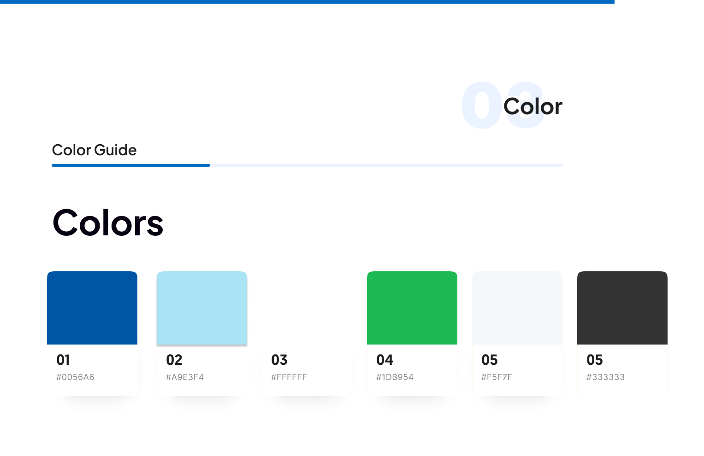

# Universidad Peruana de Ciencias Aplicadas

### **CURSO:** Desarrollo de Aplicaciones Open Source


### **NRC**: 4334

### **Profesor:** Hugo Allan Mori Paiva


### **Ingeniería de software**

## Informe de Trabajo Final


### **Nombre del startup:* EternaCare* 

### **Nombre del producto:* Carlink* 


## **Integrantes**


| **Nombre**                             | **Codigo** |
| -------------------------------------- | ---------- |
| ** **        |  |
| ** **                |  |
| ** **     |  |
| **Flores Apaico Josue Antonio**        | U20201F773 |


Agost 2025

## Registro de Versiones del Informe


<table>
  <thead>
    <tr>
      <th>Versión</th>
      <th>Fecha</th>
      <th>Autor</th>
      <th>Descripción de modificación</th>
    </tr>
  </thead>
  <tbody>

  </tbody>
</table>


## Project Report Collaboration Insights


## Contenido

- [Universidad Peruana de Ciencias Aplicadas](#universidad-peruana-de-ciencias-aplicadas)
    - [**CURSO:** Desarrollo de Aplicaciones Open Source](#curso-desarrollo-de-aplicaciones-open-source)
    - [**NRC**: 4334](#nrc-4334)
    - [**Profesor:** Hugo Allan Mori Paiva](#profesor-hugo-allan-mori-paiva)
    - [**Ingeniería de software**](#ingeniería-de-software)
  - [Informe de Trabajo Final](#informe-de-trabajo-final)
    - [**Nombre del startup:** EternaCare](#nombre-del-startup-apx-01)
    - [**Nombre del producto:** Carlink](#nombre-del-producto-eduhive)
  - [**Integrantes**](#integrantes)
  - [Registro de Versiones del Informe](#registro-de-versiones-del-informe)
  - [Project Report Collaboration Insights](#project-report-collaboration-insights)
  - [Contenido](#contenido)
  - [Student Outcome](#student-outcome)
  - [Capitulo I](#capitulo-i)
    - [1.1. Startup Profile](#11-startup-profile)
      - [1.1.1. Descripción de la Startup](#111-descripción-de-la-startup)
      - [1.1.2. Perfiles de integrantes del equipo](#112-perfiles-de-integrantes-del-equipo)
    - [1.2. Solution Profile](#12-solution-profile)
      - [1.2.1. Antecedentes y problemática](#121-antecedentes-y-problemática)
      - [1.2.2. Lean UX Process](#122-lean-ux-process)
        - [1.2.2.1. Lean UX Problem Statements](#1221-lean-ux-problem-statements)
        - [1.2.2.2. Lean UX Assumptions](#1222-lean-ux-assumptions)
        - [1.2.2.3. Lean UX Hypothesis Statements](#1223-lean-ux-hypothesis-statements)
        - [1.2.2.4. Lean UX Canvas](#1224-lean-ux-canvas)
    - [1.3. Segmentos Objetivo](#13-segmentos-objetivo)
    - [**Segmento Objetivo 1: Estudiantes Universitarios**](#segmento-objetivo-1-estudiantes-universitarios)
    - [**Segmento Objetivo 2: Profesores Universitarios**](#segmento-objetivo-2-profesores-universitarios)
  - [Capítulo II: Requirements Elicitation \& Analysis](#capítulo-ii-requirements-elicitation--analysis)
    - [2.1. Competidores](#21-competidores)
      - [2.1.1. Análisis competitivo](#211-análisis-competitivo)
      - [2.1.2. Estrategias y tácticas frente a competidores](#212-estrategias-y-tácticas-frente-a-competidores)
    - [2.2. Entrevistas](#22-entrevistas)
      - [2.2.1. Diseño de entrevistas](#221-diseño-de-entrevistas)
      - [2.2.2. Registro de entrevistas](#222-registro-de-entrevistas)
      - [2.2.3. Análisis de entrevistas](#223-análisis-de-entrevistas)
    - [2.3. Needfinding](#23-needfinding)
      - [2.3.1. User Personas](#231-user-personas)
      - [2.3.2. User Task Matrix](#232-user-task-matrix)
      - [2.3.3. User Journey Mapping](#233-user-journey-mapping)
      - [2.3.4. Empathy Mapping](#234-empathy-mapping)
      - [2.3.5. As-is Scenario Mapping](#235-as-is-scenario-mapping)
    - [2.4. Ubiquitous Language](#24-ubiquitous-language)
  - [Capítulo III: Requirements specification](#capítulo-iii-requirements-specification)
    - [3.1. To-Be Scenario Mapping](#31-to-be-scenario-mapping)
    - [3.2. User Stories](#32-user-stories)
    - [3.3. Impact Mapping](#33-impact-mapping)
    - [3.4. Product Backlog](#34-product-backlog)
  - [Capítulo IV: Product Design](#capítulo-iv-product-design)
    - [4.1. Style Guidelines](#41-style-guidelines)
      - [4.1.1. General Style Guidelines](#411-general-style-guidelines)
      - [4.1.2. Web Style Guidelines](#412-web-style-guidelines)
    - [4.2. Information Architecture](#42-information-architecture)
      - [4.2.1. Organization Systems](#421-organization-systems)
      - [4.2.2. Labeling Systems](#422-labeling-systems)
      - [4.2.3. SEO Tags and Meta Tags](#423-seo-tags-and-meta-tags)
      - [4.2.4. Searching Systems](#424-searching-systems)
      - [4.2.5. Navigation Systems](#425-navigation-systems)
    - [4.3. Landing Page UI Design](#43-landing-page-ui-design)
      - [4.3.1. Landing Page Wireframe](#431-landing-page-wireframe)
      - [4.3.2. Landing Page Mock-up](#432-landing-page-mock-up)
    - [4.4. Web Applications UX/UI Design](#44-web-applications-uxui-design)
      - [4.4.1. Web Applications Wireframes](#441-web-applications-wireframes)
      - [4.4.2. Web Applications Wireflow Diagrams](#442-web-applications-wireflow-diagrams)
      - [4.4.2. Web Applications Mock-ups](#442-web-applications-mock-ups)
      - [4.4.3. Web Applications User Flow Diagrams](#443-web-applications-user-flow-diagrams)
    - [4.5. Web Applications Prototyping](#45-web-applications-prototyping)
    - [4.6. Domain-Driven Software Architecture](#46-domain-driven-software-architecture)
      - [4.6.1. Software Architecture Context Diagram](#461-software-architecture-context-diagram)
      - [4.6.2. Software Architecture Container Diagrams](#462-software-architecture-container-diagrams)
      - [4.6.3. Software Architecture Components Diagrams](#463-software-architecture-components-diagrams)
    - [4.7. Software Object-Oriented Design](#47-software-object-oriented-design)
      - [4.7.1. Class Diagrams](#471-class-diagrams)
      - [4.7.2. Class Dictionary](#472-class-dictionary)
    - [4.8. Database Design](#48-database-design)
      - [4.8.1. Database Diagram](#481-database-diagram)
  - [Capítulo V: Product Implementation, Validation \& Deployment](#capítulo-v-product-implementation-validation--deployment)
    - [5.1. Software Configuration Management](#51-software-configuration-management)
      - [5.1.1. Software Development Environment Configuration](#511-software-development-environment-configuration)
      - [5.1.2. Source Code Management](#512-source-code-management)
      - [5.1.3. Source Code Style Guide \& Conventions](#513-source-code-style-guide--conventions)
      - [5.1.4. Software Deployment Configuration](#514-software-deployment-configuration)
    - [5.2. Landing Page, Services \& Applications Implementation.](#52-landing-page-services--applications-implementation)
      - [5.2.1. Sprint 1](#521-sprint-1)
        - [5.2.1.1. Sprint Planning 1](#5211-sprint-planning-1)
        - [5.2.1.2. Aspect Leaders and Collaborators](#5212-aspect-leaders-and-collaborators)
        - [5.2.1.3. Sprint Backlog 1](#5213-sprint-backlog-1)
        - [5.2.1.4. Development Evidence for Sprint Review](#5214-development-evidence-for-sprint-review)
        - [5.2.1.5. Execution Evidence for Sprint Review](#5215-execution-evidence-for-sprint-review)
        - [5.2.1.6. Services Documentation Evidence for Sprint Review](#5216-services-documentation-evidence-for-sprint-review)
        - [5.2.1.7. Software Deployment Evidence for Sprint Review](#5217-software-deployment-evidence-for-sprint-review)
        - [5.2.1.8. Team Collaboration Insights during Sprint](#5218-team-collaboration-insights-during-sprint)
  - [Conclusiones](#conclusiones)
  - [Bibliografía](#bibliografía)
  - [Anexos](#anexos)


## Student Outcome


## Capitulo I

### 1.1. Startup Profile

#### 1.1.1. Descripción de la Startup

#### 1.1.2. Perfiles de integrantes del equipo

### 1.2. Solution Profile

#### 1.2.1. Antecedentes y problemática

#### 1.2.2. Lean UX Process

##### 1.2.2.1. Lean UX Problem Statements

##### 1.2.2.2. Lean UX Assumptions

##### 1.2.2.3. Lean UX Hypothesis Statements

##### 1.2.2.4. Lean UX Canvas

### 1.3. Segmentos Objetivo

## Capítulo II: Requirements Elicitation & Analysis

### 2.1. Competidores

#### 2.1.1. Análisis competitivo

#### 2.1.2. Estrategias y tácticas frente a competidores

### 2.2. Entrevistas

#### 2.2.1. Diseño de entrevistas

#### 2.2.2. Registro de entrevistas

#### 2.2.3. Análisis de entrevistas

### 2.3. Needfinding

#### 2.3.1. User Personas

#### 2.3.2. User Task Matrix

#### 2.3.3. User Journey Mapping

#### 2.3.4. Empathy Mapping

#### 2.3.5. As-is Scenario Mapping

### 2.4. Ubiquitous Language

## Capítulo III: Requirements specification

### 3.1. To-Be Scenario Mapping

### 3.2. User Stories

### 3.3. Impact Mapping

### 3.4. Product Backlog

## Capítulo IV: Product Design

### 4.1. Style Guidelines

#### Branding

Queremos transmitir confianza, cercanía y una tecnología con enfoque humano. Para representar protección, bienestar y unión familiar, se propone incorporar íconos discretos como corazones, casas o figuras de personas mayores, acompañados de una tipografía limpia y contemporánea. La identidad de marca se fundamenta en:

- **Misión:** Proporcionar soluciones tecnológicas que prioricen el bienestar de los adultos mayores, fortaleciendo la conexión con sus familias y optimizando el trabajo de los cuidadores. 
- **Visión:** Crear entornos dignos, seguros y conectados para los adultos mayores, integrando tecnología humana que potencie la calidad del cuidado y la confianza familiar.

#### Logo

Buscamos proyectar una imagen moderna mediante un diseño minimalista, empleando un logotipo en tonos azules que refuerce este enfoque contemporáneo.


#### Typography

Se ha elegido Open Sans como la tipografía principal para todos los textos de la aplicación, debido a su claridad y estilo contemporáneo. Esta fuente facilita la lectura en cualquier dispositivo, proporcionando una experiencia visual cómoda y accesible.

El tamaño de la fuente se adapta automáticamente al tipo de pantalla, garantizando una presentación adecuada tanto en dispositivos móviles como en computadoras.


#### Colors

La paleta de colores incluye seis tonos principales, elegidos estratégicamente para aportar una imagen moderna, profesional y visualmente limpia en todas las áreas de la aplicación.

<br>


#### 4.1.1. General Style Guidelines

#### 4.1.2. Web Style Guidelines

### 4.2. Information Architecture

#### 4.2.1. Organization Systems

Nuestro propósito es garantizar una experiencia de usuario simple y coherente, tanto en el sitio web como en la aplicación móvil de **Carlink**. La arquitectura visual fue diseñada estratégicamente para cubrir las necesidades de los dos segmentos principales de nuestra audiencia.  

Ambos perfiles cuentan con acceso a las mismas secciones, pero con diferentes niveles de permisos. Los profesionales de la salud pueden generar y gestionar reportes médicos o programar citas, mientras que los familiares tienen acceso únicamente a la visualización de estadísticas y reportes, además de contar con un canal de comunicación restringido a emergencias o consultas puntuales.  


Tal como muestra el diagrama, el flujo sigue una secuencia estructurada que facilita la gestión de la salud de los pacientes y permite la interacción fluida entre médicos y familiares. A continuación, se detallan las etapas del proceso y sus funciones:

1. **Landing Page**: Página de bienvenida donde los usuarios conocen los beneficios de Carlink.  
2. **Inicio**: Permite a los usuarios ingresar con una cuenta existente o crear una nueva.  
3. **Registro**:  
   - **Crear Cuenta**: Ingreso manual de datos.  
   - **Google Sign-Up**: Registro simplificado mediante una cuenta de Google.  
   - **Completar Datos**: Formulario con información personal básica.  
4. **Inicio de Sesión**: Acceso con credenciales previamente registradas.  
5. **Página Principal**: Centro de navegación hacia las funciones clave de la plataforma.  
6. **Stats**: Visualización de estadísticas médicas del paciente.  
7. **Reports**: Generación de reportes detallados sobre evolución y estado de salud.  
8. **Messages**: Comunicación directa entre médicos y familiares.  
9. **Appointments**: Gestión de citas médicas, incluyendo programación y seguimiento.  
10. **Account**: Configuración y actualización de la información del usuario.  

Este flujo asegura que los médicos puedan tomar decisiones informadas, mientras que los familiares se mantienen al tanto del estado de salud del paciente en todo momento.  

#### 4.2.2. Labeling Systems

El sistema de etiquetado seguirá la misma lógica que la arquitectura organizacional. Cada encabezado redirige al usuario de manera intuitiva a la sección correspondiente dentro de la plataforma.  

##### Secciones y contenido de la Landing Page

| **Sección**  | **Contenido** |
|-------------|---------------|
| **Página Principal** | Punto de entrada a **Carlink**, donde se introduce la aplicación y se destacan su misión, visión y beneficios en la gestión de la salud. |
| **About** | Explica en detalle las principales funcionalidades de Carlink, el rol de médicos y familiares y las ventajas de utilizar la plataforma. |
| **Premium** | Presenta las características exclusivas de la versión premium, como reportes avanzados, integración con sistemas externos y mayor personalización. |
| **Contacto** | Información de contacto con el equipo de soporte: correo técnico, canales de negocio y redes sociales. |
| **Log In** | Permite el acceso a cuentas registradas y ofrece la opción de crear un nuevo perfil para aprovechar todas las funciones. |

##### Secciones y contenido de Carlink

| **Sección**  | **Contenido** |
|-------------|---------------|
| **Home** | Muestra las funciones principales y acceso rápido a los módulos. |
| **Stats** | Datos estadísticos y evolución del estado de salud del paciente. |
| **Reports** | Generación de informes médicos con registros históricos y gráficos. |
| **Messages** | Canal de comunicación directa entre médicos y familiares. |
| **Appointments** | Agenda médica con programación y recordatorios de consultas. |
| **Account** | Configuración de perfil y ajustes personalizados. |


#### 4.2.3. SEO Tags and Meta Tags

La **Landing Page** busca atraer nuevos usuarios, transmitir confianza y posicionar la propuesta de valor de **EternaCare**. Las etiquetas SEO y meta están optimizadas para captar búsquedas relacionadas con tecnología de salud y bienestar de adultos mayores.  

**Título de la página (Title)**

```html
<title>Carlink – Tecnología para el bienestar de adultos mayores</title>

<meta name="description" content="Carlink, la solución digital de EternaCare, conecta a médicos y familias para mejorar la calidad de vida de adultos mayores mediante información confiable en tiempo real.">

<meta name="keywords" content="EternaCare, Carlink, cuidado de adultos mayores, salud digital, bienestar, monitoreo, comunicación familiar, citas médicas, reportes de salud">

<meta name="author" content="Equipo EternaCare">

```


#### 4.2.4. Searching Systems

Para garantizar que los usuarios (médicos y familiares) puedan acceder fácilmente a la información sin perder tiempo, **Carlink** integra un sistema de búsqueda robusto y eficiente:

- **Búsqueda Global**: Permite localizar cualquier dato dentro de la plataforma a través de palabras clave.  
- **Búsqueda en Reportes**: Ofrece filtros por paciente, historial clínico o fecha, facilitando la localización de registros médicos específicos.  
- **Búsqueda en Mensajes**: Posibilita encontrar conversaciones relevantes entre médicos y familiares, evitando la pérdida de información crítica.  
- **Búsqueda en Citas Médicas**: Permite localizar consultas programadas según la fecha, tipo de cita o médico a cargo.  

Este sistema de búsqueda contribuye a la accesibilidad, ahorra tiempo y mejora la interacción entre los usuarios, asegurando que la información esté siempre disponible de forma rápida e intuitiva.

---

#### 4.2.5. Navigation Systems

La navegación en **Carlink** se ha estructurado para que los usuarios se desplacen con facilidad entre las distintas secciones de la plataforma. Se emplea una barra de menú principal, accesos rápidos y un diseño jerárquico que guía la experiencia paso a paso.

##### **Estructura de Navegación en la Landing Page**

| **Sección**  | **Descripción** |
|-------------|-----------------|
| **Página Principal** | Presenta a Carlink y la propuesta de valor de EternaCare. Desde aquí se introducen misión, visión y principales beneficios. |
| **About** | Explica las herramientas clave de la plataforma, el rol de médicos y familiares, y cómo se logra una gestión eficiente de la salud. |
| **Premium** | Describe las ventajas de la versión premium, con funciones avanzadas de reportes, integración con otros sistemas y mayor personalización. |
| **Contacto** | Ofrece medios de comunicación con el equipo de EternaCare: correo técnico, redes sociales y contacto para negocios. |
| **Log In** | Espacio para acceder a cuentas existentes o registrarse y comenzar a usar Carlink. |

##### **Estructura de Navegación en Carlink**

| **Sección**  | **Descripción** |
|-------------|-----------------|
| **Home** | Página de inicio dentro de la aplicación con acceso directo a las funciones más utilizadas. |
| **Stats** | Visualización de datos estadísticos sobre la evolución de la salud del paciente. |
| **Reports** | Generación de reportes médicos con gráficos y registros históricos organizados. |
| **Messages** | Canal de comunicación en tiempo real entre médicos y familiares. |
| **Appointments** | Agenda de citas médicas, con programación y recordatorios automáticos. |
| **Account** | Configuración del perfil de usuario y personalización de la cuenta. |

---

#### Accesibilidad y navegación predictiva

**Carlink** integra accesos rápidos para las funciones esenciales y un sistema de navegación predictiva que recomienda secciones según los hábitos del usuario. Esto permite una experiencia intuitiva y adaptada a las necesidades, mejorando la eficiencia del uso tanto para médicos como para familiares.  


### 4.3. Landing Page UI Design

#### 4.3.1. Landing Page Wireframe

#### 4.3.2. Landing Page Mock-up

### 4.4. Web Applications UX/UI Design

#### 4.4.1. Web Applications Wireframes

#### 4.4.2. Web Applications Wireflow Diagrams

#### 4.4.2. Web Applications Mock-ups

#### 4.4.3. Web Applications User Flow Diagrams

### 4.5. Web Applications Prototyping

### 4.6. Domain-Driven Software Architecture

#### 4.6.1. Software Architecture Context Diagram


#### 4.6.2. Software Architecture Container Diagrams


#### 4.6.3. Software Architecture Components Diagrams
Diagrama de Componentes de la API RESTful


Diagrama de Componentes de la Aplicación Web (SPA)


### 4.7. Software Object-Oriented Design

#### 4.7.1. Class Diagrams

#### 4.7.2. Class Dictionary

### 4.8. Database Design

#### 4.8.1. Database Diagram

## Capítulo V: Product Implementation, Validation & Deployment

### 5.1. Software Configuration Management

#### 5.1.1. Software Development Environment Configuration

#### 5.1.2. Source Code Management

#### 5.1.3. Source Code Style Guide & Conventions

#### 5.1.4. Software Deployment Configuration

### 5.2. Landing Page, Services & Applications Implementation.

#### 5.2.1. Sprint 1

##### 5.2.1.1. Sprint Planning 1

##### 5.2.1.2. Aspect Leaders and Collaborators

##### 5.2.1.3. Sprint Backlog 1

##### 5.2.1.4. Development Evidence for Sprint Review

##### 5.2.1.5. Execution Evidence for Sprint Review

##### 5.2.1.6. Services Documentation Evidence for Sprint Review

##### 5.2.1.7. Software Deployment Evidence for Sprint Review

##### 5.2.1.8. Team Collaboration Insights during Sprint


## Conclusiones

## Bibliografía

## Anexos

