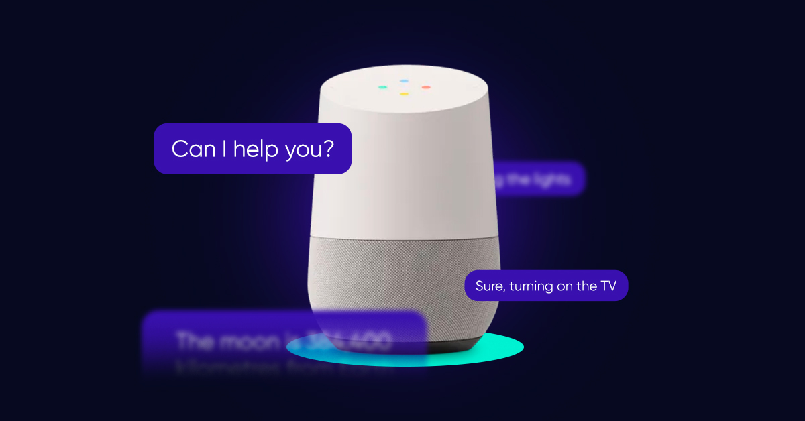

# Universidad Peruana de Ciencias Aplicadas

### **CURSO:** Desarrollo de Aplicaciones Open Source

### **NRC**: 4334

### **Profesor:** Hugo Allan Mori Paiva

### **Ingeniería de software**

## Informe de Trabajo Final

### **Nombre del startup:* EternaCare*

### **Nombre del producto:* Carlink*

## **Integrantes**

| **Nombre**                        | **Codigo** |
|-----------------------------------|------------|
| **Verona Flores Italo Sebastian** | U20221E617 |
| ** **                             |            |
| ** **                             |            |
| **Flores Apaico Josue Antonio**   | U20201F773 |

Agosto 2025

## Registro de Versiones del Informe

<table>
  <thead>
    <tr>
      <th>Versión</th>
      <th>Fecha</th>
      <th>Autor</th>
      <th>Descripción de modificación</th>
    </tr>
  </thead>
  <tbody>
  </tbody>
</table>

## Project Report Collaboration Insights

## Contenido

- [Universidad Peruana de Ciencias Aplicadas](#universidad-peruana-de-ciencias-aplicadas)
    - [**CURSO:** Desarrollo de Aplicaciones Open Source](#curso-desarrollo-de-aplicaciones-open-source)
    - [**NRC**: 4334](#nrc-4334)
    - [**Profesor:** Hugo Allan Mori Paiva](#profesor-hugo-allan-mori-paiva)
    - [**Ingeniería de software**](#ingeniería-de-software)
  - [Informe de Trabajo Final](#informe-de-trabajo-final)
    - [**Nombre de la startup:** EternaCare](#nombre-del-startup-apx-01)
    - [**Nombre del producto:** Carlink](#nombre-del-producto-eduhive)
  - [**Integrantes**](#integrantes)
  - [Registro de Versiones del Informe](#registro-de-versiones-del-informe)
  - [Project Report Collaboration Insights](#project-report-collaboration-insights)
  - [Contenido](#contenido)
  - [Student Outcome](#student-outcome)
  - [Capitulo I](#capitulo-i)
    - [1.1. Startup Profile](#11-startup-profile)
      - [1.1.1. Descripción de la Startup](#111-descripción-de-la-startup)
      - [1.1.2. Perfiles de integrantes del equipo](#112-perfiles-de-integrantes-del-equipo)
    - [1.2. Solution Profile](#12-solution-profile)
      - [1.2.1. Antecedentes y problemática](#121-antecedentes-y-problemática)
      - [1.2.2. Lean UX Process](#122-lean-ux-process)
        - [1.2.2.1. Lean UX Problem Statements](#1221-lean-ux-problem-statements)
        - [1.2.2.2. Lean UX Assumptions](#1222-lean-ux-assumptions)
        - [1.2.2.3. Lean UX Hypothesis Statements](#1223-lean-ux-hypothesis-statements)
        - [1.2.2.4. Lean UX Canvas](#1224-lean-ux-canvas)
    - [1.3. Segmentos Objetivo](#13-segmentos-objetivo)
    - [**Segmento Objetivo 1: Estudiantes Universitarios**](#segmento-objetivo-1-estudiantes-universitarios)
    - [**Segmento Objetivo 2: Profesores Universitarios**](#segmento-objetivo-2-profesores-universitarios)
  - [Capítulo II: Requirements Elicitation \& Analysis](#capítulo-ii-requirements-elicitation--analysis)
    - [2.1. Competidores](#21-competidores)
      - [2.1.1. Análisis competitivo](#211-análisis-competitivo)
      - [2.1.2. Estrategias y tácticas frente a competidores](#212-estrategias-y-tácticas-frente-a-competidores)
    - [2.2. Entrevistas](#22-entrevistas)
      - [2.2.1. Diseño de entrevistas](#221-diseño-de-entrevistas)
      - [2.2.2. Registro de entrevistas](#222-registro-de-entrevistas)
      - [2.2.3. Análisis de entrevistas](#223-análisis-de-entrevistas)
    - [2.3. Needfinding](#23-needfinding)
      - [2.3.1. User Personas](#231-user-personas)
      - [2.3.2. User Task Matrix](#232-user-task-matrix)
      - [2.3.3. User Journey Mapping](#233-user-journey-mapping)
      - [2.3.4. Empathy Mapping](#234-empathy-mapping)
      - [2.3.5. As-is Scenario Mapping](#235-as-is-scenario-mapping)
    - [2.4. Ubiquitous Language](#24-ubiquitous-language)
  - [Capítulo III: Requirements specification](#capítulo-iii-requirements-specification)
    - [3.1. To-Be Scenario Mapping](#31-to-be-scenario-mapping)
    - [3.2. User Stories](#32-user-stories)
    - [3.3. Impact Mapping](#33-impact-mapping)
    - [3.4. Product Backlog](#34-product-backlog)
  - [Capítulo IV: Product Design](#capítulo-iv-product-design)
    - [4.1. Style Guidelines](#41-style-guidelines)
      - [4.1.1. General Style Guidelines](#411-general-style-guidelines)
      - [4.1.2. Web Style Guidelines](#412-web-style-guidelines)
    - [4.2. Information Architecture](#42-information-architecture)
      - [4.2.1. Organization Systems](#421-organization-systems)
      - [4.2.2. Labeling Systems](#422-labeling-systems)
      - [4.2.3. SEO Tags and Meta Tags](#423-seo-tags-and-meta-tags)
      - [4.2.4. Searching Systems](#424-searching-systems)
      - [4.2.5. Navigation Systems](#425-navigation-systems)
    - [4.3. Landing Page UI Design](#43-landing-page-ui-design)
      - [4.3.1. Landing Page Wireframe](#431-landing-page-wireframe)
      - [4.3.2. Landing Page Mock-up](#432-landing-page-mock-up)
    - [4.4. Web Applications UX/UI Design](#44-web-applications-uxui-design)
      - [4.4.1. Web Applications Wireframes](#441-web-applications-wireframes)
      - [4.4.2. Web Applications Wireflow Diagrams](#442-web-applications-wireflow-diagrams)
      - [4.4.2. Web Applications Mock-ups](#442-web-applications-mock-ups)
      - [4.4.3. Web Applications User Flow Diagrams](#443-web-applications-user-flow-diagrams)
    - [4.5. Web Applications Prototyping](#45-web-applications-prototyping)
    - [4.6. Domain-Driven Software Architecture](#46-domain-driven-software-architecture)
      - [4.6.1. Software Architecture Context Diagram](#461-software-architecture-context-diagram)
      - [4.6.2. Software Architecture Container Diagrams](#462-software-architecture-container-diagrams)
      - [4.6.3. Software Architecture Components Diagrams](#463-software-architecture-components-diagrams)
    - [4.7. Software Object-Oriented Design](#47-software-object-oriented-design)
      - [4.7.1. Class Diagrams](#471-class-diagrams)
      - [4.7.2. Class Dictionary](#472-class-dictionary)
    - [4.8. Database Design](#48-database-design)
      - [4.8.1. Database Diagram](#481-database-diagram)
  - [Capítulo V: Product Implementation, Validation \& Deployment](#capítulo-v-product-implementation-validation--deployment)
    - [5.1. Software Configuration Management](#51-software-configuration-management)
      - [5.1.1. Software Development Environment Configuration](#511-software-development-environment-configuration)
      - [5.1.2. Source Code Management](#512-source-code-management)
      - [5.1.3. Source Code Style Guide \& Conventions](#513-source-code-style-guide--conventions)
      - [5.1.4. Software Deployment Configuration](#514-software-deployment-configuration)
    - [5.2. Landing Page, Services \& Applications Implementation.](#52-landing-page-services--applications-implementation)
      - [5.2.1. Sprint 1](#521-sprint-1)
        - [5.2.1.1. Sprint Planning 1](#5211-sprint-planning-1)
        - [5.2.1.2. Aspect Leaders and Collaborators](#5212-aspect-leaders-and-collaborators)
        - [5.2.1.3. Sprint Backlog 1](#5213-sprint-backlog-1)
        - [5.2.1.4. Development Evidence for Sprint Review](#5214-development-evidence-for-sprint-review)
        - [5.2.1.5. Execution Evidence for Sprint Review](#5215-execution-evidence-for-sprint-review)
        - [5.2.1.6. Services Documentation Evidence for Sprint Review](#5216-services-documentation-evidence-for-sprint-review)
        - [5.2.1.7. Software Deployment Evidence for Sprint Review](#5217-software-deployment-evidence-for-sprint-review)
        - [5.2.1.8. Team Collaboration Insights during Sprint](#5218-team-collaboration-insights-during-sprint)
  - [Conclusiones](#conclusiones)
  - [Bibliografía](#bibliografía)
  - [Anexos](#anexos)

## Student Outcome

## Capitulo I

### 1.1. Startup Profile

#### 1.1.1. Descripción de la Startup

#### 1.1.2. Perfiles de integrantes del equipo

### 1.2. Solution Profile

#### 1.2.1. Antecedentes y problemática

#### 1.2.2. Lean UX Process

##### 1.2.2.1. Lean UX Problem Statements

##### 1.2.2.2. Lean UX Assumptions

##### 1.2.2.3. Lean UX Hypothesis Statements

##### 1.2.2.4. Lean UX Canvas

### 1.3. Segmentos Objetivo

## Capítulo II: Requirements Elicitation & Analysis

### 2.1. Competidores

- **Competidores Directos**

Los competidores directos de EternaCare son plataformas con modelos de negocio similares, enfocadas en el cuidado y monitoreo de adultos mayores a través de soluciones digitales.

* **Quimun:** Startup chilena que se especializa en la gestión integral de residencias de adultos mayores. Su plataforma digitaliza procesos administrativos y médicos, y facilita la comunicación entre familiares y el personal de cuidado. Compite directamente en la región (Chile, Ecuador y con planes de expansión en Perú y Colombia) y ofrece funcionalidades muy parecidas a las de EternaCare, lo que la convierte en una rival clave.

  

  
    
  

* **Safe365:** Esta aplicación española se centra en el **monitoreo y localización** de personas mayores. Si bien su principal función es la seguridad y la asistencia en emergencias (botón de pánico, localización en tiempo real), también incorpora comunicación familiar. Su enfoque en la seguridad se alinea con una parte importante de la propuesta de valor de CareLink.

  

  
    
* 

* **MiCuidum (Cuidum):** Una plataforma que se enfoca en la **gestión del cuidado a domicilio**. Permite a las familias monitorear y coordinar la atención del adulto mayor, facilitando la comunicación entre familiares, cuidadores y profesionales de la salud. Su modelo de asistencia domiciliaria la posiciona como una competidora directa, aunque con un enfoque específico en el hogar.

  

  
     
  

- **Competidores Indirectos**

Los competidores indirectos de EternaCare ofrecen soluciones que satisfacen algunas de las necesidades de su público objetivo, pero con un modelo de negocio o un enfoque diferente, lo que las hace menos una amenaza directa.

* **Mon Ami:** Esta plataforma se orienta al **bienestar social y emocional**, conectando a adultos mayores con estudiantes universitarios para compañía y asistencia en actividades diarias. A diferencia de EternaCare, su enfoque no es clínico ni de monitoreo de salud, sino de acompañamiento, cubriendo una necesidad que CareLink podría considerar secundaria pero importante.
  

    
  

* **Dispositivos Inteligentes y Asistentes de Voz:** Soluciones de IoT como **Blipcare** (monitores de salud) o asistentes como **Amazon Echo Show** compiten en el espacio de la gestión de salud desde el hogar. Ofrecen recordatorios de medicación y facilitan el día a día, pero carecen de la profundidad en el monitoreo integral y las funciones de comunicación familiar que son el núcleo de la plataforma CareLink.

  

  
    
  

#### 2.1.1. Análisis competitivo

<table border="1" cellspacing="0" cellpadding="6">
  <tr>
    <th colspan="2" style="font-size: 20px; text-align:left;">Competitive Analysis Landscape</th>
    <th colspan="4"></th>
  </tr>
  <tr>
    <td><b>¿Por qué llevar a cabo este análisis?</b></td>
    <td colspan="5">Este análisis permite identificar fortalezas y debilidades de la startup frente a los principales competidores, así como oportunidades y amenazas del entorno, mejorando la estrategia y la propuesta de valor.</td>
  </tr>
  <tr>
    <th></th>
    <th>CareLink (EternaCare) <!----></th>
    <th>Quimun </th>
    <th>Safe365 </th>
    <th>MiCuidum </th>
  </tr>
  <tr>
    <th>Overview</th>
    <td>Plataforma integral para monitoreo de salud física, emocional y mental de adultos mayores; reportes, alertas, comunicación y futura integración IoT. Centrada en hogares y centros geriátricos.</td>
    <td>Plataforma SaaS que gestiona residencias de adultos mayores, con módulos administrativos, clínicos y canal directo con familias.</td>
    <td>App de localización y alertas, con botón de emergencia, notificaciones y localización en tiempo real para familiares.</td>
    <td>Plataforma para la gestión y monitoreo personalizado a domicilio, red de cuidadores y acceso a profesionales de la salud.</td>
  </tr>
  <tr>
    <th>Ventaja competitiva / valor</th>
    <td>Integración hogar-centro, reportes en tiempo real, comunicación multicanal, visión tecnológica e integración IoT futura.</td>
    <td>Gestión y digitalización avanzada institucional, optimización administrativa, alianzas en LatAm.</td>
    <td>Líder en localización, simplicidad, foco en seguridad y tranquilidad familiar.</td>
    <td>Personalización, red profesional de cuidadores, gestión de salud domiciliaria y comunicación familiar.</td>
  </tr>
  <tr>
    <th>Mercado objetivo</th>
    <td>Familias, cuidadores y centros geriátricos en Perú/LatAm.</td>
    <td>Residencias y centros geriátricos.</td>
    <td>Familias con adultos mayores autónomos/semi-independientes.</td>
    <td>Familias que cuidan a mayores en casa.</td>
  </tr>
  <tr>
    <th>Estrategias de marketing</th>
    <td>Marketing digital, alianzas institucionales, pilotos y recomendaciones.</td>
    <td>Venta institucional, alianzas y demos directas.</td>
    <td>Marketing en tiendas de apps, digital.</td>
    <td>Marketing digital, partnerships médicos y asociaciones.</td>
  </tr>
  <tr>
    <th>Productos & Servicios</th>
    <td>Web/app móvil, alertas inteligentes, reportes visuales, integración wearable/IoT, comunicación en tiempo real.</td>
    <td>Gestión administrativa, módulos clínicos, reportes, comunicación.</td>
    <td>App móvil, localización GPS, botón SOS.</td>
    <td>App/web, red de cuidadores, reportes familiares, acceso médico remoto.</td>
  </tr>
  <tr>
    <th>Precios & Costos</th>
    <td>Suscripción mensual (familia/usuario), licencias institucionales/packs.</td>
    <td>Licencias por centro/residencia (institucional).</td>
    <td>Gratuito/premium.</td>
    <td>Suscripciones mensuales según nivel de servicio.</td>
  </tr>
  <tr>
    <th>Canales de distribución (Web y/o Móvil)</th>
    <td>Web, App móvil (iOS y Android).</td>
    <td>Web/SaaS para instituciones.</td>
    <td>App móvil (iOS/Android).</td>
    <td>Web, app móvil.</td>
  </tr>
  <tr>
    <th>Fortalezas</th>
    <td>Enfoque integral hogar-centro, comunicación en tiempo real, proyección IoT, diseño centrado en usuario latino.</td>
    <td>Experiencia institucional, digitalización profunda, presencia regional.</td>
    <td>Simplicidad, liderazgo en localización y respuesta rápida.</td>
    <td>Red de cuidadores profesionales, seguimiento y personalización diaria.</td>
  </tr>
  <tr>
    <th>Debilidades</th>
    <td>Penetración baja, dependencia de aliados, nueva en el mercado, difícil adopción inicial en segmento sénior.</td>
    <td>Útil solo para instituciones, poca flexibilidad doméstica.</td>
    <td>Funcionalidad limitada (localización/alertas), sin módulo clínico.</td>
    <td>Costos altos, depende de cuidador externo, enfoque solo domiciliario.</td>
  </tr>
  <tr>
    <th>Oportunidades</th>
    <td>Ampliar a nuevas regiones LatAm, alianzas con aseguradoras, integración avanzada IoT, crecimiento mercado cuidado remoto.</td>
    <td>Expansión regional/con nuevos módulos tecnológicos.</td>
    <td>Incluir nuevos módulos de salud, integrar con telemedicina.</td>
    <td>Asociaciones médicas, integración IoT y generación de datos.</td>
  </tr>
  <tr>
    <th>Amenazas</th>
    <td>Nuevos actores internacionales, regulación sanitaria, adopción digital lenta.</td>
    <td>Competidores flexibles o con visión híbrida.</td>
    <td>Cambio en preferencia hacia plataformas clínicas integrales.</td>
    <td>Competencia de soluciones más económicas/escalables.</td>
  </tr>
</table>

#### 2.1.2. Estrategias y tácticas frente a competidores

1. Estrategias para afrontar fortalezas de competidores
    - **Personalización e integración IoT**: Desarrollar alianzas tecnológicas para integrar rápidamente dispositivos IoT y wearables, superando la oferta de monitoreo tradicional de otros competidores.
    - **Plataforma híbrida (hogar y centro)**: Enfatizar el enfoque transversal de CareLink (centros y domicilios) en campañas y demostraciones, destacando la flexibilidad frente a soluciones exclusivas para residencias o solo para el hogar.
    - **Enfoque en experiencia de usuario latino**: Mantener una interfaz simple, local y amigable, diferenciándose de soluciones extranjeras menos adaptadas a necesidades regionales.

2. Tácticas para aprovechar debilidades de competidores
    - **Comunicación multi-canal y en tiempo real**: Publicitar las limitaciones de comunicación en competidores como Safe365 (orientado solo a alertas) y Quimun (institucional), resaltando la bidireccionalidad y personalización que ofrece CareLink para familias y cuidadores.
    - **Ampliar servicios a segmento doméstico**: Ofrecer versiones de entrada o pilotos gratuitos para el cuidado domiciliario aprovechando que Quimun y MiCuidum no abarcan ambos segmentos de manera integral.
    - **Servicios de valor agregado**: Proveer reportes avanzados, herramientas predictivas de salud y soporte familiar, atributos poco presentes en competidores enfocados solo en monitoreo o gestión administrativa.

3. Estrategias frente a oportunidades
    - **Alianzas estratégicas**: Buscar convenios con aseguradoras, asociaciones de adultos mayores y centros geriátricos para escalar la adopción y mejorar el reconocimiento de marca, captando oportunidades de mercado en crecimiento.
    - **Expansión regional**: Priorizar expansión piloto en mercados vecinos (LatAm) aprovechando que varias plataformas extranjeras aún no tienen presencia física en la región.
    - **Educación digital**: Implementar talleres y campañas para reducir las barreras de adopción tecnológica entre adultos mayores y cuidadores.

4. Estrategias frente a amenazas
    - **Cumplimiento regulatorio y privacidad**: Mantener estrictos estándares de seguridad de datos y ajustarse a la regulación sanitaria local para reducir el riesgo frente a la entrada de actores internacionales.
    - **Innovación continua**: Desarrollar un roadmap ágil para iterar nuevas funciones basadas en feedback real de usuarios, anticipando movimientos de la competencia.
    - **Diferenciación por costo/beneficio**: Flexibilizar planes de precios y ofrecer más valor (reportes, comunicación, soporte) por el mismo o menor costo en comparación con competidores.

### 2.2. Entrevistas

#### 2.2.1. Diseño de entrevistas

#### 2.2.2. Registro de entrevistas

#### 2.2.3. Análisis de entrevistas

### 2.3. Needfinding

#### 2.3.1. User Personas

#### 2.3.2. User Task Matrix

#### 2.3.3. User Journey Mapping

#### 2.3.4. Empathy Mapping

#### 2.3.5. As-is Scenario Mapping

### 2.4. Ubiquitous Language

## Capítulo III: Requirements specification

### 3.1. To-Be Scenario Mapping

### 3.2. User Stories

### 3.3. Impact Mapping

### 3.4. Product Backlog

## Capítulo IV: Product Design

### 4.1. Style Guidelines

#### 4.1.1. General Style Guidelines

#### 4.1.2. Web Style Guidelines

### 4.2. Information Architecture

#### 4.2.1. Organization Systems

#### 4.2.2. Labeling Systems

#### 4.2.3. SEO Tags and Meta Tags

#### 4.2.4. Searching Systems

#### 4.2.5. Navigation Systems

### 4.3. Landing Page UI Design

#### 4.3.1. Landing Page Wireframe

#### 4.3.2. Landing Page Mock-up

### 4.4. Web Applications UX/UI Design

#### 4.4.1. Web Applications Wireframes

#### 4.4.2. Web Applications Wireflow Diagrams

#### 4.4.2. Web Applications Mock-ups

#### 4.4.3. Web Applications User Flow Diagrams

### 4.5. Web Applications Prototyping

### 4.6. Domain-Driven Software Architecture

#### 4.6.1. Software Architecture Context Diagram

#### 4.6.2. Software Architecture Container Diagrams

#### 4.6.3. Software Architecture Components Diagrams

### 4.7. Software Object-Oriented Design

#### 4.7.1. Class Diagrams

#### 4.7.2. Class Dictionary

### 4.8. Database Design

#### 4.8.1. Database Diagram

## Capítulo V: Product Implementation, Validation & Deployment

### 5.1. Software Configuration Management

#### 5.1.1. Software Development Environment Configuration

#### 5.1.2. Source Code Management

#### 5.1.3. Source Code Style Guide & Conventions

#### 5.1.4. Software Deployment Configuration

### 5.2. Landing Page, Services & Applications Implementation.

#### 5.2.1. Sprint 1

##### 5.2.1.1. Sprint Planning 1

##### 5.2.1.2. Aspect Leaders and Collaborators

##### 5.2.1.3. Sprint Backlog 1

##### 5.2.1.4. Development Evidence for Sprint Review

##### 5.2.1.5. Execution Evidence for Sprint Review

##### 5.2.1.6. Services Documentation Evidence for Sprint Review

##### 5.2.1.7. Software Deployment Evidence for Sprint Review

##### 5.2.1.8. Team Collaboration Insights during Sprint

## Conclusiones

## Bibliografía

## Anexos

